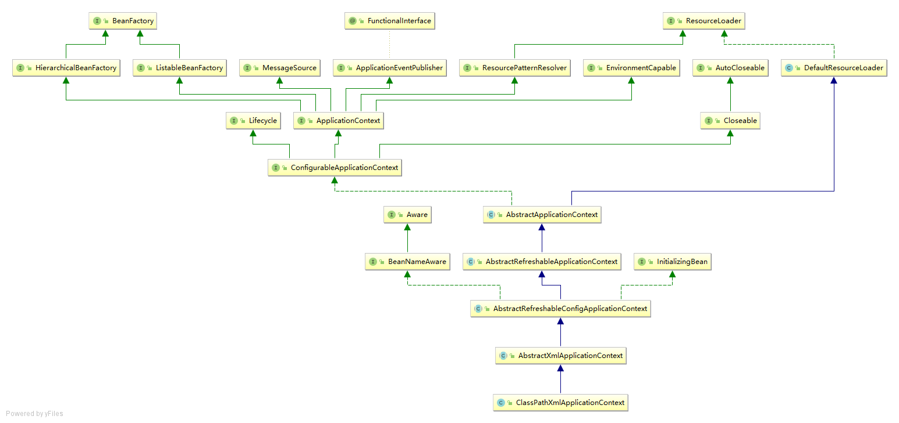

- [第一节学习](#%e7%ac%ac%e4%b8%80%e8%8a%82%e5%ad%a6%e4%b9%a0)
  - [ClassPathXmlApplicationContext](#classpathxmlapplicationcontext)

## 第一节学习

### ClassPathXmlApplicationContext

demo：com.der.day001.BaseStudy

```$xslt
ClassPathXmlApplicationContext context = new ClassPathXmlApplicationContext("classpath:spring-start.xml");
TestEntity bean = context.getBean(TestEntity.class);
bean.send();
context.close();

<?xml version="1.0" encoding="UTF-8"?>
<beans xmlns="http://www.springframework.org/schema/beans"
       xmlns:xsi="http://www.w3.org/2001/XMLSchema-instance"
       xsi:schemaLocation="http://www.springframework.org/schema/beans http://www.springframework.org/schema/beans/spring-beans.xsd">

    <bean class="com.der.domain.TestEntity" />
</beans>
```

整个继承体系如下:<br/>
<br/>
构造器源码：<br/>
```$xslt
public ClassPathXmlApplicationContext(
        String[] configLocations, boolean refresh, @Nullable ApplicationContext parent)
        throws BeansException {
    super(parent); -- ① -- ②
    setConfigLocations(configLocations); --③
    if (refresh) {
        refresh(); -- ④
    }
}
```

ClassPathXmlApplicationContext初始化步骤：<br/>
&nbsp;&nbsp;&nbsp;&nbsp;① ClassPathXmlApplicationContext继承父类直到AbstractApplicationContext调用getResourcePatternResolver获取资源解析器<br/>
&nbsp;&nbsp;&nbsp;&nbsp;② AbstractApplicationContext调用setParent方法设置父级ApplicationContext <br/>
``` AbstractApplicationContext的setParent方法
public void setParent(@Nullable ApplicationContext parent) {
    this.parent = parent;
    if (parent != null) {
        Environment parentEnvironment = parent.getEnvironment();
        if (parentEnvironment instanceof ConfigurableEnvironment) {
            getEnvironment().merge((ConfigurableEnvironment) parentEnvironment);
        }
    }
}
```
&nbsp;&nbsp;&nbsp;&nbsp;③ ClassPathXmlApplicationContext调用AbstractRefreshableConfigApplicationContext.setConfigLocations设置配置文件路径<br/>
``` AbstractRefreshableConfigApplicationContext.setConfigLocations
public void setConfigLocations(@Nullable String... locations) {
    if (locations != null) {
        Assert.noNullElements(locations, "Config locations must not be null");
        this.configLocations = new String[locations.length];
        for (int i = 0; i < locations.length; i++) {
            this.configLocations[i] = resolvePath(locations[i]).trim();
        }
    }
    else {
        this.configLocations = null;
    }
}
org.springframework.context.support.AbstractRefreshableConfigApplicationContext.resolvePath
protected String resolvePath(String path) {
    return getEnvironment().resolveRequiredPlaceholders(path);
}

此方法的目的在于将占位符(placeholder)解析成实际的地址。比如可以这么写: new ClassPathXmlApplicationContext("classpath:config.xml");那么classpath:就是需要被解析的。
getEnvironment方法来自于ConfigurableApplicationContext接口，源码很简单，如果为空就调用createEnvironment创建一个。
AbstractApplicationContext.createEnvironment:

protected ConfigurableEnvironment createEnvironment() {
    return new StandardEnvironment();
}
```
[setConfigLocations详情](./base_tree/setConfigLocations.md)<br/>

&nbsp;&nbsp;&nbsp;&nbsp;④ Spring bean解析<br/>
```
org.springframework.context.support.AbstractApplicationContext.refresh
public void refresh() throws BeansException, IllegalStateException {
    synchronized (this.startupShutdownMonitor) {  -- 对该实体类加锁，防止线程影响
        // Prepare this context for refreshing.
        prepareRefresh();

        // Tell the subclass to refresh the internal bean factory.
        ConfigurableListableBeanFactory beanFactory = obtainFreshBeanFactory(); -- BeanFactory创建

        // Prepare the bean factory for use in this context.
        prepareBeanFactory(beanFactory);

        try {
            // Allows post-processing of the bean factory in context subclasses.
            postProcessBeanFactory(beanFactory);

            // Invoke factory processors registered as beans in the context.
            invokeBeanFactoryPostProcessors(beanFactory);

            // Register bean processors that intercept bean creation.
            registerBeanPostProcessors(beanFactory);

            // Initialize message source for this context.
            initMessageSource();

            // Initialize event multicaster for this context.
            initApplicationEventMulticaster();

            // Initialize other special beans in specific context subclasses.
            onRefresh();

            // Check for listener beans and register them.
            registerListeners();

            // Instantiate all remaining (non-lazy-init) singletons.
            finishBeanFactoryInitialization(beanFactory);

            // Last step: publish corresponding event.
            finishRefresh();
        }

        catch (BeansException ex) {
            if (logger.isWarnEnabled()) {
                logger.warn("Exception encountered during context initialization - " +
                        "cancelling refresh attempt: " + ex);
            }

            // Destroy already created singletons to avoid dangling resources.
            destroyBeans();

            // Reset 'active' flag.
            cancelRefresh(ex);

            // Propagate exception to caller.
            throw ex;
        }

        finally {
            // Reset common introspection caches in Spring's core, since we
            // might not ever need metadata for singleton beans anymore...
            resetCommonCaches();
        }
    }
}
```
[spring bean解析](./base_tree/springbean解析.md)<br/>
