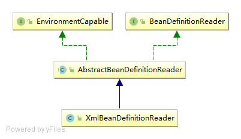
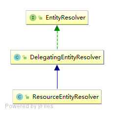

## 第一节学习

### ClassPathXmlApplicationContext

demo：com.der.day001.BaseStudy

```$xslt
ClassPathXmlApplicationContext context = new ClassPathXmlApplicationContext("classpath:spring-start.xml");
TestEntity bean = context.getBean(TestEntity.class);
bean.send();
context.close();

<?xml version="1.0" encoding="UTF-8"?>
<beans xmlns="http://www.springframework.org/schema/beans"
       xmlns:xsi="http://www.w3.org/2001/XMLSchema-instance"
       xsi:schemaLocation="http://www.springframework.org/schema/beans http://www.springframework.org/schema/beans/spring-beans.xsd">

    <bean class="com.der.domain.TestEntity" />
</beans>
```

整个继承体系如下:<br/>
<br/>
构造器源码：<br/>
```$xslt
public ClassPathXmlApplicationContext(
        String[] configLocations, boolean refresh, @Nullable ApplicationContext parent)
        throws BeansException {
    super(parent); -- ① -- ②
    setConfigLocations(configLocations); --③
    if (refresh) {
        refresh(); -- ④
    }
}
```

ClassPathXmlApplicationContext初始化步骤：<br/>
&nbsp;&nbsp;&nbsp;&nbsp;① ClassPathXmlApplicationContext继承父类直到AbstractApplicationContext调用getResourcePatternResolver获取资源解析器<br/>
&nbsp;&nbsp;&nbsp;&nbsp;② AbstractApplicationContext调用setParent方法设置父级ApplicationContext <br/>
``` AbstractApplicationContext的setParent方法
public void setParent(@Nullable ApplicationContext parent) {
    this.parent = parent;
    if (parent != null) {
        Environment parentEnvironment = parent.getEnvironment();
        if (parentEnvironment instanceof ConfigurableEnvironment) {
            getEnvironment().merge((ConfigurableEnvironment) parentEnvironment);
        }
    }
}
```
&nbsp;&nbsp;&nbsp;&nbsp;③ ClassPathXmlApplicationContext调用AbstractRefreshableConfigApplicationContext.setConfigLocations设置配置文件路径<br/>
``` AbstractRefreshableConfigApplicationContext.setConfigLocations
public void setConfigLocations(@Nullable String... locations) {
    if (locations != null) {
        Assert.noNullElements(locations, "Config locations must not be null");
        this.configLocations = new String[locations.length];
        for (int i = 0; i < locations.length; i++) {
            this.configLocations[i] = resolvePath(locations[i]).trim();
        }
    }
    else {
        this.configLocations = null;
    }
}
org.springframework.context.support.AbstractRefreshableConfigApplicationContext.resolvePath
protected String resolvePath(String path) {
    return getEnvironment().resolveRequiredPlaceholders(path);
}

此方法的目的在于将占位符(placeholder)解析成实际的地址。比如可以这么写: new ClassPathXmlApplicationContext("classpath:config.xml");那么classpath:就是需要被解析的。
getEnvironment方法来自于ConfigurableApplicationContext接口，源码很简单，如果为空就调用createEnvironment创建一个。
AbstractApplicationContext.createEnvironment:

protected ConfigurableEnvironment createEnvironment() {
    return new StandardEnvironment();
}
```
StandardEnvironment继承结构：<br/>
<br/>
StandardEnvironment在无参构造函数中调用父类AbstractEnvironment无参构造<br/>
AbstractEnvironment构造器<br/>
```$xslt
private final MutablePropertySources propertySources = new MutablePropertySources(this.logger);
public AbstractEnvironment() {
    customizePropertySources(this.propertySources);
}
```
PropertySources继承体系：<br/>
<br/>

``` 
org.springframework.core.env.StandardEnvironment.customizePropertySources
protected void customizePropertySources(MutablePropertySources propertySources) {
    propertySources.addLast(new PropertiesPropertySource("systemProperties", this.getSystemProperties()));
    propertySources.addLast(new SystemEnvironmentPropertySource("systemEnvironment", this.getSystemEnvironment()));
}

org.springframework.core.env.AbstractEnvironment.getSystemProperties
public Map<String, Object> getSystemProperties() {
    try {
        return (Map) System.getProperties();
    }
    catch (AccessControlException ex) {
        return (Map) new ReadOnlySystemAttributesMap() {
            @Override
            @Nullable
            protected String getSystemAttribute(String attributeName) {
                try {
                    return System.getProperty(attributeName);
                }
                catch (AccessControlException ex) {
                    if (logger.isInfoEnabled()) {
                        logger.info("Caught AccessControlException when accessing system property '" +
                                attributeName + "'; its value will be returned [null]. Reason: " + ex.getMessage());
                    }
                    return null;
                }
            }
        };
    }
}
//如果安全管理器阻止获取全部的系统属性，那么会尝试获取单个属性的可能性，如果还不行就抛异常了。
//getSystemEnvironment方法相同，不过最终调用的是System.getenv，可以获取jvm和OS的一些版本信息。
org.springframework.core.env.AbstractEnvironment.getSystemEnvironment
public Map<String, Object> getSystemEnvironment() {
    if (suppressGetenvAccess()) {
        return Collections.emptyMap();
    }
    try {
        return (Map) System.getenv();
    }
    catch (AccessControlException ex) {
        return (Map) new ReadOnlySystemAttributesMap() {
            @Override
            @Nullable
            protected String getSystemAttribute(String attributeName) {
                try {
                    return System.getenv(attributeName);
                }
                catch (AccessControlException ex) {
                    if (logger.isInfoEnabled()) {
                        logger.info("Caught AccessControlException when accessing system environment variable '" +
                                attributeName + "'; its value will be returned [null]. Reason: " + ex.getMessage());
                    }
                    return null;
                }
            }
        };
    }
}
```
classpath:spring-start.xml的路径解析：<br/>
``` 
org.springframework.context.support.AbstractRefreshableConfigApplicationContext#resolvePath
public String resolveRequiredPlaceholders(String text) throws IllegalArgumentException {
    return this.propertyResolver.resolveRequiredPlaceholders(text);
}
org.springframework.core.env.AbstractEnvironment.resolveRequiredPlaceholders
private final ConfigurablePropertyResolver propertyResolver = new PropertySourcesPropertyResolver(this.propertySources);
public String resolveRequiredPlaceholders(String text) throws IllegalArgumentException {
    return this.propertyResolver.resolveRequiredPlaceholders(text);
}
org.springframework.core.env.AbstractPropertyResolver.resolveRequiredPlaceholders
public String resolveRequiredPlaceholders(String text) throws IllegalArgumentException {
    if (this.strictHelper == null) {
        this.strictHelper = createPlaceholderHelper(false);
    }
    return doResolvePlaceholders(text, this.strictHelper);
}
org.springframework.core.env.AbstractPropertyResolver.createPlaceholderHelper
this.placeholderPrefix -- org.springframework.util.SystemPropertyUtils.PLACEHOLDER_PREFIX = "${";
this.placeholderSuffix -- org.springframework.util.SystemPropertyUtils.PLACEHOLDER_SUFFIX = "}";
this.valueSeparator -- org.springframework.util.SystemPropertyUtils.VALUE_SEPARATOR = ":";
private PropertyPlaceholderHelper createPlaceholderHelper(boolean ignoreUnresolvablePlaceholders) {
    return new PropertyPlaceholderHelper(this.placeholderPrefix, this.placeholderSuffix,
            this.valueSeparator, ignoreUnresolvablePlaceholders);
}
org.springframework.core.env.AbstractPropertyResolver.doResolvePlaceholders
private String doResolvePlaceholders(String text, PropertyPlaceholderHelper helper) {
    return helper.replacePlaceholders(text, this::getPropertyAsRawString);
}
org.springframework.core.env.PropertySourcesPropertyResolver.getPropertyAsRawString
protected String getPropertyAsRawString(String key) {
    return getProperty(key, String.class, false);
}
org.springframework.core.env.PropertySourcesPropertyResolver.getProperty(java.lang.String, java.lang.Class<T>, boolean)
protected <T> T getProperty(String key, Class<T> targetValueType, boolean resolveNestedPlaceholders) {
    if (this.propertySources != null) {
        for (PropertySource<?> propertySource : this.propertySources) {
            if (logger.isTraceEnabled()) {
                logger.trace("Searching for key '" + key + "' in PropertySource '" +
                        propertySource.getName() + "'");
            }
            Object value = propertySource.getProperty(key);
            if (value != null) {
                if (resolveNestedPlaceholders && value instanceof String) {
                    value = resolveNestedPlaceholders((String) value);
                }
                logKeyFound(key, propertySource, value);
                return convertValueIfNecessary(value, targetValueType);
            }
        }
    }
    if (logger.isTraceEnabled()) {
        logger.trace("Could not find key '" + key + "' in any property source");
    }
    return null;
}
从System.getProperty和System.getenv获取，但是由于环境变量是无法自定义的，所以其实此处只能通过System.setProperty指定。
```
<br/>
&nbsp;&nbsp;&nbsp;&nbsp;④ Spring bean解析<br/>
```
org.springframework.context.support.AbstractApplicationContext.refresh
public void refresh() throws BeansException, IllegalStateException {
    synchronized (this.startupShutdownMonitor) {  -- 对该实体类加锁，防止线程影响
        // Prepare this context for refreshing.
        prepareRefresh();

        // Tell the subclass to refresh the internal bean factory.
        ConfigurableListableBeanFactory beanFactory = obtainFreshBeanFactory(); -- BeanFactory创建

        // Prepare the bean factory for use in this context.
        prepareBeanFactory(beanFactory);

        try {
            // Allows post-processing of the bean factory in context subclasses.
            postProcessBeanFactory(beanFactory);

            // Invoke factory processors registered as beans in the context.
            invokeBeanFactoryPostProcessors(beanFactory);

            // Register bean processors that intercept bean creation.
            registerBeanPostProcessors(beanFactory);

            // Initialize message source for this context.
            initMessageSource();

            // Initialize event multicaster for this context.
            initApplicationEventMulticaster();

            // Initialize other special beans in specific context subclasses.
            onRefresh();

            // Check for listener beans and register them.
            registerListeners();

            // Instantiate all remaining (non-lazy-init) singletons.
            finishBeanFactoryInitialization(beanFactory);

            // Last step: publish corresponding event.
            finishRefresh();
        }

        catch (BeansException ex) {
            if (logger.isWarnEnabled()) {
                logger.warn("Exception encountered during context initialization - " +
                        "cancelling refresh attempt: " + ex);
            }

            // Destroy already created singletons to avoid dangling resources.
            destroyBeans();

            // Reset 'active' flag.
            cancelRefresh(ex);

            // Propagate exception to caller.
            throw ex;
        }

        finally {
            // Reset common introspection caches in Spring's core, since we
            // might not ever need metadata for singleton beans anymore...
            resetCommonCaches();
        }
    }
}
org.springframework.context.support.AbstractApplicationContext.prepareRefresh
protected void prepareRefresh() {
    // Switch to active.
    this.startupDate = System.currentTimeMillis();
    this.closed.set(false); -- 设置关闭状态为false
    this.active.set(true); -- 设置激活状态为true

    if (logger.isDebugEnabled()) {
        if (logger.isTraceEnabled()) {
            logger.trace("Refreshing " + this);
        }
        else {
            logger.debug("Refreshing " + getDisplayName());
        }
    }

    // Initialize any placeholder property sources in the context environment.
    initPropertySources(); 在上下文环境中初始化任何占位符属性来源

    // Validate that all properties marked as required are resolvable:
    // see ConfigurablePropertyResolver#setRequiredProperties
    getEnvironment().validateRequiredProperties(); -- 校验属性

    // Store pre-refresh ApplicationListeners...
    if (this.earlyApplicationListeners == null) {
        this.earlyApplicationListeners = new LinkedHashSet<>(this.applicationListeners);
    }
    else {
        // Reset local application listeners to pre-refresh state.
        this.applicationListeners.clear();
        this.applicationListeners.addAll(this.earlyApplicationListeners);
    }

    // Allow for the collection of early ApplicationEvents,
    // to be published once the multicaster is available...
    this.earlyApplicationEvents = new LinkedHashSet<>();
}

//属性校验
org.springframework.core.env.AbstractEnvironment.validateRequiredProperties
public void validateRequiredProperties() throws MissingRequiredPropertiesException {
    this.propertyResolver.validateRequiredProperties();
}
org.springframework.core.env.AbstractPropertyResolver.validateRequiredProperties
private final Set<String> requiredProperties = new LinkedHashSet<>();
public void validateRequiredProperties() {
    MissingRequiredPropertiesException ex = new MissingRequiredPropertiesException();
    for (String key : this.requiredProperties) {
        if (this.getProperty(key) == null) {
            ex.addMissingRequiredProperty(key);
        }
    }
    if (!ex.getMissingRequiredProperties().isEmpty()) {
        throw ex;
    }
}
requiredProperties是通过setRequiredProperties方法设置的，保存在一个list里面，默认是空的，也就是不需要校验任何属性。
public void setRequiredProperties(String... requiredProperties) {
    for (String key : requiredProperties) {
        this.requiredProperties.add(key);
    }
}
```
BeanFactory创建:<br/>
```
protected ConfigurableListableBeanFactory obtainFreshBeanFactory() {
    refreshBeanFactory();
    return getBeanFactory();
}
org.springframework.context.support.AbstractRefreshableApplicationContext.refreshBeanFactory
protected final void refreshBeanFactory() throws BeansException {
    if (hasBeanFactory()) { -- 如果已经有，销毁以前的
        destroyBeans();
        closeBeanFactory();
    }
    //创建了一个DefaultListableBeanFactory对象
    try {
        DefaultListableBeanFactory beanFactory = createBeanFactory(); -- 创建BeanFactory
        beanFactory.setSerializationId(getId());
        customizeBeanFactory(beanFactory); -- 定制化beanFactory
        loadBeanDefinitions(beanFactory);
        synchronized (this.beanFactoryMonitor) {
            this.beanFactory = beanFactory;
        }
    }
    catch (IOException ex) {
        throw new ApplicationContextException("I/O error parsing bean definition source for " + getDisplayName(), ex);
    }
}
```

```
创建默认的BeanFactory
protected DefaultListableBeanFactory createBeanFactory() {
    return new DefaultListableBeanFactory(getInternalParentBeanFactory());
}
```
<br/>
BeanFactory定制：<br/>
```
org.springframework.context.support.AbstractRefreshableApplicationContext.customizeBeanFactory
protected void customizeBeanFactory(DefaultListableBeanFactory beanFactory) {
    if (this.allowBeanDefinitionOverriding != null) {
        //默认false，不允许覆盖
        beanFactory.setAllowBeanDefinitionOverriding(this.allowBeanDefinitionOverriding);
    }
    if (this.allowCircularReferences != null) {
        //默认false，不允许循环引用
        beanFactory.setAllowCircularReferences(this.allowCircularReferences);
    }
}
```
Bean加载：<br/>
```
org.springframework.context.support.AbstractXmlApplicationContext.loadBeanDefinitions(org.springframework.beans.factory.support.DefaultListableBeanFactory)
核心加载Bean
protected void loadBeanDefinitions(DefaultListableBeanFactory beanFactory) throws BeansException, IOException {
    // Create a new XmlBeanDefinitionReader for the given BeanFactory.
    XmlBeanDefinitionReader beanDefinitionReader = new XmlBeanDefinitionReader(beanFactory);

    // Configure the bean definition reader with this context's
    // resource loading environment.
    beanDefinitionReader.setEnvironment(this.getEnvironment());
    beanDefinitionReader.setResourceLoader(this);
    beanDefinitionReader.setEntityResolver(new ResourceEntityResolver(this));

    // Allow a subclass to provide custom initialization of the reader,
    // then proceed with actually loading the bean definitions.
    initBeanDefinitionReader(beanDefinitionReader);
    loadBeanDefinitions(beanDefinitionReader);
}
```
创建一个新的XmlBeanDefinitionReader给定BeanFactory。<br/>
<br/>
<br/>