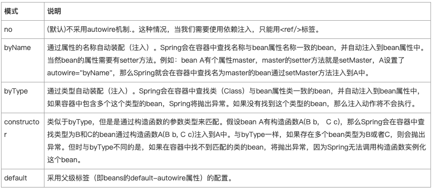

- [Spring - bean的autowire属性(自动装配)](#spring---bean%e7%9a%84autowire%e5%b1%9e%e6%80%a7%e8%87%aa%e5%8a%a8%e8%a3%85%e9%85%8d)

# Spring - bean的autowire属性(自动装配)

当我们要往一个bean的某个属性里注入另外一个bean，我们会使用<property> + <ref/>标签的形式。但是对于大型项目，假设有一个bean A被多个bean引用注入，
如果A的id因为某种原因修改了，那么所有引用了A的bean的<ref/>标签内容都得修改，这时候如果使用autowire="byType"，那么引用了A的bean就完全不用修改了。
autowire到底都什么用？我们继续往下看。

autowire的用法：
<bean id="auto" class="example.autoBean" autowire="byType"/>

autowire属性有5种模式，如下表：

其中byType和constructor模式也支持数组和强类型集合（即指定了集合元素类型）。如bean A有个属性定义是List<Foo>类型，Spring会在容器中查找所有类型为Foo的bean，
注入到该属性。记住是Foo，不是List。

另外如果集合和Map集合，那么Map的key必须是String类型，Spring会根据value的类型去匹配。例如有属性bean A中有一个属性为Map<String, Foo> p，
容器中有bean B和C类型均为Foo，那么A实例化完成后，p属性的值为：{"B"：B的实例对象，"C"：C的实例对象}。

除了可以给单独一个bean配置autowire属性，我们还可以给某个bean配置文件的<beans/>标签添加default-autowire属性。在<beans/>标签中指定default-autowire属性，
那么对于子标签<bean/>如果没有单独的设置autowire属性，那么将采用父标签<beans/>的default-autowire属性的模式，如果单独设置了autowire属性，则采用自己的模式。

虽然autowrie给我们带来配置的便利性，但是也有缺点，比如会导致bean的关系没那么显而易见，所以用autowire还是ref还是需要根据项目来决定。

**autowire-candidate**
前面我们说到配置有autowire属性的bean，Spring在实例化这个bean的时候会在容器中查找匹配的bean对autowire bean进行属性注入，这些被查找的bean我们称为候选bean。
作为候选bean，我凭什么就要被你用，老子不给你用。所以候选bean给自己增加了autowire-candidate="false"属性（默认是true），那么容器就不会把这个bean当做候选bean了，
即这个bean不会被当做自动装配对象。同样，<beans/>标签可以定义default-autowire-candidate="false"属性让它包含的所有bean都不做为候选bean。

