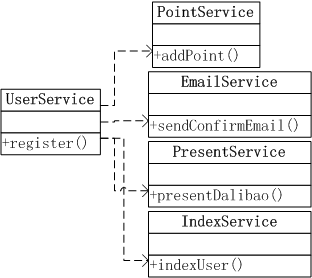
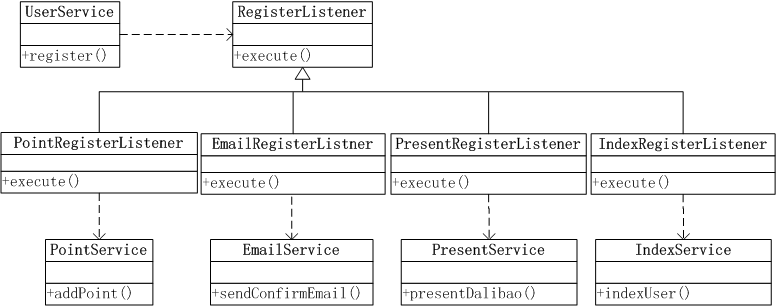
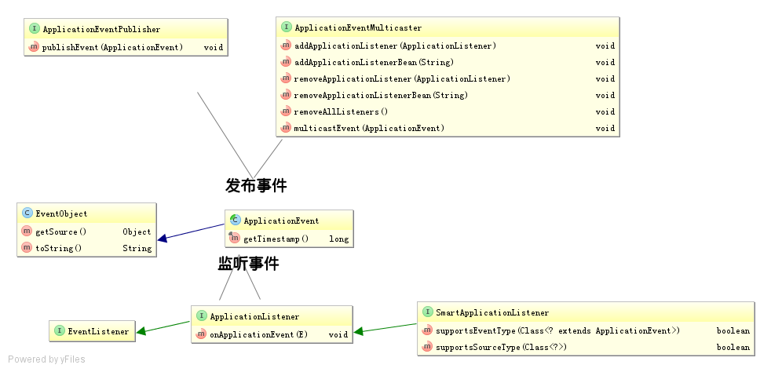
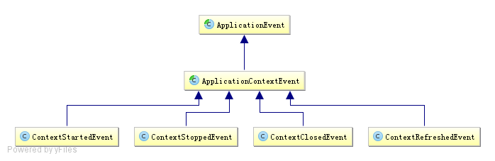
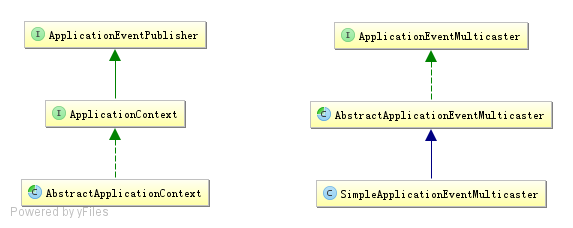

# Spring事件驱动模型

## 简介
事件驱动模型也就是我们常说的观察者，或者发布-订阅模型；理解它的几个关键点： 
首先是一种对象间的一对多的关系；最简单的如交通信号灯，信号灯是目标（一方），行人注视着信号灯（多方）； 
当目标发送改变（发布），观察者（订阅者）就可以接收到改变； 
观察者如何处理（如行人如何走，是快走/慢走/不走，目标不会管的），目标无需干涉；所以就松散耦合了它们之间的关系。 
eg: 
用户注册 
 

使用一个观察者来解耦这些Service之间的依赖关系 
 

典型的事件处理模型/观察者，**解耦目标对象和它的依赖对象，目标只需要通知它的依赖对象，具体怎么处理，依赖对象自己决定**。比如是异步还是同步，延迟还是非延迟等。 
**上边其实也使用了DIP（依赖倒置原则），依赖于抽象，而不是具体。** 
**IoC思想：即以前主动去创建它依赖的Service，现在只是被动等待别人注册进来。** 
**目的是**：松散耦合对象间的一对多的依赖关系 

**接口目的是抽象，抽象类目的是复用**

**在Java中接口还一个非常重要的好处：接口是可以多实现的，类/抽象类只能单继承，所以使用接口可以非常容易扩展新功能（还可以实现所谓的mixin），类/抽象类办不到。**

## Java GUI事件驱动模型/观察者 
JavaBean规范提供了JavaBean的PropertyEditorSupport及PropertyChangeListener支持。 
PropertyEditorSupport就是目标，而PropertyChangeListener就是监听器 

## Java提供的事件驱动模型/观察者抽象
JDK内部直接提供了观察者模式的抽象： 
目标：java.util.Observable，提供了目标需要的关键抽象：addObserver/deleteObserver/notifyObservers()等，具体请参考javadoc。 
观察者：java.util.Observer，提供了观察者需要的主要抽象：update(Observable o, Object arg)，
此处还提供了一种推模型（目标主动把数据通过arg推到观察者）/拉模型（目标需要根据o自己去拉数据，arg为null）。 

 ## Spring提供的事件驱动模型/观察者抽象
  
 **事件**
具体代表者是：ApplicationEvent： 
1、其继承自JDK的EventObject，JDK要求所有事件将继承它，并通过source得到事件源，比如我们的AWT事件体系也是继承自它； 
2、系统默认提供了如下ApplicationEvent事件实现： 
 
只有一个ApplicationContextEvent，表示ApplicationContext容器事件，且其又有如下实现： 
ContextStartedEvent：ApplicationContext启动后触发的事件；（目前版本没有任何作用） 
ContextStoppedEvent：ApplicationContext停止后触发的事件；（目前版本没有任何作用） 
ContextRefreshedEvent：ApplicationContext初始化或刷新完成后触发的事件；（容器初始化完成后调用） 
ContextClosedEvent：ApplicationContext关闭后触发的事件；（如web容器关闭时自动会触发spring容器的关闭，如果是普通java应用，需要调用ctx.registerShutdownHook();注册虚拟机关闭时的钩子才行） 
注：org.springframework.context.support.AbstractApplicationContext抽象类实现了LifeCycle的start和stop回调并发布ContextStartedEvent和ContextStoppedEvent事件；但是无任何实现调用它，所以目前无任何作用。 
**目标（发布事件者）** 
具体代表者是：ApplicationEventPublisher及ApplicationEventMulticaster，系统默认提供了如下实现：

