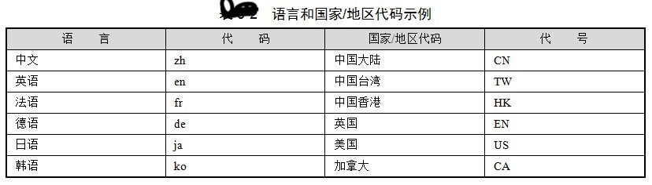
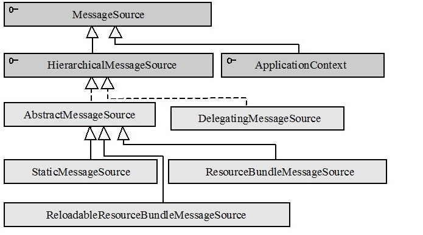

# AbstractApplicationContext的initMessageSource

国际化信息

“国际化信息”也称为“本地化信息”，一般需要两个条件才可以确定一个特定类型的本地化信息，它们分别是“语言类型”和“国家/地区的类型”。<br/>
如中文本地化信息既有中国大陆地区的中文，又有中国台湾、中国香港地区的中文，还有新加坡地区的中文。<br/>
Java通过java.util.Locale类表示一个本地化对象，它允许通过语言参数和国家/地区参数创建一个确定的本地化对象。<br/>

语言参数使用ISO标准语言代码表示，这些代码是由ISO-639标准定义的，每一种语言由两个小写字母表示。在许多网站上都可以找到这些代码的完整列表，<br/>
下面的网址是提供了标准语言代码的信息：<br/>
http://www.loc.gov/standards/iso639-2/php/English_list.php。<br/>

国家/地区参数也由标准的ISO国家/地区代码表示，这些代码是由ISO-3166标准定义的，每个国家/地区由两个大写字母表示。<br/>
用户可以从以下网址查看ISO-3166的标准代码：<br/>
http://www.iso.ch/iso/en/prods-services/iso3166ma/02iso-3166-code-lists/list-en1.html。<br/>
<br/>

## Locale
java.util.Locale是表示语言和国家/地区信息的本地化类，它是创建国际化应用的基础。下面给出几个创建本地化对象的示例：<br/>
```
//①带有语言和国家/地区信息的本地化对象  
Locale locale1 = new Locale("zh","CN");   
//②只有语言信息的本地化对象  
Locale locale2 = new Locale("zh");   
//③等同于Locale("zh","CN")  
Locale locale3 = Locale.CHINA;   
//④等同于Locale("zh")  
Locale locale4 = Locale.CHINESE;   
//⑤获取本地系统默认的本地化对象  
Locale locale 5= Locale.getDefault();  
```
用户既可以同时指定语言和国家/地区参数定义一个本地化对象①，也可以仅通过语言参数定义一个泛本地化对象②。<br/>
Locale类中通过静态常量定义了一些常用的本地化对象，③和④处就直接通过引用常量返回本地化对象。此外，用户还可以获取系统默认的本地化对象，如⑤所示。<br/>
`在测试时，如果希望改变系统默认的本地化设置，可以在启动JVM时通过命令参数指定：java -Duser.language=en -Duser.region=US MyTest。`<br/>

## 本地化工具类
JDK的java.util包中提供了几个支持本地化的格式化操作工具类：NumberFormat、DateFormat、MessageFormat。下面，我们分别通过实例了解它们的用法：
```
eg1:
Locale locale = new Locale("zh", "CN");  
NumberFormat currFmt = NumberFormat.getCurrencyInstance(locale);  
double amt = 123456.78;  
System.out.println(currFmt.format(amt));  
上面的实例通过NumberFormat按本地化的方式对货币金额进行格式化操作，运行实例，输出以下信息：
￥123,456.78  
eg2:
Locale locale = new Locale("en", "US");  
Date date = new Date();  
DateFormat df = DateFormat.getDateInstance(DateFormat.MEDIUM, locale);  
System.out.println(df.format(date));  
通过DateFormat#getDateInstance(int style,Locale locale)方法按本地化的方式对日期进行格式化操作。
该方法第一个入参为时间样式，第二个入参为本地化对象。运行以上代码，输出以下信息：
Jan 8, 2007  

MessageFormat在NumberFormat和DateFormat的基础上提供了强大的占位符字符串的格式化功能，它支持时间、货币、数字以及对象属性的格式化操作。
下面的实例演示了一些常见的格式化功能：
 //①信息格式化串  
String pattern1 = "{0}，你好！你于{1}在工商银行存入{2} 元。";  
String pattern2 = "At {1,time,short} On{1,date,long}，{0} paid {2,number, currency}.";  
//②用于动态替换占位符的参数  
Object[] params = {"John", new GregorianCalendar().getTime(),1.0E3};  
//③使用默认本地化对象格式化信息  
String msg1 = MessageFormat.format(pattern1,params);   
//④使用指定的本地化对象格式化信息  
MessageFormat mf = new MessageFormat(pattern2,Locale.US);   
String msg2 = mf.format(params);  
System.out.println(msg1);  
System.out.println(msg2);  
```
pattern1是简单形式的格式化信息串，通过{n}占位符指定动态参数的替换位置索引，{0}表示第一个参数，{1}表示第二个参数，以此类推。<br/>
pattern2格式化信息串比较复杂一些，除参数位置索引外，还指定了参数的类型和样式。从pattern2中可以看出格式化信息串的语法是很灵活的，<br/>
一个参数甚至可以出现在两个地方：如 {1,time,short}表示从第二个入参中获取时间部分的值，显示为短样式时间；而{1,date,long}表示从第二个入参中获取日期部分的值，<br/>
显示为长样式时间。关于MessageFormat更详细的使用方法，请参见JDK的Javadoc。<br/>
在②处，定义了用于替换格式化占位符的动态参数，这里，我们使用到了JDK5.0自动装包的语法，否则必须采用封装类表示基本类型的参数值。<br/>
在③处，通过MessageFormat的format()方法格式化信息串。它使用了系统默认的本地化对象，由于我们是中文平台，因此默认为Locale.CHINA。<br/>
而在④处，我们显式指定MessageFormat的本地化对象。<br/>

如果应用系统中某些信息需要支持国际化功能，则必须为希望支持的不同本地化类型分别提供对应的资源文件，并以规范的方式进行命名。
国际化资源文件的命名规范规定资源名称采用以下的方式进行命名：<资源名>_<语言代码>_<国家/地区代码>.properties     <br/>
其中，语言代码和国家/地区代码都是可选的。<资源名>.properties命名的国际化资源文件是默认的资源文件，即某个本地化类型在系统中找不到对应的资源文件，就采用这个默认的资源文件。
<资源名>_<语言代码>.properties命名的国际化资源文件是某一语言默认的资源文件，即某个本地化类型在系统中找不到精确匹配的资源文件，将采用相应语言默认的资源文件。<br/>
eg:<br/>
假设资源名为resource，则语言为英文，国家为美国，则与其对应的本地化资源文件命名为resource_en_US.properties。信息在资源文件以属性名/值的方式表示：
```
greeting.common=How are you!
greeting.morning = Good morning!
greeting.afternoon = Good Afternoon!
对应语言为中文，国家/地区为中国大陆的本地化资源文件则命名为resource_zh_ CN.properties，资源文件内容如下：
greeting.common=\u60a8\u597d\uff01
greeting.morning=\u65e9\u4e0a\u597d\uff01
greeting.afternoon=\u4e0b\u5348\u597d\uff01
```
本地化不同的同一资源文件，虽然属性值各不相同，但属性名却是相同的，这样应用程序就可以通过Locale对象和属性名精确调用到某个具体的属性值了。<br/>
`上面中文的本地化资源文件内容采用了特殊的编码表示中文字符，这是因为资源文件对文件内容有严格的要求：只能包含ASCII字符。所以必须将非ASCII字符的内容转换为Unicode代码的表示方式。
    如上面中文的resource_zh_CN.properties资源文件的三个属性值分别是“您好！”、“早上好！”和“下午好！”三个中文字符串对应的Unicode代码串。`


## MessageSource
Spring定义了访问国际化信息的MessageSource接口，并提供了几个易用的实现类。首先来了解一下该接口的几个重要方法：<br/>
- String getMessage(String code, Object[] args, String defaultMessage, Locale locale) code表示国际化资源中的属性名；
    args用于传递格式化串占位符所用的运行期参数；当在资源找不到对应属性名时，返回defaultMessage参数所指定的默认信息；locale表示本地化对象；
- String getMessage(String code, Object[] args, Locale locale) throws NoSuchMessageException
    与上面的方法类似，只不过在找不到资源中对应的属性名时，直接抛出NoSuchMessageException异常；
- String getMessage(MessageSourceResolvable resolvable, Locale locale) throws NoSuchMessageException
    MessageSourceResolvable 将属性名、参数数组以及默认信息封装起来，它的功能和第一个接口方法相同。

### MessageSource的类结构
MessageSource分别被HierarchicalMessageSource和ApplicationContext接口扩展，这里我们主要看一下HierarchicalMessageSource接口的几个实现类，如图所示：<br/>
<br/>
HierarchicalMessageSource接口添加了两个方法，建立父子层级的MessageSource结构，类似于前面我们所介绍的HierarchicalBeanFactory。
该接口的setParentMessageSource (MessageSource parent)方法用于设置父MessageSource，而getParentMessageSource()方法用于返回父MessageSource。<br/>
HierarchicalMessageSource接口最重要的两个实现类是ResourceBundleMessageSource和ReloadableResourceBundleMessageSource。
它们基于Java的ResourceBundle基础类实现，允许仅通过资源名加载国际化资源。ReloadableResourceBundleMessageSource提供了定时刷新功能，
允许在不重启系统的情况下，更新资源的信息。StaticMessageSource主要用于程序测试，它允许通过编程的方式提供国际化信息。
而DelegatingMessageSource是为方便操作父MessageSource而提供的代理类。<br/>

### ResourceBundleMessageSource
该实现类允许用户通过beanName指定一个资源名（包括类路径的全限定资源名），或通过beanNames指定一组资源名。
如下代码中(通过ResourceBundleMessageSource配置资源)，我们通过JDK的基础类完成了本地化的操作，下面我们使用ResourceBundleMessageSource来完成相同的任务。
读者可以比较两者的使用差别，并体会Spring所提供的国际化处理功能所带给我们的好处：
```
通过ResourceBundleMessageSource配置资源
<bean id="myResource"  
    class="org.springframework.context.support.ResourceBundleMessageSource">  
    <!--①通过基名指定资源，相对于类根路径-->  
    <property name="basenames">    
       <list>  
          <value>com/baobaotao/i18n/fmt_resource</value>  
       </list>  
    </property>  
</bean> 
启动Spring容器，并通过MessageSource访问配置的国际化资源
访问国际化消息：ResourceBundleMessageSource
String[] configs = {"com/baobaotao/i18n/beans.xml"};  
ApplicationContext ctx = new ClassPathXmlApplicationContext(configs);  
//①获取MessageSource的Bean  
MessageSource ms = (MessageSource)ctx.getBean("myResource");   
Object[] params = {"John", new GregorianCalendar(). getTime()};  
//②获取格式化的国际化信息  
String str1 = ms.getMessage("greeting.common",params,Locale.US);  
String str2 = ms.getMessage("greeting.morning",params,Locale.CHINA);  
String str3 = ms.getMessage("greeting.afternoon",params,Locale.CHINA);  
System.out.println(str1);  
System.out.println(str2);  
System.out.println(str3);
```

### ReloadableResourceBundleMessageSource
该实现类比之于ResourceBundleMessageSource的唯一区别在于它可以定时刷新资源文件，以便在应用程序不重启的情况下感知资源文件的变化。
很多生产系统都需要长时间持续运行，系统重启会给运行带来很大的负面影响。这时，通过该实现类就可以解决国际化信息更新的问题。请看下面的配置：
```
通过ReloadableResourceBundleMessageSource配置资源
<bean id="myResource" class="org.springframework.context.support.ReloadableResourceBundleMessageSource">  
    <property name="basenames">  
      <list>  
        <value>com/baobaotao/i18n/fmt_resource</value>  
      </list>  
    </property>  
    <!--① 刷新资源文件的周期，以秒为单位-->  
    <property name="cacheSeconds" value="5"/>   
</bean>  
在上面的配置中，我们通过cacheSeconds属性让ReloadableResourceBundleMessageSource每5秒钟刷新一次资源文件
（在真实的应用中，刷新周期不能太短，否则频繁的刷新将带来性能上的负面影响，一般不建议小于30分钟）。
cacheSeconds默认值为-1表示永不刷新，此时，该实现类的功能就蜕化为ResourceBundleMessageSource的功能。
测试ReloadableResourceBundleMessageSource刷新资源
String[] configs = {"com/baobaotao/i18n/beans.xml"};  
ApplicationContext ctx = new ClassPathXmlApplicationContext(configs);  
MessageSource ms = (MessageSource)ctx.getBean("myResource");  
Object[] params = {"John", new GregorianCalendar().getTime()};  
for (int i = 0; i < 2; i++) {  
    String str1 = ms.getMessage("greeting.common",params,Locale.US);      
    System.out.println(str1);  
    Thread.currentThread().sleep(20000); //①模拟程序应用，在此期间，我们更改资源文件   
}  
在①处，我们让程序睡眠20秒钟，在这期间，我们将fmt_resource_zh_CN.properties资源文件的greeting.common键值调整为：
---How are you!{0},today is {1}---
结果前后
How are you!John,today is 1/9/07 4:55 PM
---How are you!John,today is 1/9/07 4:55 PM---
```

## 容器级的国际化信息资源
MessageSource类图结构中，我们发现ApplicationContext实现了MessageSource的接口。也就是说ApplicationContext的实现类本身也是一个MessageSource对象。<br/>
国际化信息一般在系统输出信息时使用，如Spring MVC的页面标签，控制器Controller等，不同的模块都可能通过这些组件访问国际化信息，因此Spring就将国际化消息作为容器的公共基础设施对所有组件开放。

Spring容器的内部工作机制埋下了伏笔：在容器启动过程时，对Spring容器启动时的步骤进行剖析，initMessageSource()方法所执行的工作就是初始化容器中的国际化信息资源：
它根据反射机制从BeanDefinitionRegistry中找出名称为“messageSource”且类型为org.springframework.context.MessageSource的Bean，将这个Bean定义的信息资源加载为容器级的国际化信息资源。请看下面的配置：
```
容器级资源的配置
<!--①注册资源Bean,其Bean名称只能为messageSource -->  
<bean id="messageSource"   
      class="org.springframework.context.support.ResourceBundleMessageSource">  
  <property name="basenames">  
     <list>  
       <value>com/baobaotao/i18n/fmt_resource</value>  
     </list>  
  </property>  
</bean> 
通过ApplicationContext直接访问国际化信息
String[] configs = {"com/baobaotao/i18n/beans.xml"};  
ApplicationContext ctx = new ClassPathXmlApplicationContext(configs);  
//①直接通过容器访问国际化信息  
Object[] params = {"John", new GregorianCalendar().getTime()};  
String str1 = ctx.getMessage("greeting.common",params,Locale.US);  
String str2 = ctx.getMessage("greeting.morning",params,Locale.CHINA);     
System.out.println(str1);  
System.out.println(str2); 
ps:假设MessageSource Bean名字没有命名为“messageSource”，以上代码将抛出NoSuchMessageException异常。
```


