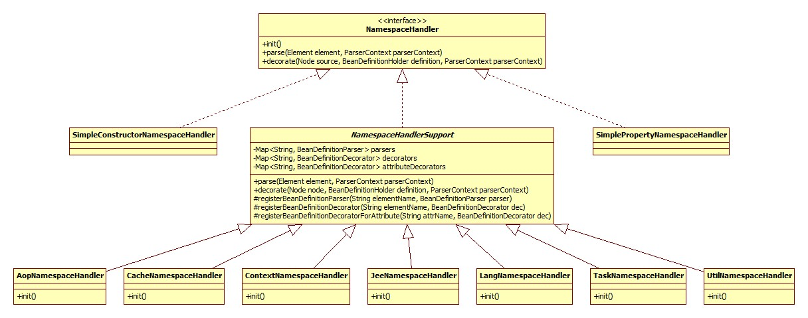

# NamespaceHandler继承体系

 

## init 初始化

resolve中调用了其init方法，此方法用以向NamespaceHandler对象注册BeanDefinitionParser对象。
此接口用以解析顶层(beans下)的非默认命名空间元素，比如<context:annotation-config />。
所以这样逻辑就很容易理解了: 每种子标签的解析仍是策略模式的体现，init负责向父类NamespaceHandlerSupport注册不同的策略，
由父类的NamespaceHandlerSupport.parse方法根据具体的子标签调用相应的策略完成解析的过程。