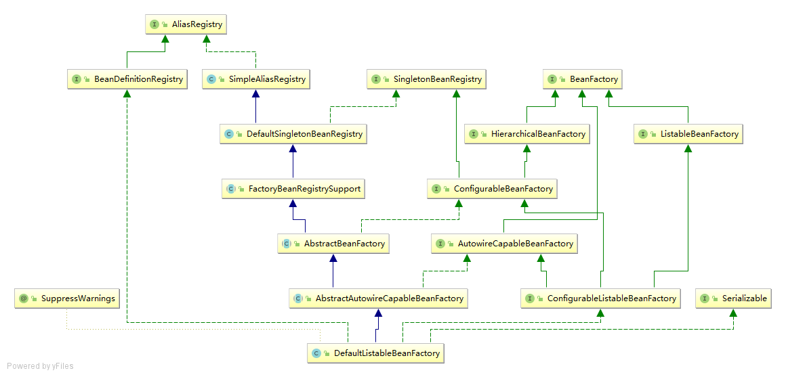
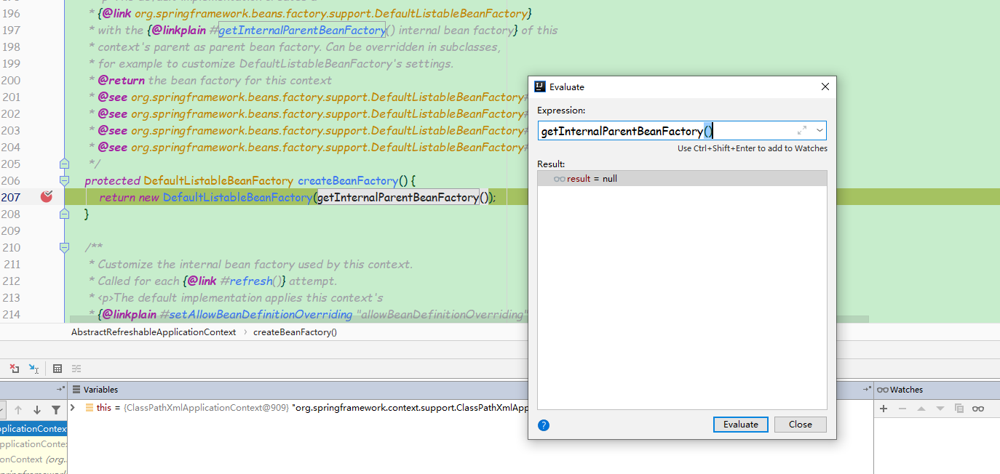
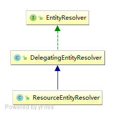

- [obtainFreshBeanFactory](#obtainfreshbeanfactory)
  - [刷新BeanFactory](#%e5%88%b7%e6%96%b0beanfactory)
    - [创建默认的BeanFactory](#%e5%88%9b%e5%bb%ba%e9%bb%98%e8%ae%a4%e7%9a%84beanfactory)
    - [定制化beanFactory：<br/>](#%e5%ae%9a%e5%88%b6%e5%8c%96beanfactorybr)
    - [Bean加载：<br/>](#bean%e5%8a%a0%e8%bd%bdbr)
    - [创建一个新的XmlBeanDefinitionReader给定BeanFactory。<br/>](#%e5%88%9b%e5%bb%ba%e4%b8%80%e4%b8%aa%e6%96%b0%e7%9a%84xmlbeandefinitionreader%e7%bb%99%e5%ae%9abeanfactorybr)
    - [解析路径资源](#%e8%a7%a3%e6%9e%90%e8%b7%af%e5%be%84%e8%b5%84%e6%ba%90)
      - [获取资源文件 -- Resource是代表一种资源的接口](#%e8%8e%b7%e5%8f%96%e8%b5%84%e6%ba%90%e6%96%87%e4%bb%b6----resource%e6%98%af%e4%bb%a3%e8%a1%a8%e4%b8%80%e7%a7%8d%e8%b5%84%e6%ba%90%e7%9a%84%e6%8e%a5%e5%8f%a3)
      - [解析资源文件内容](#%e8%a7%a3%e6%9e%90%e8%b5%84%e6%ba%90%e6%96%87%e4%bb%b6%e5%86%85%e5%ae%b9)
        - [加载文件到内存](#%e5%8a%a0%e8%bd%bd%e6%96%87%e4%bb%b6%e5%88%b0%e5%86%85%e5%ad%98)
        - [Bean解析](#bean%e8%a7%a3%e6%9e%90)
          - [org.springframework.beans.factory.xml.DefaultBeanDefinitionDocumentReader.registerBeanDefinitions](#orgspringframeworkbeansfactoryxmldefaultbeandefinitiondocumentreaderregisterbeandefinitions)

# obtainFreshBeanFactory

```
org.springframework.context.support.AbstractApplicationContext.obtainFreshBeanFactory
protected ConfigurableListableBeanFactory obtainFreshBeanFactory() {
    refreshBeanFactory();
    return getBeanFactory();
}
```
## 刷新BeanFactory
```
org.springframework.context.support.AbstractRefreshableApplicationContext.refreshBeanFactory
protected final void refreshBeanFactory() throws BeansException {
    if (hasBeanFactory()) { -- 如果已经有，销毁以前的
        destroyBeans();
        closeBeanFactory();
    }
    //创建了一个DefaultListableBeanFactory对象
    try {
        DefaultListableBeanFactory beanFactory = createBeanFactory(); -- 创建BeanFactory ⬇️
        beanFactory.setSerializationId(getId());
        customizeBeanFactory(beanFactory); -- 定制化beanFactory
        loadBeanDefinitions(beanFactory);
        synchronized (this.beanFactoryMonitor) {
            this.beanFactory = beanFactory;
        }
    }
    catch (IOException ex) {
        throw new ApplicationContextException("I/O error parsing bean definition source for " + getDisplayName(), ex);
    }
}
```
### 创建默认的BeanFactory

```
创建默认的BeanFactory
protected DefaultListableBeanFactory createBeanFactory() {
    return new DefaultListableBeanFactory(getInternalParentBeanFactory());
}
```
<br/>

### 定制化beanFactory：<br/>
```
org.springframework.context.support.AbstractRefreshableApplicationContext.customizeBeanFactory
protected void customizeBeanFactory(DefaultListableBeanFactory beanFactory) {
    if (this.allowBeanDefinitionOverriding != null) {
        //默认false，不允许覆盖
        beanFactory.setAllowBeanDefinitionOverriding(this.allowBeanDefinitionOverriding);
    }
    if (this.allowCircularReferences != null) {
        //默认false，不允许循环引用
        beanFactory.setAllowCircularReferences(this.allowCircularReferences);
    }
}
```

### Bean加载：<br/>
```
org.springframework.context.support.AbstractXmlApplicationContext.loadBeanDefinitions(org.springframework.beans.factory.support.DefaultListableBeanFactory)
核心加载Bean
protected void loadBeanDefinitions(DefaultListableBeanFactory beanFactory) throws BeansException, IOException {
    // Create a new XmlBeanDefinitionReader for the given BeanFactory.
    XmlBeanDefinitionReader beanDefinitionReader = new XmlBeanDefinitionReader(beanFactory);  ⬇️

    // 配置resourceEesolver和环境信息
    // resource loading environment.
    beanDefinitionReader.setEnvironment(this.getEnvironment());
    beanDefinitionReader.setResourceLoader(this);
    beanDefinitionReader.setEntityResolver(new ResourceEntityResolver(this));

    // Allow a subclass to provide custom initialization of the reader,
    // then proceed with actually loading the bean definitions.
    // 将新的bean定义读取器初始化 -- 空实现
    initBeanDefinitionReader(beanDefinitionReader);
    // 解析路径
    loadBeanDefinitions(beanDefinitionReader);
}
```

### 创建一个新的XmlBeanDefinitionReader给定BeanFactory。<br/>
<br/>
EntityResolver接口在org.xml.sax中定义。DelegatingEntityResolver用于schema和dtd的解析。进行路径解析

### 解析路径资源
```
org.springframework.context.support.AbstractXmlApplicationContext.loadBeanDefinitions(org.springframework.beans.factory.xml.XmlBeanDefinitionReader)
protected void loadBeanDefinitions(XmlBeanDefinitionReader reader) throws BeansException, IOException {
    Resource[] configResources = getConfigResources();
    if (configResources != null) {
        reader.loadBeanDefinitions(configResources);
    }
    String[] configLocations = getConfigLocations();
    if (configLocations != null) {
        reader.loadBeanDefinitions(configLocations);
    }
}
org.springframework.beans.factory.support.AbstractBeanDefinitionReader.loadBeanDefinitions(java.lang.String...)
public int loadBeanDefinitions(String... locations) throws BeanDefinitionStoreException {
    Assert.notNull(locations, "Location array must not be null");
    int count = 0;
    for (String location : locations) {
        count += loadBeanDefinitions(location);
    }
    return count;
}
org.springframework.beans.factory.support.AbstractBeanDefinitionReader.loadBeanDefinitions(java.lang.String, java.util.Set<org.springframework.core.io.Resource>)
public int loadBeanDefinitions(String location, @Nullable Set<Resource> actualResources) throws BeanDefinitionStoreException {
    //getResource的实现在AbstractApplicationContext：
    ResourceLoader resourceLoader = getResourceLoader();
    if (resourceLoader == null) {
        throw new BeanDefinitionStoreException(
                "Cannot load bean definitions from location [" + location + "]: no ResourceLoader available");
    }

    if (resourceLoader instanceof ResourcePatternResolver) {
        // Resource pattern matching available.
        try {
            //获取资源的方法在org.springframework.core.io.support.PathMatchingResourcePatternResolver.getResources
            //加载
            Resource[] resources = ((ResourcePatternResolver) resourceLoader).getResources(location);
            //解析
            //最终逐个调用XmlBeanDefinitionReader的loadBeanDefinitions方法
            //Resource是代表一种资源的接口
            //最终调用接口org.springframework.beans.factory.xml.XmlBeanDefinitionReader.loadBeanDefinitions(org.springframework.core.io.support.EncodedResource)
            int count = loadBeanDefinitions(resources);
            if (actualResources != null) {
                Collections.addAll(actualResources, resources);
            }
            if (logger.isTraceEnabled()) {
                logger.trace("Loaded " + count + " bean definitions from location pattern [" + location + "]");
            }
            return count;
        }
        catch (IOException ex) {
            throw new BeanDefinitionStoreException(
                    "Could not resolve bean definition resource pattern [" + location + "]", ex);
        }
    }
    else {
        // Can only load single resources by absolute URL.
        Resource resource = resourceLoader.getResource(location);
        int count = loadBeanDefinitions(resource);
        if (actualResources != null) {
            actualResources.add(resource);
        }
        if (logger.isTraceEnabled()) {
            logger.trace("Loaded " + count + " bean definitions from location [" + location + "]");
        }
        return count;
    }
}
```
#### 获取资源文件 -- Resource是代表一种资源的接口
```
org.springframework.core.io.support.PathMatchingResourcePatternResolver.getResources
public Resource[] getResources(String locationPattern) throws IOException {
    Assert.notNull(locationPattern, "Location pattern must not be null");
    if (locationPattern.startsWith(CLASSPATH_ALL_URL_PREFIX)) {
        // a class path resource (multiple resources for same name possible)
        if (getPathMatcher().isPattern(locationPattern.substring(CLASSPATH_ALL_URL_PREFIX.length()))) {
            // a class path resource pattern
            return findPathMatchingResources(locationPattern);
        }
        else {
            // all class path resources with the given name
            return findAllClassPathResources(locationPattern.substring(CLASSPATH_ALL_URL_PREFIX.length()));
        }
    }
    else {
        // Generally only look for a pattern after a prefix here,
        // and on Tomcat only after the "*/" separator for its "war:" protocol.
        int prefixEnd = (locationPattern.startsWith("war:") ? locationPattern.indexOf("*/") + 1 :
                locationPattern.indexOf(':') + 1);
        if (getPathMatcher().isPattern(locationPattern.substring(prefixEnd))) {
            // a file pattern
            return findPathMatchingResources(locationPattern);
        }
        else {
            // a single resource with the given name
            return new Resource[] {getResourceLoader().getResource(locationPattern)};
        }
    }
}
```

#### 解析资源文件内容
```
XmlBeanDefinitionReader的loadBeanDefinitions方法
org.springframework.beans.factory.xml.XmlBeanDefinitionReader.loadBeanDefinitions(org.springframework.core.io.Resource)
public int loadBeanDefinitions(Resource resource) throws BeanDefinitionStoreException {
    return loadBeanDefinitions(new EncodedResource(resource));
}
资源解析部分
org.springframework.beans.factory.xml.XmlBeanDefinitionReader.loadBeanDefinitions(org.springframework.core.io.support.EncodedResource)
InputStream inputStream = encodedResource.getResource().getInputStream();
try {
    InputSource inputSource = new InputSource(inputStream);
    if (encodedResource.getEncoding() != null) {
        inputSource.setEncoding(encodedResource.getEncoding());
    }
    return doLoadBeanDefinitions(inputSource, encodedResource.getResource());
}
org.springframework.beans.factory.xml.XmlBeanDefinitionReader.doLoadBeanDefinitions
protected int doLoadBeanDefinitions(InputSource inputSource, Resource resource)
        throws BeanDefinitionStoreException {
    try {
        Document doc = doLoadDocument(inputSource, resource);  ⬇️
        int count = registerBeanDefinitions(doc, resource); //Bean解析  ⬇️
        if (logger.isDebugEnabled()) {
            logger.debug("Loaded " + count + " bean definitions from " + resource);
        }
        return count;
    }
    catch (BeanDefinitionStoreException ex) {
        throw ex;
    }
    catch (SAXParseException ex) {
        throw new XmlBeanDefinitionStoreException(resource.getDescription(),
                "Line " + ex.getLineNumber() + " in XML document from " + resource + " is invalid", ex);
    }
    catch (SAXException ex) {
        throw new XmlBeanDefinitionStoreException(resource.getDescription(),
                "XML document from " + resource + " is invalid", ex);
    }
    catch (ParserConfigurationException ex) {
        throw new BeanDefinitionStoreException(resource.getDescription(),
                "Parser configuration exception parsing XML from " + resource, ex);
    }
    catch (IOException ex) {
        throw new BeanDefinitionStoreException(resource.getDescription(),
                "IOException parsing XML document from " + resource, ex);
    }
    catch (Throwable ex) {
        throw new BeanDefinitionStoreException(resource.getDescription(),
                "Unexpected exception parsing XML document from " + resource, ex);
    }
}
```
##### 加载文件到内存
```
documentLoader是一个DefaultDocumentLoader对象，此类是DocumentLoader接口的唯一实现。getEntityResolver方法返回ResourceEntityResolver。
errorHandler是一个SimpleSaxErrorHandler对象。
校验模型其实就是确定xml文件使用xsd方式还是dtd方式来校验。Spring会通过读取xml文件的方式判断应该采用哪种。
NamespaceAware默认false，因为默认配置了校验为true。
DefaultDocumentLoader.loadDocument:
protected Document doLoadDocument(InputSource inputSource, Resource resource) throws Exception {
    return this.documentLoader.loadDocument(inputSource, getEntityResolver(), this.errorHandler,
            getValidationModeForResource(resource), isNamespaceAware());
}
```
<br/>
```
public Document loadDocument(InputSource inputSource, EntityResolver entityResolver,
			ErrorHandler errorHandler, int validationMode, boolean namespaceAware) throws Exception {
    DocumentBuilderFactory factory = createDocumentBuilderFactory(validationMode, namespaceAware);
    if (logger.isTraceEnabled()) {
        logger.trace("Using JAXP provider [" + factory.getClass().getName() + "]");
    }
    DocumentBuilder builder = createDocumentBuilder(factory, entityResolver, errorHandler);
    return builder.parse(inputSource);
}
protected DocumentBuilderFactory createDocumentBuilderFactory(int validationMode, boolean namespaceAware)
			throws ParserConfigurationException {
    DocumentBuilderFactory factory = DocumentBuilderFactory.newInstance();
    factory.setNamespaceAware(namespaceAware);
    if (validationMode != XmlValidationModeDetector.VALIDATION_NONE) {
        //此方法设置为仅对dtd有效，xsd无效
        factory.setValidating(true);
        if (validationMode == XmlValidationModeDetector.VALIDATION_XSD) {
            // Enforce namespace aware for XSD...
            //开启xsd(schema)支持
            // Enforce namespace aware for XSD...
            factory.setNamespaceAware(true);
            try {
                factory.setAttribute(SCHEMA_LANGUAGE_ATTRIBUTE, XSD_SCHEMA_LANGUAGE);
            }
            catch (IllegalArgumentException ex) {
                ParserConfigurationException pcex = new ParserConfigurationException(
                        "Unable to validate using XSD: Your JAXP provider [" + factory +
                        "] does not support XML Schema. Are you running on Java 1.4 with Apache Crimson? " +
                        "Upgrade to Apache Xerces (or Java 1.5) for full XSD support.");
                pcex.initCause(ex);
                throw pcex;
            }
        }
    }
    return factory;
}
```

##### Bean解析
```
开始注册bean
public int registerBeanDefinitions(Document doc, Resource resource) throws BeanDefinitionStoreException {
    BeanDefinitionDocumentReader documentReader = createBeanDefinitionDocumentReader();
    int countBefore = getRegistry().getBeanDefinitionCount();
    documentReader.registerBeanDefinitions(doc, createReaderContext(resource)); ⬇️
    return getRegistry().getBeanDefinitionCount() - countBefore;
}
org.springframework.beans.factory.xml.XmlBeanDefinitionReader.createBeanDefinitionDocumentReader
protected BeanDefinitionDocumentReader createBeanDefinitionDocumentReader() {
    //documentReaderClass默认是DefaultBeanDefinitionDocumentReader，这其实也是策略模式，通过setter方法可以更换其实现。
    return BeanUtils.instantiateClass(this.documentReaderClass);
}
org.springframework.beans.factory.xml.XmlBeanDefinitionReader.createReaderContext
public XmlReaderContext createReaderContext(Resource resource) {
    //problemReporter是一个FailFastProblemReporter对象。
    //eventListener是EmptyReaderEventListener对象，此类里的方法都是空实现。
    //sourceExtractor是NullSourceExtractor对象，直接返回空，也是空实现。
    //getNamespaceHandlerResolver默认返回DefaultNamespaceHandlerResolver对象，用来获取xsd对应的处理器。
    //XmlReaderContext的作用感觉就是这一堆参数的容器，糅合到一起传给DocumentReader，并美其名为Context。可以看出，Spring中到处都是策略模式，大量操作被抽象成接口。
    return new XmlReaderContext(resource, this.problemReporter, this.eventListener,
            this.sourceExtractor, this, getNamespaceHandlerResolver());
}
```
###### org.springframework.beans.factory.xml.DefaultBeanDefinitionDocumentReader.registerBeanDefinitions
```
public void registerBeanDefinitions(Document doc, XmlReaderContext readerContext) {
    this.readerContext = readerContext;
    doRegisterBeanDefinitions(doc.getDocumentElement());
}
org.springframework.beans.factory.xml.DefaultBeanDefinitionDocumentReader.doRegisterBeanDefinitions
protected void doRegisterBeanDefinitions(Element root) {
    // Any nested <beans> elements will cause recursion in this method. In
    // order to propagate and preserve <beans> default-* attributes correctly,
    // keep track of the current (parent) delegate, which may be null. Create
    // the new (child) delegate with a reference to the parent for fallback purposes,
    // then ultimately reset this.delegate back to its original (parent) reference.
    // this behavior emulates a stack of delegates without actually necessitating one.
    // delegate的作用在于处理beans标签的嵌套，其实Spring配置文件是可以写成这样的:
    //----
    <?xml version="1.0" encoding="UTF-8"?>    
    <beans>    
        <bean class="base.SimpleBean"></bean>
        <beans>
            <bean class="java.lang.Object"></bean>
        </beans>
    </beans>
    ----//
    BeanDefinitionParserDelegate parent = this.delegate;
    this.delegate = createDelegate(getReaderContext(), root, parent);
    //默认的命名空间即
    //http://www.springframework.org/schema/beans
    if (this.delegate.isDefaultNamespace(root)) {
        //检查profile属性
        String profileSpec = root.getAttribute(PROFILE_ATTRIBUTE);
        if (StringUtils.hasText(profileSpec)) {
            //----
            xml(schema)的命名空间其实类似于java的报名，命名空间采用URL，比如Spring的是这样:
            <?xml version="1.0" encoding="UTF-8"?>    
            <beans xmlns="http://www.springframework.org/schema/beans"></beans>
            ----//
            //profile属性可以分割 ⬇️
            String[] specifiedProfiles = StringUtils.tokenizeToStringArray(
                    profileSpec, BeanDefinitionParserDelegate.MULTI_VALUE_ATTRIBUTE_DELIMITERS);
            // We cannot use Profiles.of(...) since profile expressions are not supported
            // in XML config. See SPR-12458 for details.
            if (!getReaderContext().getEnvironment().acceptsProfiles(specifiedProfiles)) {
                if (logger.isDebugEnabled()) {
                    logger.debug("Skipped XML bean definition file due to specified profiles [" + profileSpec +
                            "] not matching: " + getReaderContext().getResource());
                }
                return;
            }
        }
    }
    //preProcessXml方法是个空实现，供子类去覆盖，目的在于给子类一个把我们自定义的标签转为Spring标准标签的机会
    preProcessXml(root);
    //对于非默认命名空间的元素交由delegate处理
    parseBeanDefinitions(root, this.delegate); ⬇️
    postProcessXml(root);

    this.delegate = parent;
}
```
####### profile的检查, AbstractEnvironment.acceptsProfiles:
```
org.springframework.core.env.AbstractEnvironment.acceptsProfiles(java.lang.String...)
public boolean acceptsProfiles(String... profiles) {
    Assert.notEmpty(profiles, "Must specify at least one profile");
    for (String profile : profiles) {
        //profile属性支持!取反
        if (StringUtils.hasLength(profile) && profile.charAt(0) == '!') {
            if (!isProfileActive(profile.substring(1))) {
                return true;
            }
        }
        else if (isProfileActive(profile)) {
            return true;
        }
    }
    return false;
}
```
####### 对于非默认命名空间的元素交由delegate处理
```
org.springframework.beans.factory.xml.DefaultBeanDefinitionDocumentReader.parseBeanDefinitions
protected void parseBeanDefinitions(Element root, BeanDefinitionParserDelegate delegate) {
    if (delegate.isDefaultNamespace(root)) {
        NodeList nl = root.getChildNodes();
        for (int i = 0; i < nl.getLength(); i++) {
            Node node = nl.item(i);
            if (node instanceof Element) {
                Element ele = (Element) node;
                if (delegate.isDefaultNamespace(ele)) {
                    parseDefaultElement(ele, delegate);
                }
                else {
                    delegate.parseCustomElement(ele);
                }
            }
        }
    }
    else {
        delegate.parseCustomElement(root);
    }
}
默认命名空间解析
private void parseDefaultElement(Element ele, BeanDefinitionParserDelegate delegate) {
    if (delegate.nodeNameEquals(ele, IMPORT_ELEMENT)) {
        //引入其他文件
        // importBeanDefinitionResource加载方式和之前的配置文件加载完全一样，不过注意被import进来的文件是先于当前文件被解析的
        //----
        eg：
        <import resource="CTIContext.xml" />
        <import resource="customerContext.xml" />
        ----//
        importBeanDefinitionResource(ele);
    }
    else if (delegate.nodeNameEquals(ele, ALIAS_ELEMENT)) {
        //解析alias元素
        //加入有一个bean名为componentA-dataSource，但是另一个组件想以componentB-dataSource的名字使用，就可以这样定义:
        //----
        eg：<alias name="componentA-dataSource" alias="componentB-dataSource"/>
        ----//
        processAliasRegistration(ele); ⬇️
    }
    else if (delegate.nodeNameEquals(ele, BEAN_ELEMENT)) {
        //解析bean元素  -- 主要理解
        processBeanDefinition(ele, delegate); ⬇️
    }
    else if (delegate.nodeNameEquals(ele, NESTED_BEANS_ELEMENT)) {
        // recurse
        // 解析beans元素
        // beans元素的嵌套直接递归调用DefaultBeanDefinitionDocumentReader.parseBeanDefinitions。
        doRegisterBeanDefinitions(ele);
    }
}
```
####### alias元素解析
```
org.springframework.beans.factory.xml.DefaultBeanDefinitionDocumentReader.processAliasRegistration
protected void processAliasRegistration(Element ele) {
    String name = ele.getAttribute(NAME_ATTRIBUTE);
    String alias = ele.getAttribute(ALIAS_ATTRIBUTE);
    boolean valid = true;
    if (!StringUtils.hasText(name)) {
        getReaderContext().error("Name must not be empty", ele);
        valid = false;
    }
    if (!StringUtils.hasText(alias)) {
        getReaderContext().error("Alias must not be empty", ele);
        valid = false;
    }
    if (valid) {
        try {
            getReaderContext().getRegistry().registerAlias(name, alias); ⬇️
        }
        catch (Exception ex) {
            getReaderContext().error("Failed to register alias '" + alias +
                    "' for bean with name '" + name + "'", ele, ex);
        }
        getReaderContext().fireAliasRegistered(name, alias, extractSource(ele));
    }
}
org.springframework.core.SimpleAliasRegistry.registerAlias
public void registerAlias(String name, String alias) {
    Assert.hasText(name, "'name' must not be empty");
    Assert.hasText(alias, "'alias' must not be empty");
    //别名关系的保存使用Map完成，key为别名，value为本来的名字。
    synchronized (this.aliasMap) {
        //名字和别名一样
        if (alias.equals(name)) {
            this.aliasMap.remove(alias);
            if (logger.isDebugEnabled()) {
                logger.debug("Alias definition '" + alias + "' ignored since it points to same name");
            }
        }
        else {
            String registeredName = this.aliasMap.get(alias);
            if (registeredName != null) {
                if (registeredName.equals(name)) {
                    // An existing alias - no need to re-register
                    return;
                }
                if (!allowAliasOverriding()) {
                    throw new IllegalStateException("Cannot define alias '" + alias + "' for name '" +
                            name + "': It is already registered for name '" + registeredName + "'.");
                }
                if (logger.isDebugEnabled()) {
                    logger.debug("Overriding alias '" + alias + "' definition for registered name '" +
                            registeredName + "' with new target name '" + name + "'");
                }
            }
            checkForAliasCircle(name, alias);
            this.aliasMap.put(alias, name);
            if (logger.isTraceEnabled()) {
                logger.trace("Alias definition '" + alias + "' registered for name '" + name + "'");
            }
        }
    }
}
```
####### bean元素解析
```
org.springframework.beans.factory.xml.DefaultBeanDefinitionDocumentReader.processBeanDefinition
protected void processBeanDefinition(Element ele, BeanDefinitionParserDelegate delegate) {
    BeanDefinitionHolder bdHolder = delegate.parseBeanDefinitionElement(ele);  ⬇️ -- id和name处理
    if (bdHolder != null) {
        bdHolder = delegate.decorateBeanDefinitionIfRequired(ele, bdHolder);  ⬇️ -- bean注册
        try {
            // Register the final decorated instance.
            BeanDefinitionReaderUtils.registerBeanDefinition(bdHolder, getReaderContext().getRegistry());
        }
        catch (BeanDefinitionStoreException ex) {
            getReaderContext().error("Failed to register bean definition with name '" +
                    bdHolder.getBeanName() + "'", ele, ex);
        }
        // Send registration event.
        // 空实现
        getReaderContext().fireComponentRegistered(new BeanComponentDefinition(bdHolder));
    }
}
```
######## id和name处理
```
首先获取到id和name属性，name属性支持配置多个，以逗号分隔，如果没有指定id，那么将以第一个name属性值代替。
id必须是唯一的，name属性其实是alias的角色，可以和其它的bean重复，如果name也没有配置，那么其实什么也没做。
org.springframework.beans.factory.xml.BeanDefinitionParserDelegate.parseBeanDefinitionElement(org.w3c.dom.Element, org.springframework.beans.factory.config.BeanDefinition)
public BeanDefinitionHolder parseBeanDefinitionElement(Element ele, @Nullable BeanDefinition containingBean) {
    String id = ele.getAttribute(ID_ATTRIBUTE);
    String nameAttr = ele.getAttribute(NAME_ATTRIBUTE);
    List<String> aliases = new ArrayList<>();
    //对name属性使用，进行分割
    if (StringUtils.hasLength(nameAttr)) {
        //按,分隔
        String[] nameArr = StringUtils.tokenizeToStringArray(nameAttr, MULTI_VALUE_ATTRIBUTE_DELIMITERS);
        aliases.addAll(Arrays.asList(nameArr));
    }
    String beanName = id;
    if (!StringUtils.hasText(beanName) && !aliases.isEmpty()) {
        //name的第一个值作为id
        beanName = aliases.remove(0);
        if (logger.isTraceEnabled()) {
            logger.trace("No XML 'id' specified - using '" + beanName +
                    "' as bean name and " + aliases + " as aliases");
        }
    }
    //默认null
    if (containingBean == null) {
        //校验id是否已重复，如果重复直接抛异常
        //校验是通过内部一个HashSet完成的，出现过的id都会保存进此Set
        checkNameUniqueness(beanName, aliases, ele);
    }
    AbstractBeanDefinition beanDefinition = parseBeanDefinitionElement(ele, beanName, containingBean);
    if (beanDefinition != null) {
        if (!StringUtils.hasText(beanName)) {
            try {
                if (containingBean != null) {
                    beanName = BeanDefinitionReaderUtils.generateBeanName(
                            beanDefinition, this.readerContext.getRegistry(), true);
                }
                else {
                    // 如果name和id属性都没有指定，那么Spring会自己生成一个
                    beanName = this.readerContext.generateBeanName(beanDefinition);
                    // Register an alias for the plain bean class name, if still possible,
                    // if the generator returned the class name plus a suffix.
                    // This is expected for Spring 1.2/2.0 backwards compatibility.
                    String beanClassName = beanDefinition.getBeanClassName();
                    if (beanClassName != null &&
                            beanName.startsWith(beanClassName) && beanName.length() > beanClassName.length() &&
                            !this.readerContext.getRegistry().isBeanNameInUse(beanClassName)) {
                        aliases.add(beanClassName);
                    }
                }
                if (logger.isTraceEnabled()) {
                    logger.trace("Neither XML 'id' nor 'name' specified - " +
                            "using generated bean name [" + beanName + "]");
                }
            }
            catch (Exception ex) {
                error(ex.getMessage(), ele);
                return null;
            }
        }
        String[] aliasesArray = StringUtils.toStringArray(aliases);
        return new BeanDefinitionHolder(beanDefinition, beanName, aliasesArray);
    }
    return null;
}
org.springframework.beans.factory.xml.BeanDefinitionParserDelegate.parseBeanDefinitionElement(org.w3c.dom.Element, java.lang.String, org.springframework.beans.factory.config.BeanDefinition)
public AbstractBeanDefinition parseBeanDefinitionElement(
			Element ele, String beanName, @Nullable BeanDefinition containingBean) {
    this.parseState.push(new BeanEntry(beanName));
    //首先获取到bean的class属性和parent属性，配置了parent之后，当前bean会继承父bean的属性。之后根据class和parent创建BeanDefinition对象
    String className = null;
    if (ele.hasAttribute(CLASS_ATTRIBUTE)) {
        className = ele.getAttribute(CLASS_ATTRIBUTE).trim();
    }
    String parent = null;
    if (ele.hasAttribute(PARENT_ATTRIBUTE)) {
        parent = ele.getAttribute(PARENT_ATTRIBUTE);
    }
    try {
        // BeanDefinition的创建在BeanDefinitionReaderUtils.createBeanDefinition:
        AbstractBeanDefinition bd = createBeanDefinition(className, parent);
        //解析bean的其它属性，其实就是读取其配置，调用相应的setter方法保存在BeanDefinition中
        //解析bean的decription子元素
        parseBeanDefinitionAttributes(ele, beanName, containingBean, bd);
        bd.setDescription(DomUtils.getChildElementValueByTagName(ele, DESCRIPTION_ELEMENT));

        parseMetaElements(ele, bd);
        parseLookupOverrideSubElements(ele, bd.getMethodOverrides());
        parseReplacedMethodSubElements(ele, bd.getMethodOverrides());

        parseConstructorArgElements(ele, bd);
        parsePropertyElements(ele, bd);
        parseQualifierElements(ele, bd);

        bd.setResource(this.readerContext.getResource());
        bd.setSource(extractSource(ele));

        return bd;
    }
    catch (ClassNotFoundException ex) {
        error("Bean class [" + className + "] not found", ele, ex);
    }
    catch (NoClassDefFoundError err) {
        error("Class that bean class [" + className + "] depends on not found", ele, err);
    }
    catch (Throwable ex) {
        error("Unexpected failure during bean definition parsing", ele, ex);
    }
    finally {
        this.parseState.pop();
    }
    return null;
}
```
######### BeanDefinition的创建在BeanDefinitionReaderUtils.createBeanDefinition:
```
org.springframework.beans.factory.xml.BeanDefinitionParserDelegate.createBeanDefinition
protected AbstractBeanDefinition createBeanDefinition(@Nullable String className, @Nullable String parentName)
			throws ClassNotFoundException {
    return BeanDefinitionReaderUtils.createBeanDefinition(
            parentName, className, this.readerContext.getBeanClassLoader());
}
org.springframework.beans.factory.support.BeanDefinitionReaderUtils.createBeanDefinition
public static AbstractBeanDefinition createBeanDefinition(
			@Nullable String parentName, @Nullable String className, @Nullable ClassLoader classLoader) throws ClassNotFoundException {
	// AbstractBeanDefinition继承自BeanMetadataAttributeAccessor类，底层使用了一个LinkedHashMap保存metadata
    GenericBeanDefinition bd = new GenericBeanDefinition();
    bd.setParentName(parentName);
    if (className != null) {
        if (classLoader != null) {
            bd.setBeanClass(ClassUtils.forName(className, classLoader));
        }
        else {
            bd.setBeanClassName(className);
        }
    }
    return bd;
}
```

######## bean注册
```
org.springframework.beans.factory.xml.DefaultBeanDefinitionDocumentReader.processBeanDefinition
public static void registerBeanDefinition(
			BeanDefinitionHolder definitionHolder, BeanDefinitionRegistry registry)
			throws BeanDefinitionStoreException {
    // Register bean definition under primary name.
    String beanName = definitionHolder.getBeanName();
    // registry其实就是DefaultListableBeanFactory对象
    registry.registerBeanDefinition(beanName, definitionHolder.getBeanDefinition());  ⬇️
    // Register aliases for bean name, if any.
    String[] aliases = definitionHolder.getAliases();  ⬇️
    if (aliases != null) {
        for (String alias : aliases) {
            registry.registerAlias(beanName, alias);
        }
    }
}
org.springframework.beans.factory.support.DefaultListableBeanFactory.registerBeanDefinition
public void registerBeanDefinition(String beanName, BeanDefinition beanDefinition)
			throws BeanDefinitionStoreException {
    // 判断beanName和实体不为空
    Assert.hasText(beanName, "Bean name must not be empty");
    Assert.notNull(beanDefinition, "BeanDefinition must not be null");
    // 如果对象为抽象bean definition
    if (beanDefinition instanceof AbstractBeanDefinition) {
        try {
            ((AbstractBeanDefinition) beanDefinition).validate();
        }
        catch (BeanDefinitionValidationException ex) {
            throw new BeanDefinitionStoreException(beanDefinition.getResourceDescription(), beanName,
                    "Validation of bean definition failed", ex);
        }
    }
    BeanDefinition existingDefinition = this.beanDefinitionMap.get(beanName);
    if (existingDefinition != null) {
        if (!isAllowBeanDefinitionOverriding()) {
            throw new BeanDefinitionOverrideException(beanName, beanDefinition, existingDefinition);
        }
        else if (existingDefinition.getRole() < beanDefinition.getRole()) {
            // e.g. was ROLE_APPLICATION, now overriding with ROLE_SUPPORT or ROLE_INFRASTRUCTURE
            if (logger.isInfoEnabled()) {
                logger.info("Overriding user-defined bean definition for bean '" + beanName +
                        "' with a framework-generated bean definition: replacing [" +
                        existingDefinition + "] with [" + beanDefinition + "]");
            }
        }
        else if (!beanDefinition.equals(existingDefinition)) {
            if (logger.isDebugEnabled()) {
                logger.debug("Overriding bean definition for bean '" + beanName +
                        "' with a different definition: replacing [" + existingDefinition +
                        "] with [" + beanDefinition + "]");
            }
        }
        else {
            if (logger.isTraceEnabled()) {
                logger.trace("Overriding bean definition for bean '" + beanName +
                        "' with an equivalent definition: replacing [" + existingDefinition +
                        "] with [" + beanDefinition + "]");
            }
        }
        this.beanDefinitionMap.put(beanName, beanDefinition);
    }
    else {
        if (hasBeanCreationStarted()) {
            // Cannot modify startup-time collection elements anymore (for stable iteration)
            synchronized (this.beanDefinitionMap) {
                this.beanDefinitionMap.put(beanName, beanDefinition);
                List<String> updatedDefinitions = new ArrayList<>(this.beanDefinitionNames.size() + 1);
                updatedDefinitions.addAll(this.beanDefinitionNames);
                updatedDefinitions.add(beanName);
                this.beanDefinitionNames = updatedDefinitions;
                removeManualSingletonName(beanName);
            }
        }
        else {
            // Still in startup registration phase
            // 此方法核心
            this.beanDefinitionMap.put(beanName, beanDefinition);
            this.beanDefinitionNames.add(beanName);
            removeManualSingletonName(beanName);
        }
        this.frozenBeanDefinitionNames = null;
    }
    if (existingDefinition != null || containsSingleton(beanName)) {
        resetBeanDefinition(beanName);
    }
}
org.springframework.core.SimpleAliasRegistry.registerAlias 把键值对放在了一个ConcurrentHashMap里。
public void registerAlias(String name, String alias) {
    Assert.hasText(name, "'name' must not be empty");
    Assert.hasText(alias, "'alias' must not be empty");
    synchronized (this.aliasMap) {
        if (alias.equals(name)) {
            this.aliasMap.remove(alias);
            if (logger.isDebugEnabled()) {
                logger.debug("Alias definition '" + alias + "' ignored since it points to same name");
            }
        }
        else {
            String registeredName = this.aliasMap.get(alias);
            if (registeredName != null) {
                if (registeredName.equals(name)) {
                    // An existing alias - no need to re-register
                    return;
                }
                if (!allowAliasOverriding()) {
                    throw new IllegalStateException("Cannot define alias '" + alias + "' for name '" +
                            name + "': It is already registered for name '" + registeredName + "'.");
                }
                if (logger.isDebugEnabled()) {
                    logger.debug("Overriding alias '" + alias + "' definition for registered name '" +
                            registeredName + "' with new target name '" + name + "'");
                }
            }
            checkForAliasCircle(name, alias);
            this.aliasMap.put(alias, name);
            if (logger.isTraceEnabled()) {
                logger.trace("Alias definition '" + alias + "' registered for name '" + name + "'");
            }
        }
    }
}
```
<br/>

[bean依赖解析过程](obtainFreshBeanFactory-expand.md)

######## Beans注册
```
入口在DefaultBeanDefinitionDocumentReader.parseBeanDefinitions->BeanDefinitionParserDelegate.parseCustomElement(第二个参数为空):
 --> doRegisterBeanDefinitions(parseBeanDefinitions) --> parseBeanDefinitions(delegate.parseCustomElement(ele);)
public BeanDefinition parseCustomElement(Element ele, @Nullable BeanDefinition containingBd) {
    String namespaceUri = getNamespaceURI(ele);
    if (namespaceUri == null) {
        return null;
    }
    // NamespaceHandlerResolver由XmlBeanDefinitionReader初始化，是一个DefaultNamespaceHandlerResolver对象，也是NamespaceHandlerResolver接口的唯一实现。
    // 使用了一个Map了保存其映射关系，key就是命名空间的uri，value是NamespaceHandler对象或是Class完整名，如果发现是类名，那么用反射的方法进行初始化，如果是NamespaceHandler对象，那么直接返回
    NamespaceHandler handler = this.readerContext.getNamespaceHandlerResolver().resolve(namespaceUri);
    if (handler == null) {
        error("Unable to locate Spring NamespaceHandler for XML schema namespace [" + namespaceUri + "]", ele);
        return null;
    }
    return handler.parse(ele, new ParserContext(this.readerContext, this, containingBd));
}
org.springframework.beans.factory.xml.DefaultNamespaceHandlerResolver.resolve
使用了一个Map了保存其映射关系，key就是命名空间的uri，value是NamespaceHandler对象或是Class完整名，如果发现是类名，
那么用反射的方法进行初始化，如果是NamespaceHandler对象，那么直接返回
NamespaceHandler映射关系来自于各个Spring jar包下的META-INF/spring.handlers文件，以spring-context包为例:
http\://www.springframework.org/schema/context=org.springframework.context.config.ContextNamespaceHandler
http\://www.springframework.org/schema/jee=org.springframework.ejb.config.JeeNamespaceHandler
http\://www.springframework.org/schema/lang=org.springframework.scripting.config.LangNamespaceHandler
http\://www.springframework.org/schema/task=org.springframework.scheduling.config.TaskNamespaceHandler
http\://www.springframework.org/schema/cache=org.springframework.cache.config.CacheNamespaceHandler
public NamespaceHandler resolve(String namespaceUri) {
    Map<String, Object> handlerMappings = getHandlerMappings();
    Object handlerOrClassName = handlerMappings.get(namespaceUri);
    if (handlerOrClassName == null) {
        return null;
    }
    else if (handlerOrClassName instanceof NamespaceHandler) {
        return (NamespaceHandler) handlerOrClassName;
    }
    else {
        String className = (String) handlerOrClassName;
        try {
            Class<?> handlerClass = ClassUtils.forName(className, this.classLoader);
            if (!NamespaceHandler.class.isAssignableFrom(handlerClass)) {
                throw new FatalBeanException("Class [" + className + "] for namespace [" + namespaceUri +
                        "] does not implement the [" + NamespaceHandler.class.getName() + "] interface");
            }
            NamespaceHandler namespaceHandler = (NamespaceHandler) BeanUtils.instantiateClass(handlerClass);
            namespaceHandler.init();
            handlerMappings.put(namespaceUri, namespaceHandler);
            return namespaceHandler;
        }
        catch (ClassNotFoundException ex) {
            throw new FatalBeanException("Could not find NamespaceHandler class [" + className +
                    "] for namespace [" + namespaceUri + "]", ex);
        }
        catch (LinkageError err) {
            throw new FatalBeanException("Unresolvable class definition for NamespaceHandler class [" +
                    className + "] for namespace [" + namespaceUri + "]", err);
        }
    }
}
```
