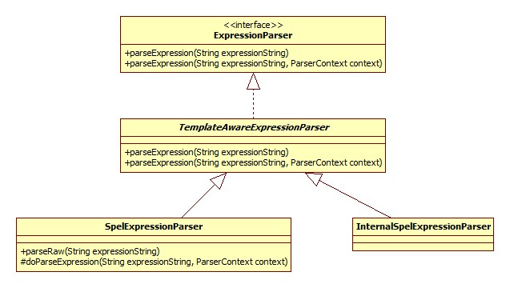

# BeanExpressionResolver

此接口只有一个实现: StandardBeanExpressionResolver。接口只含有一个方法:

```
public Object evaluate(@Nullable String value, BeanExpressionContext evalContext) throws BeansException {
    if (!StringUtils.hasLength(value)) {
        return value;
    }
    try {
        Expression expr = this.expressionCache.get(value);
        if (expr == null) {
            expr = this.expressionParser.parseExpression(value, this.beanExpressionParserContext);
            this.expressionCache.put(value, expr);
        }
        StandardEvaluationContext sec = this.evaluationCache.get(evalContext);
        if (sec == null) {
            sec = new StandardEvaluationContext(evalContext);
            sec.addPropertyAccessor(new BeanExpressionContextAccessor());
            sec.addPropertyAccessor(new BeanFactoryAccessor());
            sec.addPropertyAccessor(new MapAccessor());
            sec.addPropertyAccessor(new EnvironmentAccessor());
            sec.setBeanResolver(new BeanFactoryResolver(evalContext.getBeanFactory()));
            sec.setTypeLocator(new StandardTypeLocator(evalContext.getBeanFactory().getBeanClassLoader()));
            ConversionService conversionService = evalContext.getBeanFactory().getConversionService();
            if (conversionService != null) {
                sec.setTypeConverter(new StandardTypeConverter(conversionService));
            }
            customizeEvaluationContext(sec);
            this.evaluationCache.put(evalContext, sec);
        }
        return expr.getValue(sec);
    }
    catch (Throwable ex) {
        throw new BeanExpressionException("Expression parsing failed", ex);
    }
}
```
StandardBeanExpressionResolver对象内部有一个关键的成员: SpelExpressionParser,其整个类图:

这便是Spring3.0开始出现的Spel表达式的解释器。