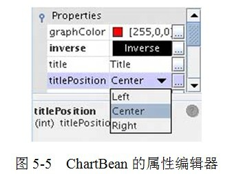
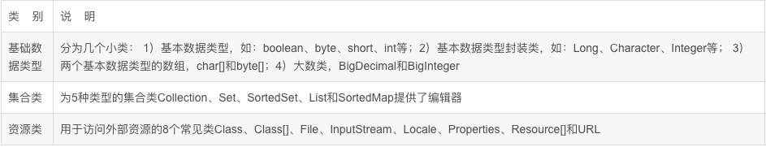

- [属性编辑器PropertyEditor](#%e5%b1%9e%e6%80%a7%e7%bc%96%e8%be%91%e5%99%a8propertyeditor)
  - [JavaBean的编辑器](#javabean%e7%9a%84%e7%bc%96%e8%be%91%e5%99%a8)
  - [PropertyEditor](#propertyeditor)
  - [BeanInfo](#beaninfo)
  - [实例](#%e5%ae%9e%e4%be%8b)
  - [Spring默认属性编辑器](#spring%e9%bb%98%e8%ae%a4%e5%b1%9e%e6%80%a7%e7%bc%96%e8%be%91%e5%99%a8)
  - [自定义属性编辑器](#%e8%87%aa%e5%ae%9a%e4%b9%89%e5%b1%9e%e6%80%a7%e7%bc%96%e8%be%91%e5%99%a8)
  - [注册自定义的属性编辑器](#%e6%b3%a8%e5%86%8c%e8%87%aa%e5%ae%9a%e4%b9%89%e7%9a%84%e5%b1%9e%e6%80%a7%e7%bc%96%e8%be%91%e5%99%a8)

# 属性编辑器PropertyEditor

在Spring配置文件里，我们往往通过字面值为Bean各种类型的属性提供设置值：不管是double类型还是int类型，在配置文件中都对应字符串类型的字面值。<br/>
BeanWrapper填充Bean属性时如何将这个字面值转换为对应的double或int等内部类型呢？我们可以隐约地感觉到一定有一个转换器在其中起作用，这个转换器就是属性编辑器。<br/>

**任何实现java.beans.PropertyEditor接口的类都是属性编辑器。属性编辑器的主要功能就是将外部的设置值转换为JVM内部的对应类型，所以属性编辑器其实就是一个类型转换器。**

PropertyEditor是JavaBean规范定义的接口，JavaBean规范中还有其他一些PropertyEditor配置的接口。为了彻底理解属性编辑器，必须对JavaBean中有关属性编辑器的规范进行学习

## JavaBean的编辑器
JavaBean规范通过java.beans.PropertyEditor定义了设置JavaBean属性的方法，通过BeanInfo描述了JavaBean哪些属性是可定制的，此外还描述了可定制属性与PropertyEditor的对应关系。

BeanInfo与JavaBean之间的对应关系，通过两者之间规范的命名确立，对应JavaBean的BeanInfo采用如下的命名规范：<Bean>BeanInfo。
如ChartBean对应的BeanInfo为ChartBeanBeanInfo，Car对应的BeanInfo为CarBeanInfo。
当JavaBean、其各属性的编辑器、和BeanInfo信息一起注册到IDE中后，当在开发界面中对JavaBean进行定制时，IDE就会根据JavaBean规范找到对应的BeanInfo，
再根据BeanInfo中的描述信息找到JavaBean属性描述（是否开放、使用哪个属性编辑器），进而为JavaBean生成特定开发编辑界面。

JavaBean规范提供了一个管理默认属性编辑器的管理器：PropertyEditorManager，该管理器内保存着一些常见类型的属性编辑器，
**如果某个JavaBean的常见类型属性没有通过BeanInfo显式指定属性编辑器，IDE将自动使用PropertyEditorManager中注册的对应默认属性编辑器。**

## PropertyEditor
PropertyEditor是属性编辑器的接口，它规定了将外部设置值转换为内部JavaBean属性值的转换接口方法。PropertyEditor主要的接口方法说明如下：<br/>
- **Object getValue()**：返回属性的当前值。基本类型被封装成对应的包装类实例；
- **void setValue(Object newValue)**：设置属性的值，基本类型以包装类传入（自动装箱）；
- **String getAsText()**：将属性对象用一个字符串表示，以便外部的属性编辑器能以可视化的方式显示。缺省返回null，表示该属性不能以字符串表示；
- **void setAsText(String text)**：用一个字符串去更新属性的内部值，这个字符串一般从外部属性编辑器传入；
- **String[] getTags()**：返回表示有效属性值的字符串数组（如boolean属性对应的有效Tag为true和false），以便属性编辑器能以下拉框的方式显示出来。缺省返回null，表示属性没有匹配的字符值有限集合；
- **String getJavaInitializationString()**：为属性提供一个表示初始值的字符串，属性编辑器以此值作为属性的默认值。

> 可以看出PropertyEditor接口方法是内部属性值和外部设置值的沟通桥梁。此外，我们可以很容易地发现该接口的很多方法是专为IDE中的可视化属性编辑器提供的：如getTags()、getJavaInitializationString()以及另外一些我们未此介绍的接口方法。

**Java为PropertyEditor提供了一个方便的实现类：PropertyEditorSupport，该类实现了PropertyEditor接口并提供默认实现，一般情况下，用户可以通过扩展这个方便类设计自己的属性编辑器。**

## BeanInfo
> BeanInfo主要描述了JavaBean哪些属性可以编辑以及对应的属性编辑器，每一个属性对应一个属性描述器PropertyDescriptor。
> PropertyDescriptor的构造函数有两个入参：PropertyDescriptor(String propertyName, Class beanClass) ，其中propertyName为属性名；而beanClass为JavaBean对应的Class。

此外PropertyDescriptor还有一个setPropertyEditorClass(Class propertyEditorClass)方法，为JavaBean属性指定编辑器。
BeanInfo接口最重要的方法就是：PropertyDescriptor[] getPropertyDescriptors() ，该方法返回JavaBean的属性描述器数组。
**BeanInfo接口有一个常用的实现类：SimpleBeanInfo，一般情况下，可以通过扩展SimpleBeanInfo实现自己的功能。**

## 实例
ChartBean是一个可定制图表组件，允许通过属性的设置定制图表的样式以得到满足各种不同使用场合要求的图表。我们忽略ChartBean的其他属性，仅关注其中的两个属性：<br/>
```
import javax.swing.JPanel;
import static javax.swing.border.TitledBorder.CENTER;
 
public class ChartBean extends JPanel{  
    private int titlePosition = CENTER;  
    private boolean inverse;  
    //省略get/setter方法  
}
```
我们为titlePosition属性提供一个属性编辑器。我们不去直接实现PropertyEditor，而是通过扩展PropertyEditorSupport这个方便类来定义我们的属性编辑器：
```
//----
通过getTags()方法返回一个字符串数组，因此在IDE中该属性对应的编辑器将自动提供一个下拉框，下拉框中包含3个可选项：“Left”、“Center”、“Right”。
而3和4处的两个方法分别完成属性值到字符串的双向转换功能。CharBean的inverse属性也有一个相似的编辑器InverseEditor，我们忽略不讲。
下面编写ChartBean对应的BeanInfo，根据JavaBean的命名规范，这个BeanInfo应该命名为ChartBeanBeanInfo，它负责将属性编辑器和ChartBean的属性挂钩起来：
----//
import java.beans.*;
public class TitlePositionEditor extends PropertyEditorSupport {
    private final String[] options = {"Left", "Center", "Right"};
    //1. 代表可选属性值的字符串标识数组
    @Override
    public String[] getTags() {
        return options;
    }
    //2. 代表属性初始值的字符串
    @Override
    public String getJavaInitializationString() {
        return "" + getValue();
    }
    //3. 将内部属性值转换为对应的字符串表示形式，供属性编辑器显示之用
    @Override
    public String getAsText() {
        int value = (Integer) getValue();
        return options[value];
    }
    //4. 将外部设置的字符串转换为内部属性的值
    @Override
    public void setAsText(String s) {
        for (int i = 0; i < options.length; i++) {
            if (options[i].equals(s)) {
                setValue(i);
                return;
            }
        }
    }
}
import java.beans.*;
public class ChartBeanBeanInfo extends SimpleBeanInfo {
    @Override
    public PropertyDescriptor[] getPropertyDescriptors() {
        try {
            //1. 将TitlePositionEditor绑定到ChartBean的titlePosition属性中    
            PropertyDescriptor titlePositionDescriptor = new PropertyDescriptor("titlePosition", ChartBean.class);
            titlePositionDescriptor.setPropertyEditorClass(TitlePositionEditor.class);
            //2. 将InverseEditor绑定到ChartBean的inverse属性中            
            PropertyDescriptor inverseDescriptor = new PropertyDescriptor("inverse", ChartBean.class);
            inverseDescriptor.setPropertyEditorClass(InverseEditor.class);
            return new PropertyDescriptor[]{titlePositionDescriptor, inverseDescriptor};
        } catch (IntrospectionException e) {
            e.printStackTrace();
            return null;
        }
    }
}
```
在ChartBeanBeanInfo中，我们分别为ChartBean和titlePosition和inverse属性指定对应的属性编辑器。
将ChartBean组件、各属性的编辑器以及ChartBeanBeanInfo打成JAR包，使用IDE组件扩展管理功能注册到IDE中。
这样，我们就可以像使用TextField、Checkbox等这些组件一样对ChartBean进行可视化的开发设计工作了。
下面是ChartBean在NetBeans IDE中的属性编辑器效果图，如图所示。
<br/>
ChartBean可设置的属性都列在属性查看器中，当单击titlePosition属性时，下拉框中列出了我们提供的3个选项。

## Spring默认属性编辑器
Spring的属性编辑器和传统的用于IDE开发时的属性编辑器不同，它们没有UI界面，**仅负责将配置文件中的文本配置值转换为Bean属性的对应值，所以Spring的属性编辑器并非传统意义上的JavaBean属性编辑器。**
Spring为常见的属性类型提供了默认的属性编辑器。从下图中，我们可以看出BeanWrapperImpl类扩展了PropertyEditorRegistrySupport类，<br/>
Spring在PropertyEditor RegistrySupport中为常见属性类型提供了默认的属性编辑器，这些“常见的类型”共32个，可分为3大类，总结如下：<br/>
<br/>
PropertyEditorRegistrySupport中有两个用于保存属性编辑器的Map类型变量：<br/>
- defaultEditors：用于保存默认属性类型的编辑器，元素的键为属性类型，值为对应的属性编辑器实例；
- customEditors：用于保存用户自定义的属性编辑器，元素的键值和defaultEditors相同
> PropertyEditorRegistrySupport通过类似以下的代码定义默认属性编辑器：
>> this.defaultEditors.put(char.class, new CharacterEditor(false));  
   this.defaultEditors.put(Character.class, new CharacterEditor(true));  
   this.defaultEditors.put(Locale.class, new LocaleEditor());  
   this.defaultEditors.put(Properties.class, new PropertiesEditor()); 
   
> 这些默认的属性编辑器解决常见属性类型的注册问题，如果用户的应用包括一些特殊类型的属性，且希望在配置文件中以字面值提供配置值，那么就需要编写自定义属性编辑器并注册到Spring容器中。这样，Spring才能将配置文件中的属性配置值转换为对应的属性类型值。

## 自定义属性编辑器

Spring大部分默认属性编辑器都直接扩展于java.beans.PropertyEditorSupport类，用户也可以通过扩展PropertyEditorSupport实现自己的属性编辑器。
比起用于IDE环境的属性编辑器来说，**Spring环境下使用的属性编辑器的功能非常单一：
仅需要将配置文件中字面值转换为属性类型的对象即可，并不需要提供UI界面，因此仅需要简单覆盖PropertyEditorSupport的setAsText()方法就可以了。**
```
eg:
public class Car {  
    private int maxSpeed;  
    public String brand;  
    private double price;  
    //省略get/setter  
}  
public class Boss {  
    private String name;  
    private Car car = new Car();  
    //省略get/setter  
}  
```
Boss有两个属性：name和car，分别对应String类型和Car类型。Spring拥有String类型的默认属性编辑器，因此对于String类型的属性我们不用操心。<br/>
但Car类型是我们自定义的类型，要配置Boss的car属性，有两种方案：<br/>
- 1)在配置文件中为car专门配置一个<bean>，然后在boss的<bean>中通过ref引用car Bean，这正是我们上一章中所用的方法；
- 2)为Car类型提供一个自定义的属性编辑器，这样，我们就通过字面值为Boss的car属性提供配置值。<br/>
第一种方案是常用的方法，但是在有些情况下，这种方式需要将属性对象一步步肢解为最终可以用基本类型表示的Bean，使配置文件变得不够清晰，直接为属性类提供一个对应的自定义属性编辑器可能会是更好的替代方案。<br/>
我们来为Car编写一个自定义的属性编辑器:
```
import java.beans.PropertyEditorSupport;  
public class CustomCarEditor extends PropertyEditorSupport {  
    //1. 将字面值转换为属性类型对象  
    public void setAsText(String text){   
        if(text == null || text.indexOf(",") == -1){  
            throw new IllegalArgumentException("设置的字符串格式不正确");  
        }  
        String[] infos = text.split(",");  
        Car car = new Car();  
        car.setBrand(infos[0]);  
        car.setMaxSpeed(Integer.parseInt(infos[1]));  
        car.setPrice(Double.parseDouble(infos[2]));  
         //2. 调用父类的setValue()方法设置转换后的属性对象  
        setValue(car);   
    }  
} 
```
CustomCarEditor很简单，它仅覆盖PropertyEditorSupport便利类的setAsText(String text)方法，该方法负责将配置文件以字符串提供的字面值转换为Car对象。
字面值采用逗号分隔的格式同时为brand、maxSpeed和price属性值提供设置值，setAsText()方法解析这个字面值并生成对应的Car对象。
由于我们并不需要将Boss内部的car属性反显到属性编辑器中，因此不需要覆盖getAsText()方法。

## 注册自定义的属性编辑器
**如果使用BeanFactory，用户需要手工调用registerCustomEditor(Class requiredType, PropertyEditor propertyEditor)方法注册自定义属性编辑器；
如果使用ApplicationContext，则只需要在配置文件通过CustomEditorConfigurer注册就可以了。**
CustomEditorConfigurer实现BeanFactoryPostProcessor接口，因此是一个Bean工厂后处理器。
我们知道Bean工厂后处理器在Spring容器加载配置文件并生成BeanDefinition半成品后就会被自动执行。
因此CustomEditorConfigurer有容器启动时有机会注入自定义的属性编辑器。
下面的配置片断定义了一个CustomEditorConfigurer：
```
<!--①配置自动注册属性编辑器的CustomEditorConfigurer -->  
<bean class="org.springframework.beans.factory.config.CustomEditorConfigurer">  
    <property name="customEditors">  
        <map>  
             <!--②-1属性编辑器对应的属性类型-->  
             <entry key="com.baobaotao.editor.Car">   
                <!--②-2对应的属性编辑器Bean -->  
                <bean class="com.baobaotao.editor.CustomCarEditor" />  
            </entry>  
        </map>  
    </property>  
</bean>  
 <bean id="boss" class="com.baobaotao.editor.Boss">  
       <property name="name" value="John"/>   
       <!--③该属性将使用②处的属性编辑器完成属性填充操作-->  
       <property name="car" value="红旗CA72,200,20000.00"/>   
</bean> 
```
在①处，我们定义了用于注册自定义属性编辑器的CustomEditorConfigurer，Spring容器将通过反射机制自动调用这个Bean。
CustomEditorConfigurer通过一个Map属性定义需要自动注册的自定义属性编辑器。
在②处，我们为Car类型指定了对应属性编辑器CustomCarEditor，注意键是属性类型，而值是对应的属性编辑器Bean，而不是属性编辑器的类名。
最精彩的部分当然是③处的配置，我们原来通过一个<bean>元素标签配置好car Bean，然后在boss的<bean>中通过ref引用car Bean，但是现在我们直接通过value为car属性提供配置。
BeanWrapper在设置boss的car属性时，它将检索自定义属性编辑器的注册表，当发现Car属性类型拥有对应的属性编辑器CustomCarEditor时，
它就会利用CustomCarEditor将“红旗CA72,200,20000.00”转换为Car对象。

ps:
**按照JavaBeans的规范，JavaBeans的基础设施会在JavaBean相同类包下查找是否存在<JavaBean>Editor的类，
如果存在，自动使用<JavaBean>Editor作为该JavaBean的PropertyEditor。**
`如com.baobaotao.domain.UserEditor会自动成为com.baobaotao.domain.User对应的PropertyEditor。Spring也支持这个规范，也即如果采用这种规约命令PropertyEditor，就无须显式在CustomEditorConfigurer中注册了，Spring将自动查找并注册这个PropertyEditor。
 　　另：Spring 3.0除支持PropertyEditor外，还在核心包中引入了自建的ConversionService，它提供了更为强大的类型转换的能力，可以完成任意类型之间的转换，还可以在转换过程中参考目标对象所在宿主类的上下文信息。Spring的类型转换同时支持PropertyEditor和ConversionService。`

