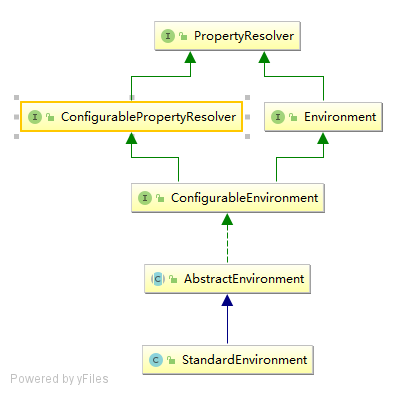
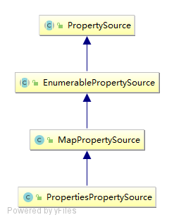
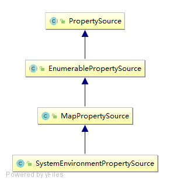
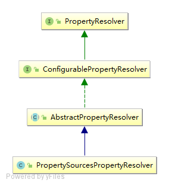

# setConfigLocations

StandardEnvironment继承结构：<br/>
<br/>
StandardEnvironment在无参构造函数中调用父类AbstractEnvironment无参构造<br/>
AbstractEnvironment构造器<br/>
```$xslt
private final MutablePropertySources propertySources = new MutablePropertySources(this.logger);
public AbstractEnvironment() {
    customizePropertySources(this.propertySources);
}
```
PropertySources继承体系：<br/>
<br/>

``` 
org.springframework.core.env.StandardEnvironment.customizePropertySources
protected void customizePropertySources(MutablePropertySources propertySources) {
    propertySources.addLast(new PropertiesPropertySource("systemProperties", this.getSystemProperties()));
    propertySources.addLast(new SystemEnvironmentPropertySource("systemEnvironment", this.getSystemEnvironment()));
}

org.springframework.core.env.AbstractEnvironment.getSystemProperties
public Map<String, Object> getSystemProperties() {
    try {
        return (Map) System.getProperties();
    }
    catch (AccessControlException ex) {
        return (Map) new ReadOnlySystemAttributesMap() {
            @Override
            @Nullable
            protected String getSystemAttribute(String attributeName) {
                try {
                    return System.getProperty(attributeName);
                }
                catch (AccessControlException ex) {
                    if (logger.isInfoEnabled()) {
                        logger.info("Caught AccessControlException when accessing system property '" +
                                attributeName + "'; its value will be returned [null]. Reason: " + ex.getMessage());
                    }
                    return null;
                }
            }
        };
    }
}
//如果安全管理器阻止获取全部的系统属性，那么会尝试获取单个属性的可能性，如果还不行就抛异常了。
//getSystemEnvironment方法相同，不过最终调用的是System.getenv，可以获取jvm和OS的一些版本信息。
org.springframework.core.env.AbstractEnvironment.getSystemEnvironment
public Map<String, Object> getSystemEnvironment() {
    if (suppressGetenvAccess()) {
        return Collections.emptyMap();
    }
    try {
        return (Map) System.getenv();
    }
    catch (AccessControlException ex) {
        return (Map) new ReadOnlySystemAttributesMap() {
            @Override
            @Nullable
            protected String getSystemAttribute(String attributeName) {
                try {
                    return System.getenv(attributeName);
                }
                catch (AccessControlException ex) {
                    if (logger.isInfoEnabled()) {
                        logger.info("Caught AccessControlException when accessing system environment variable '" +
                                attributeName + "'; its value will be returned [null]. Reason: " + ex.getMessage());
                    }
                    return null;
                }
            }
        };
    }
}
```
classpath:spring-start.xml的路径解析：<br/>
``` 
org.springframework.context.support.AbstractRefreshableConfigApplicationContext#resolvePath
public String resolveRequiredPlaceholders(String text) throws IllegalArgumentException {
    return this.propertyResolver.resolveRequiredPlaceholders(text);
}
org.springframework.core.env.AbstractEnvironment.resolveRequiredPlaceholders
private final ConfigurablePropertyResolver propertyResolver = new PropertySourcesPropertyResolver(this.propertySources);
public String resolveRequiredPlaceholders(String text) throws IllegalArgumentException {
    return this.propertyResolver.resolveRequiredPlaceholders(text);
}
org.springframework.core.env.AbstractPropertyResolver.resolveRequiredPlaceholders
public String resolveRequiredPlaceholders(String text) throws IllegalArgumentException {
    if (this.strictHelper == null) {
        this.strictHelper = createPlaceholderHelper(false);
    }
    return doResolvePlaceholders(text, this.strictHelper);
}
org.springframework.core.env.AbstractPropertyResolver.createPlaceholderHelper
this.placeholderPrefix -- org.springframework.util.SystemPropertyUtils.PLACEHOLDER_PREFIX = "${";
this.placeholderSuffix -- org.springframework.util.SystemPropertyUtils.PLACEHOLDER_SUFFIX = "}";
this.valueSeparator -- org.springframework.util.SystemPropertyUtils.VALUE_SEPARATOR = ":";
private PropertyPlaceholderHelper createPlaceholderHelper(boolean ignoreUnresolvablePlaceholders) {
    return new PropertyPlaceholderHelper(this.placeholderPrefix, this.placeholderSuffix,
            this.valueSeparator, ignoreUnresolvablePlaceholders);
}
org.springframework.core.env.AbstractPropertyResolver.doResolvePlaceholders
private String doResolvePlaceholders(String text, PropertyPlaceholderHelper helper) {
    return helper.replacePlaceholders(text, this::getPropertyAsRawString);
}
org.springframework.core.env.PropertySourcesPropertyResolver.getPropertyAsRawString
protected String getPropertyAsRawString(String key) {
    return getProperty(key, String.class, false);
}
org.springframework.core.env.PropertySourcesPropertyResolver.getProperty(java.lang.String, java.lang.Class<T>, boolean)
protected <T> T getProperty(String key, Class<T> targetValueType, boolean resolveNestedPlaceholders) {
    if (this.propertySources != null) {
        for (PropertySource<?> propertySource : this.propertySources) {
            if (logger.isTraceEnabled()) {
                logger.trace("Searching for key '" + key + "' in PropertySource '" +
                        propertySource.getName() + "'");
            }
            Object value = propertySource.getProperty(key);
            if (value != null) {
                if (resolveNestedPlaceholders && value instanceof String) {
                    value = resolveNestedPlaceholders((String) value);
                }
                logKeyFound(key, propertySource, value);
                return convertValueIfNecessary(value, targetValueType);
            }
        }
    }
    if (logger.isTraceEnabled()) {
        logger.trace("Could not find key '" + key + "' in any property source");
    }
    return null;
}
从System.getProperty和System.getenv获取，但是由于环境变量是无法自定义的，所以其实此处只能通过System.setProperty指定。
```
<br/>