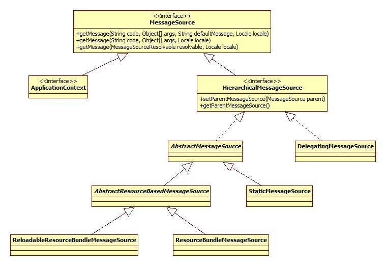
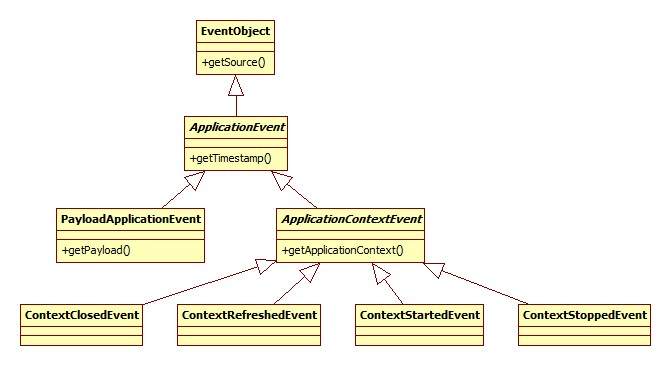
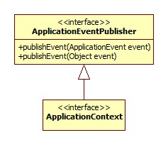
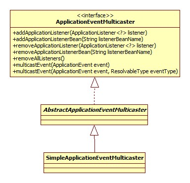
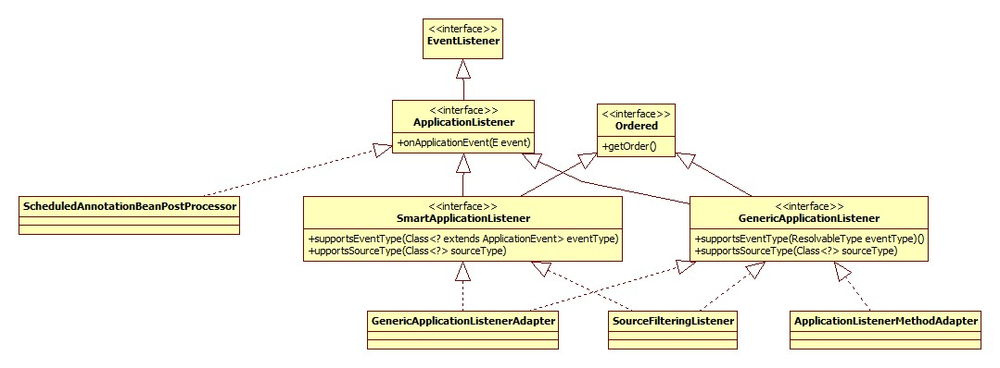

# Spring bean解析

```
org.springframework.context.support.AbstractApplicationContext.refresh
public void refresh() throws BeansException, IllegalStateException {
    synchronized (this.startupShutdownMonitor) {  -- 对该实体类加锁，防止线程影响
        // Prepare this context for refreshing.
        prepareRefresh();

        // Tell the subclass to refresh the internal bean factory.
        ConfigurableListableBeanFactory beanFactory = obtainFreshBeanFactory(); -- BeanFactory创建

        // Prepare the bean factory for use in this context.
        prepareBeanFactory(beanFactory); -- 对BeanFactory进行一些特征的设置工作

        try {
            // Allows post-processing of the bean factory in context subclasses.
            postProcessBeanFactory(beanFactory);

            // Invoke factory processors registered as beans in the context.
            invokeBeanFactoryPostProcessors(beanFactory); -- 允许我们在bean正是初始化之前改变其值

            // Register bean processors that intercept bean creation.
            registerBeanPostProcessors(beanFactory);

            // Initialize message source for this context.
            initMessageSource(); -- Spring国际化

            // Initialize event multicaster for this context.
            initApplicationEventMulticaster();

            // Initialize other special beans in specific context subclasses.
            onRefresh();

            // Check for listener beans and register them.
            registerListeners();

            // Instantiate all remaining (non-lazy-init) singletons.
            finishBeanFactoryInitialization(beanFactory);

            // Last step: publish corresponding event.
            finishRefresh();
        }

        catch (BeansException ex) {
            if (logger.isWarnEnabled()) {
                logger.warn("Exception encountered during context initialization - " +
                        "cancelling refresh attempt: " + ex);
            }

            // Destroy already created singletons to avoid dangling resources.
            destroyBeans();

            // Reset 'active' flag.
            cancelRefresh(ex);

            // Propagate exception to caller.
            throw ex;
        }

        finally {
            // Reset common introspection caches in Spring's core, since we
            // might not ever need metadata for singleton beans anymore...
            resetCommonCaches();
        }
    }
}
```
1、 org.springframework.context.support.AbstractApplicationContext.prepareRefresh
```
protected void prepareRefresh() {
    // Switch to active.
    this.startupDate = System.currentTimeMillis();
    this.closed.set(false); -- 设置关闭状态为false
    this.active.set(true); -- 设置激活状态为true

    if (logger.isDebugEnabled()) {
        if (logger.isTraceEnabled()) {
            logger.trace("Refreshing " + this);
        }
        else {
            logger.debug("Refreshing " + getDisplayName());
        }
    }

    // Initialize any placeholder property sources in the context environment.
    initPropertySources(); 在上下文环境中初始化任何占位符属性来源

    // Validate that all properties marked as required are resolvable:
    // see ConfigurablePropertyResolver#setRequiredProperties
    getEnvironment().validateRequiredProperties(); -- 校验属性

    // Store pre-refresh ApplicationListeners...
    if (this.earlyApplicationListeners == null) {
        this.earlyApplicationListeners = new LinkedHashSet<>(this.applicationListeners);
    }
    else {
        // Reset local application listeners to pre-refresh state.
        this.applicationListeners.clear();
        this.applicationListeners.addAll(this.earlyApplicationListeners);
    }

    // Allow for the collection of early ApplicationEvents,
    // to be published once the multicaster is available...
    this.earlyApplicationEvents = new LinkedHashSet<>();
}
```
[prepareRefresh方法](./bean_module/prepareRefresh.md)

2、BeanFactory创建:<br/>
```
protected ConfigurableListableBeanFactory obtainFreshBeanFactory() {
    refreshBeanFactory();
    return getBeanFactory();
}
```
[BeanFactory创建](./bean_module/obtainFreshBeanFactory.md)


3、prepareBeanFactory
```
protected void prepareBeanFactory(ConfigurableListableBeanFactory beanFactory) {
	// Tell the internal bean factory to use the context's class loader etc.
    beanFactory.setBeanClassLoader(getClassLoader());
    beanFactory.setBeanExpressionResolver(new StandardBeanExpressionResolver(beanFactory.getBeanClassLoader()));
    // 用于向Spring注册java.beans.PropertyEditor
    beanFactory.addPropertyEditorRegistrar(new ResourceEditorRegistrar(this, getEnvironment()));

    // Configure the bean factory with context callbacks.
    beanFactory.addBeanPostProcessor(new ApplicationContextAwareProcessor(this));
    beanFactory.ignoreDependencyInterface(EnvironmentAware.class);
    beanFactory.ignoreDependencyInterface(EmbeddedValueResolverAware.class);
    beanFactory.ignoreDependencyInterface(ResourceLoaderAware.class);
    beanFactory.ignoreDependencyInterface(ApplicationEventPublisherAware.class);
    beanFactory.ignoreDependencyInterface(MessageSourceAware.class);
    beanFactory.ignoreDependencyInterface(ApplicationContextAware.class);

    // BeanFactory interface not registered as resolvable type in a plain factory.
    // MessageSource registered (and found for autowiring) as a bean.
    beanFactory.registerResolvableDependency(BeanFactory.class, beanFactory);
    beanFactory.registerResolvableDependency(ResourceLoader.class, this);
    beanFactory.registerResolvableDependency(ApplicationEventPublisher.class, this);
    beanFactory.registerResolvableDependency(ApplicationContext.class, this);

    // Register early post-processor for detecting inner beans as ApplicationListeners.
    beanFactory.addBeanPostProcessor(new ApplicationListenerDetector(this));

    // Detect a LoadTimeWeaver and prepare for weaving, if found.
    if (beanFactory.containsBean(LOAD_TIME_WEAVER_BEAN_NAME)) {
        beanFactory.addBeanPostProcessor(new LoadTimeWeaverAwareProcessor(beanFactory));
        // Set a temporary ClassLoader for type matching.
        beanFactory.setTempClassLoader(new ContextTypeMatchClassLoader(beanFactory.getBeanClassLoader()));
    }

    // Register default environment beans.
    if (!beanFactory.containsLocalBean(ENVIRONMENT_BEAN_NAME)) {
        beanFactory.registerSingleton(ENVIRONMENT_BEAN_NAME, getEnvironment());
    }
    if (!beanFactory.containsLocalBean(SYSTEM_PROPERTIES_BEAN_NAME)) {
        beanFactory.registerSingleton(SYSTEM_PROPERTIES_BEAN_NAME, getEnvironment().getSystemProperties());
    }
    if (!beanFactory.containsLocalBean(SYSTEM_ENVIRONMENT_BEAN_NAME)) {
        beanFactory.registerSingleton(SYSTEM_ENVIRONMENT_BEAN_NAME, getEnvironment().getSystemEnvironment());
    }
}
```
方法负责对BeanFactory进行一些特征的设置工作，"特征"包含这么几个方面:<br/>
**BeanExpressionResolver**<br/>
[BeanExpressionResolver](./bean_module/prepareBeanFactory-BeanExpressionResolver.md)<br/>
prepareBeanFactory将一个此对象放入BeanFactory<br/>
beanFactory.setBeanExpressionResolver(new StandardBeanExpressionResolver(beanFactory.getBeanClassLoader()));<br/>
**PropertyEditorRegistrar**<br/>
[PropertyEditorRegistrar](./bean_module/prepareBeanFactory-PropertyEditorRegistrar.md)<br/>
此接口用于向Spring注册java.beans.PropertyEditor，只有一个方法:
registerCustomEditors(PropertyEditorRegistry registry)
实现也只有一个: ResourceEditorRegistrar。
在编写xml配置时，我们设置的值都是字符串形式，所以在使用时肯定需要转为我们需要的类型，PropertyEditor接口正是定义了这么个东西。
prepareBeanFactory
```
beanFactory.addPropertyEditorRegistrar(new ResourceEditorRegistrar(this, getEnvironment()));
```
BeanFactory也暴露了registerCustomEditors方法用以添加自定义的转换器，所以这个地方是组合模式的体现。
我们有两种方式可以添加自定义PropertyEditor:
```
通过context.getBeanFactory().registerCustomEditor
通过Spring配置文件:
<bean class="org.springframework.beans.factory.config.CustomEditorConfigurer">
  <property name="customEditors">
          <map>
              <entry key="base.Cat" value="base.CatEditor" /> 
      </map>
  </property>
</bean>
```
**环境注入**<br/>
在Spring中我们自己的bean可以通过实现EnvironmentAware等一系列Aware接口获取到Spring内部的一些对象。prepareBeanFactory:<br/>
`beanFactory.addBeanPostProcessor(new ApplicationContextAwareProcessor(this));`
ApplicationContextAwareProcessor核心的invokeAwareInterfaces方法:
```
private void invokeAwareInterfaces(Object bean) {
    if (bean instanceof Aware) {
        if (bean instanceof EnvironmentAware) {
            ((EnvironmentAware) bean).setEnvironment(this.applicationContext.getEnvironment());
        }
        if (bean instanceof EmbeddedValueResolverAware) {
            ((EmbeddedValueResolverAware) bean).setEmbeddedValueResolver(this.embeddedValueResolver);
        }
        //....
    }
}
```
**依赖解析忽略**<br/>
```
beanFactory.ignoreDependencyInterface(EnvironmentAware.class);
beanFactory.ignoreDependencyInterface(EmbeddedValueResolverAware.class);
beanFactory.ignoreDependencyInterface(ResourceLoaderAware.class);
beanFactory.ignoreDependencyInterface(ApplicationEventPublisherAware.class);
beanFactory.ignoreDependencyInterface(MessageSourceAware.class);
beanFactory.ignoreDependencyInterface(ApplicationContextAware.class);
```
**bean伪装**<br/>
有些对象并不在BeanFactory中，但是我们依然想让它们可以被装配，这就需要伪装一下:
```
beanFactory.registerResolvableDependency(BeanFactory.class, beanFactory);
beanFactory.registerResolvableDependency(ResourceLoader.class, this);
beanFactory.registerResolvableDependency(ApplicationEventPublisher.class, this);
beanFactory.registerResolvableDependency(ApplicationContext.class, this);
```
伪装关系保存在一个Map<Class<?>, Object>里。

**LoadTimeWeaver**<br/>
如果配置了此bean，那么：<br/>
```
if (beanFactory.containsBean(LOAD_TIME_WEAVER_BEAN_NAME)) {
    beanFactory.addBeanPostProcessor(new LoadTimeWeaverAwareProcessor(beanFactory));
    // Set a temporary ClassLoader for type matching.
    beanFactory.setTempClassLoader(new ContextTypeMatchClassLoader(beanFactory.getBeanClassLoader()));
}
```
**注册环境**<br/>
```
f (!beanFactory.containsLocalBean(ENVIRONMENT_BEAN_NAME)) {
    beanFactory.registerSingleton(ENVIRONMENT_BEAN_NAME, getEnvironment());
}
if (!beanFactory.containsLocalBean(SYSTEM_PROPERTIES_BEAN_NAME)) {
    beanFactory.registerSingleton(SYSTEM_PROPERTIES_BEAN_NAME, getEnvironment().getSystemProperties());
}
if (!beanFactory.containsLocalBean(SYSTEM_ENVIRONMENT_BEAN_NAME)) {
    beanFactory.registerSingleton(SYSTEM_ENVIRONMENT_BEAN_NAME, getEnvironment().getSystemEnvironment());
}
```
containsLocalBean特殊之处在于不会去父BeanFactory寻找。

4、postProcessBeanFactory<br/>
此方法允许子类在所有的bean尚未初始化之前注册BeanPostProcessor。空实现且没有子类覆盖。<br/>

5、invokeBeanFactoryPostProcessors<br/>
BeanFactoryPostProcessor接口允许我们在bean正是初始化之前改变其值。此接口只有一个方法:
```
org.springframework.context.support.AbstractApplicationContext.invokeBeanFactoryPostProcessors
protected void invokeBeanFactoryPostProcessors(ConfigurableListableBeanFactory beanFactory) {
    PostProcessorRegistrationDelegate.invokeBeanFactoryPostProcessors(beanFactory, getBeanFactoryPostProcessors());
    // Detect a LoadTimeWeaver and prepare for weaving, if found in the meantime
    // (e.g. through an @Bean method registered by ConfigurationClassPostProcessor)
    if (beanFactory.getTempClassLoader() == null && beanFactory.containsBean(LOAD_TIME_WEAVER_BEAN_NAME)) {
        beanFactory.addBeanPostProcessor(new LoadTimeWeaverAwareProcessor(beanFactory));
        beanFactory.setTempClassLoader(new ContextTypeMatchClassLoader(beanFactory.getBeanClassLoader()));
    }
}
```
有两种方式可以向Spring添加此对象:
```
1、通过代码的方式
context.addBeanFactoryPostProcessor
2、通过xml配置的方式
<bean class="base.SimpleBeanFactoryPostProcessor" />
```
注意此时尚未进行bean的初始化工作，初始化是在后面的finishBeanFactoryInitialization进行的，所以在BeanFactoryPostProcessor对象中获取bean会导致提前初始化。
`PostProcessorRegistrationDelegate.invokeBeanFactoryPostProcessors(beanFactory, getBeanFactoryPostProcessors());` -- 关键源代码<br/>
getBeanFactoryPostProcessors获取的就是AbstractApplicationContext的成员beanFactoryPostProcessors(ArrayList)，但是很有意思，只有通过<br/>
**context.addBeanFactoryPostProcessor这种方式添加的才会出现在这个List里，所以对于xml配置方式，此List其实没有任何元素。玄机就在PostProcessorRegistrationDelegate里**。<br/>
核心思想就是使用BeanFactory的getBeanNamesForType方法获取相应的BeanDefinition的name数组，之后逐一调用getBean方法获取到bean(初始化)<br/>
ps：此处有一个优先级的概念，如果你的BeanFactoryPostProcessor同时实现了Ordered或者是PriorityOrdered接口，那么会被首先执行。<br/>

6、BeanPostProcessor注册<br/>
此部分实质上是在BeanDefinitions中寻找BeanPostProcessor，之后调用BeanFactory.addBeanPostProcessor方法保存在一个List中，注意添加时仍然有优先级的概念，优先级高的在前面。

7、MessageSource<br/>
此接口用以支持Spring国际化。继承体系如下:<br/>
<br/>
AbstractApplicationContext的initMessageSource()方法就是在BeanFactory中查找MessageSource的bean，如果配置了此bean，
那么调用getBean方法完成其初始化并将其保存在AbstractApplicationContext内部messageSource成员变量中，用以处理ApplicationContext的getMessage调用，
因为从继承体系上来看，ApplicationContext是MessageSource的子类，此处是委托模式的体现。
如果没有配置此bean，那么初始化一个DelegatingMessageSource对象，此类是一个空实现，同样用以处理getMessage调用请求。


8、事件驱动
```
initApplicationEventMulticaster -- org.springframework.context.support.AbstractApplicationContext.initApplicationEventMulticaster
```
此接口代表了Spring的事件驱动(监听器)模式。一个事件驱动包含三部分:<br/>
① 事件：java的所有事件对象一般都是java.util.EventObject的子类，Spring的整个继承体系如下:<br/>
<br/>
② 发布者（ApplicationEventPublisher）<br/>
<br/>
ApplicationEventPublisher实际上正是将请求委托给ApplicationEventMulticaster来实现的。其继承体系:<br/>
<br/>
③ 监听器<br/>
所有的监听器是jdk EventListener的子类，这是一个mark接口。继承体系:<br/>
<br/>
SmartApplicationListener和GenericApplicationListener是高度相似的，都提供了事件类型检测和顺序机制，而后者是从Spring4.2加入的，Spring官方文档推荐使用后者代替前者。<br/>
**初始化：**
因为ApplicationEventPublisher是通过委托给ApplicationEventMulticaster实现的，所以refresh方法中完成的是对ApplicationEventMulticaster的初始化:<br/>
**事件发布：**
AbstractApplicationContext.publishEvent核心代码:<br/>
```
protected void publishEvent(Object event, ResolvableType eventType) {
    getApplicationEventMulticaster().multicastEvent(applicationEvent, eventType);
}
SimpleApplicationEventMulticaster.multicastEvent:
@Override
public void multicastEvent(final ApplicationEvent event, ResolvableType eventType) {
    ResolvableType type = (eventType != null ? eventType : resolveDefaultEventType(event));
    for (final ApplicationListener<?> listener : getApplicationListeners(event, type)) {
        Executor executor = getTaskExecutor();
        if (executor != null) {
            executor.execute(new Runnable() {
                @Override
                public void run() {
                    invokeListener(listener, event);
                }
            });
        } else {
            invokeListener(listener, event);
        }
    }
}
```
**监听器获取**
获取当然还是通过beanFactory的getBean来完成的，值得注意的是Spring在此处使用了缓存(ConcurrentHashMap)来加速查找的过程。

同步/异步
可以看出，如果executor不为空，那么监听器的执行实际上是异步的。那么如何配置同步/异步呢?
```
全局
<task:executor id="multicasterExecutor" pool-size="3"/>
<bean class="org.springframework.context.event.SimpleApplicationEventMulticaster">
    <property name="taskExecutor" ref="multicasterExecutor"></property>
</bean>
```
task schema是Spring从3.0开始加入的，使我们可以不再依赖于Quartz实现定时任务，源码在org.springframework.core.task包下，使用需要引入schema：
`xmlns:task="http://www.springframework.org/schema/task"
 xsi:schemaLocation="http://www.springframework.org/schema/task http://www.springframework.org/schema/task/spring-task-4.0.xsd"`
[Spring定时任务的几种实现](./bean_module/Spring定时任务的几种实现.md)
**注解**
开启注解支持:
```
<!-- 开启@AspectJ AOP代理 -->  
<aop:aspectj-autoproxy proxy-target-class="true"/>  
<!-- 任务调度器 -->  
<task:scheduler id="scheduler" pool-size="10"/>  
<!-- 任务执行器 -->  
<task:executor id="executor" pool-size="10"/>  
<!--开启注解调度支持 @Async @Scheduled-->  
<task:annotation-driven executor="executor" scheduler="scheduler" proxy-target-class="true"/>
eg:
@Component  
public class EmailRegisterListener implements ApplicationListener<RegisterEvent> {  
    @Async  
    @Override  
    public void onApplicationEvent(final RegisterEvent event) {  
        System.out.println("注册成功，发送确认邮件给：" + ((User)event.getSource()).getUsername());  
    }  
} 
```
[Spring事件驱动模型](./bean_module/Spring事件驱动模型.md)<br/>

9、onRefresh<br/>
模版方法，允许子类在进行bean初始化之前进行一些定制操作。默认空实现。

10、ApplicationListener注册<br/>
注册监听器

11、singleton初始化
finishBeanFactoryInitialization：
```
org.springframework.context.support.AbstractApplicationContext.finishBeanFactoryInitialization
protected void finishBeanFactoryInitialization(ConfigurableListableBeanFactory beanFactory) {
    // Initialize conversion service for this context.
    if (beanFactory.containsBean(CONVERSION_SERVICE_BEAN_NAME) &&
            beanFactory.isTypeMatch(CONVERSION_SERVICE_BEAN_NAME, ConversionService.class)) {
        beanFactory.setConversionService(
                beanFactory.getBean(CONVERSION_SERVICE_BEAN_NAME, ConversionService.class));
    }
    // Register a default embedded value resolver if no bean post-processor
    // (such as a PropertyPlaceholderConfigurer bean) registered any before:
    // at this point, primarily for resolution in annotation attribute values.
    if (!beanFactory.hasEmbeddedValueResolver()) {
        //StringValueResolver
        beanFactory.addEmbeddedValueResolver(strVal -> getEnvironment().resolvePlaceholders(strVal));
    }
    // Initialize LoadTimeWeaverAware beans early to allow for registering their transformers early.
    String[] weaverAwareNames = beanFactory.getBeanNamesForType(LoadTimeWeaverAware.class, false, false);
    for (String weaverAwareName : weaverAwareNames) {
        getBean(weaverAwareName);
    }
    // Stop using the temporary ClassLoader for type matching.
    beanFactory.setTempClassLoader(null);
    // Allow for caching all bean definition metadata, not expecting further changes.
    beanFactory.freezeConfiguration();
    // Instantiate all remaining (non-lazy-init) singletons.
    beanFactory.preInstantiateSingletons();
}
```
[finishBeanFactoryInitialization详情](./bean_module/finishBeanFactoryInitialization.md)


