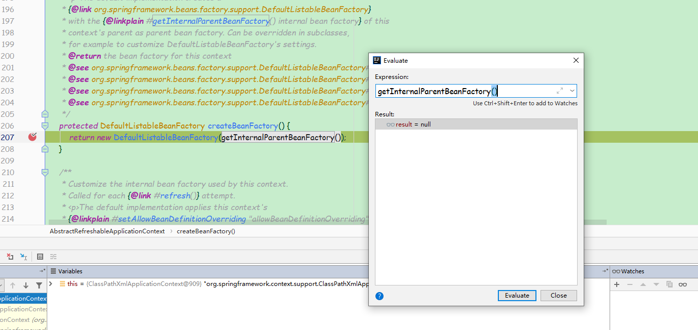

# Spring bean解析

```
org.springframework.context.support.AbstractApplicationContext.refresh
public void refresh() throws BeansException, IllegalStateException {
    synchronized (this.startupShutdownMonitor) {  -- 对该实体类加锁，防止线程影响
        // Prepare this context for refreshing.
        prepareRefresh();

        // Tell the subclass to refresh the internal bean factory.
        ConfigurableListableBeanFactory beanFactory = obtainFreshBeanFactory(); -- BeanFactory创建

        // Prepare the bean factory for use in this context.
        prepareBeanFactory(beanFactory);

        try {
            // Allows post-processing of the bean factory in context subclasses.
            postProcessBeanFactory(beanFactory);

            // Invoke factory processors registered as beans in the context.
            invokeBeanFactoryPostProcessors(beanFactory);

            // Register bean processors that intercept bean creation.
            registerBeanPostProcessors(beanFactory);

            // Initialize message source for this context.
            initMessageSource();

            // Initialize event multicaster for this context.
            initApplicationEventMulticaster();

            // Initialize other special beans in specific context subclasses.
            onRefresh();

            // Check for listener beans and register them.
            registerListeners();

            // Instantiate all remaining (non-lazy-init) singletons.
            finishBeanFactoryInitialization(beanFactory);

            // Last step: publish corresponding event.
            finishRefresh();
        }

        catch (BeansException ex) {
            if (logger.isWarnEnabled()) {
                logger.warn("Exception encountered during context initialization - " +
                        "cancelling refresh attempt: " + ex);
            }

            // Destroy already created singletons to avoid dangling resources.
            destroyBeans();

            // Reset 'active' flag.
            cancelRefresh(ex);

            // Propagate exception to caller.
            throw ex;
        }

        finally {
            // Reset common introspection caches in Spring's core, since we
            // might not ever need metadata for singleton beans anymore...
            resetCommonCaches();
        }
    }
}
org.springframework.context.support.AbstractApplicationContext.prepareRefresh
protected void prepareRefresh() {
    // Switch to active.
    this.startupDate = System.currentTimeMillis();
    this.closed.set(false); -- 设置关闭状态为false
    this.active.set(true); -- 设置激活状态为true

    if (logger.isDebugEnabled()) {
        if (logger.isTraceEnabled()) {
            logger.trace("Refreshing " + this);
        }
        else {
            logger.debug("Refreshing " + getDisplayName());
        }
    }

    // Initialize any placeholder property sources in the context environment.
    initPropertySources(); 在上下文环境中初始化任何占位符属性来源

    // Validate that all properties marked as required are resolvable:
    // see ConfigurablePropertyResolver#setRequiredProperties
    getEnvironment().validateRequiredProperties(); -- 校验属性

    // Store pre-refresh ApplicationListeners...
    if (this.earlyApplicationListeners == null) {
        this.earlyApplicationListeners = new LinkedHashSet<>(this.applicationListeners);
    }
    else {
        // Reset local application listeners to pre-refresh state.
        this.applicationListeners.clear();
        this.applicationListeners.addAll(this.earlyApplicationListeners);
    }

    // Allow for the collection of early ApplicationEvents,
    // to be published once the multicaster is available...
    this.earlyApplicationEvents = new LinkedHashSet<>();
}

//属性校验
org.springframework.core.env.AbstractEnvironment.validateRequiredProperties
public void validateRequiredProperties() throws MissingRequiredPropertiesException {
    this.propertyResolver.validateRequiredProperties();
}
org.springframework.core.env.AbstractPropertyResolver.validateRequiredProperties
private final Set<String> requiredProperties = new LinkedHashSet<>();
public void validateRequiredProperties() {
    MissingRequiredPropertiesException ex = new MissingRequiredPropertiesException();
    for (String key : this.requiredProperties) {
        if (this.getProperty(key) == null) {
            ex.addMissingRequiredProperty(key);
        }
    }
    if (!ex.getMissingRequiredProperties().isEmpty()) {
        throw ex;
    }
}
requiredProperties是通过setRequiredProperties方法设置的，保存在一个list里面，默认是空的，也就是不需要校验任何属性。
public void setRequiredProperties(String... requiredProperties) {
    for (String key : requiredProperties) {
        this.requiredProperties.add(key);
    }
}
```
BeanFactory创建:<br/>
```
protected ConfigurableListableBeanFactory obtainFreshBeanFactory() {
    refreshBeanFactory();
    return getBeanFactory();
}
org.springframework.context.support.AbstractRefreshableApplicationContext.refreshBeanFactory
protected final void refreshBeanFactory() throws BeansException {
    if (hasBeanFactory()) { -- 如果已经有，销毁以前的
        destroyBeans();
        closeBeanFactory();
    }
    //创建了一个DefaultListableBeanFactory对象
    try {
        DefaultListableBeanFactory beanFactory = createBeanFactory(); -- 创建BeanFactory
        beanFactory.setSerializationId(getId());
        customizeBeanFactory(beanFactory); -- 定制化beanFactory
        loadBeanDefinitions(beanFactory);
        synchronized (this.beanFactoryMonitor) {
            this.beanFactory = beanFactory;
        }
    }
    catch (IOException ex) {
        throw new ApplicationContextException("I/O error parsing bean definition source for " + getDisplayName(), ex);
    }
}
```

```
创建默认的BeanFactory
protected DefaultListableBeanFactory createBeanFactory() {
    return new DefaultListableBeanFactory(getInternalParentBeanFactory());
}
```
<br/>
BeanFactory定制：<br/>
```
org.springframework.context.support.AbstractRefreshableApplicationContext.customizeBeanFactory
protected void customizeBeanFactory(DefaultListableBeanFactory beanFactory) {
    if (this.allowBeanDefinitionOverriding != null) {
        //默认false，不允许覆盖
        beanFactory.setAllowBeanDefinitionOverriding(this.allowBeanDefinitionOverriding);
    }
    if (this.allowCircularReferences != null) {
        //默认false，不允许循环引用
        beanFactory.setAllowCircularReferences(this.allowCircularReferences);
    }
}
```
Bean加载：<br/>
```
org.springframework.context.support.AbstractXmlApplicationContext.loadBeanDefinitions(org.springframework.beans.factory.support.DefaultListableBeanFactory)
核心加载Bean
protected void loadBeanDefinitions(DefaultListableBeanFactory beanFactory) throws BeansException, IOException {
    // Create a new XmlBeanDefinitionReader for the given BeanFactory.
    XmlBeanDefinitionReader beanDefinitionReader = new XmlBeanDefinitionReader(beanFactory);

    // 配置resourceEesolver和环境信息
    // resource loading environment.
    beanDefinitionReader.setEnvironment(this.getEnvironment());
    beanDefinitionReader.setResourceLoader(this);
    beanDefinitionReader.setEntityResolver(new ResourceEntityResolver(this));

    // Allow a subclass to provide custom initialization of the reader,
    // then proceed with actually loading the bean definitions.
    // 将新的bean定义读取器初始化 -- 空实现
    initBeanDefinitionReader(beanDefinitionReader);
    // 解析路径
    loadBeanDefinitions(beanDefinitionReader);
}
```
创建一个新的XmlBeanDefinitionReader给定BeanFactory。<br/>
<br/>
EntityResolver接口在org.xml.sax中定义。DelegatingEntityResolver用于schema和dtd的解析。进行路径解析
```
org.springframework.context.support.AbstractXmlApplicationContext.loadBeanDefinitions(org.springframework.beans.factory.xml.XmlBeanDefinitionReader)
protected void loadBeanDefinitions(XmlBeanDefinitionReader reader) throws BeansException, IOException {
    Resource[] configResources = getConfigResources();
    if (configResources != null) {
        reader.loadBeanDefinitions(configResources);
    }
    String[] configLocations = getConfigLocations();
    if (configLocations != null) {
        reader.loadBeanDefinitions(configLocations);
    }
}
org.springframework.beans.factory.support.AbstractBeanDefinitionReader.loadBeanDefinitions(java.lang.String...)
public int loadBeanDefinitions(String... locations) throws BeanDefinitionStoreException {
    Assert.notNull(locations, "Location array must not be null");
    int count = 0;
    for (String location : locations) {
        count += loadBeanDefinitions(location);
    }
    return count;
}
org.springframework.beans.factory.support.AbstractBeanDefinitionReader.loadBeanDefinitions(java.lang.String, java.util.Set<org.springframework.core.io.Resource>)
public int loadBeanDefinitions(String location, @Nullable Set<Resource> actualResources) throws BeanDefinitionStoreException {
    //getResource的实现在AbstractApplicationContext：
    ResourceLoader resourceLoader = getResourceLoader();
    if (resourceLoader == null) {
        throw new BeanDefinitionStoreException(
                "Cannot load bean definitions from location [" + location + "]: no ResourceLoader available");
    }

    if (resourceLoader instanceof ResourcePatternResolver) {
        // Resource pattern matching available.
        try {
            //获取资源的方法在org.springframework.core.io.support.PathMatchingResourcePatternResolver.getResources
            //加载 
            Resource[] resources = ((ResourcePatternResolver) resourceLoader).getResources(location);
            //解析
            //最终逐个调用XmlBeanDefinitionReader的loadBeanDefinitions方法
            //Resource是代表一种资源的接口
            //最终调用接口org.springframework.beans.factory.xml.XmlBeanDefinitionReader.loadBeanDefinitions(org.springframework.core.io.support.EncodedResource)
            int count = loadBeanDefinitions(resources);
            if (actualResources != null) {
                Collections.addAll(actualResources, resources);
            }
            if (logger.isTraceEnabled()) {
                logger.trace("Loaded " + count + " bean definitions from location pattern [" + location + "]");
            }
            return count;
        }
        catch (IOException ex) {
            throw new BeanDefinitionStoreException(
                    "Could not resolve bean definition resource pattern [" + location + "]", ex);
        }
    }
    else {
        // Can only load single resources by absolute URL.
        Resource resource = resourceLoader.getResource(location);
        int count = loadBeanDefinitions(resource);
        if (actualResources != null) {
            actualResources.add(resource);
        }
        if (logger.isTraceEnabled()) {
            logger.trace("Loaded " + count + " bean definitions from location [" + location + "]");
        }
        return count;
    }
}
org.springframework.core.io.support.PathMatchingResourcePatternResolver.getResources
public Resource[] getResources(String locationPattern) throws IOException {
    Assert.notNull(locationPattern, "Location pattern must not be null");
    if (locationPattern.startsWith(CLASSPATH_ALL_URL_PREFIX)) {
        // a class path resource (multiple resources for same name possible)
        if (getPathMatcher().isPattern(locationPattern.substring(CLASSPATH_ALL_URL_PREFIX.length()))) {
            // a class path resource pattern
            return findPathMatchingResources(locationPattern);
        }
        else {
            // all class path resources with the given name
            return findAllClassPathResources(locationPattern.substring(CLASSPATH_ALL_URL_PREFIX.length()));
        }
    }
    else {
        // Generally only look for a pattern after a prefix here,
        // and on Tomcat only after the "*/" separator for its "war:" protocol.
        int prefixEnd = (locationPattern.startsWith("war:") ? locationPattern.indexOf("*/") + 1 :
                locationPattern.indexOf(':') + 1);
        if (getPathMatcher().isPattern(locationPattern.substring(prefixEnd))) {
            // a file pattern
            return findPathMatchingResources(locationPattern);
        }
        else {
            // a single resource with the given name
            return new Resource[] {getResourceLoader().getResource(locationPattern)};
        }
    }
}
XmlBeanDefinitionReader的loadBeanDefinitions方法
org.springframework.beans.factory.xml.XmlBeanDefinitionReader.loadBeanDefinitions(org.springframework.core.io.Resource)
public int loadBeanDefinitions(Resource resource) throws BeanDefinitionStoreException {
    return loadBeanDefinitions(new EncodedResource(resource));
}
资源解析部分
org.springframework.beans.factory.xml.XmlBeanDefinitionReader.loadBeanDefinitions(org.springframework.core.io.support.EncodedResource)
InputStream inputStream = encodedResource.getResource().getInputStream();
try {
    InputSource inputSource = new InputSource(inputStream);
    if (encodedResource.getEncoding() != null) {
        inputSource.setEncoding(encodedResource.getEncoding());
    }
    return doLoadBeanDefinitions(inputSource, encodedResource.getResource());
}
加载文件到内存
documentLoader是一个DefaultDocumentLoader对象，此类是DocumentLoader接口的唯一实现。getEntityResolver方法返回ResourceEntityResolver。
errorHandler是一个SimpleSaxErrorHandler对象。
校验模型其实就是确定xml文件使用xsd方式还是dtd方式来校验。Spring会通过读取xml文件的方式判断应该采用哪种。
NamespaceAware默认false，因为默认配置了校验为true。
DefaultDocumentLoader.loadDocument:
protected Document doLoadDocument(InputSource inputSource, Resource resource) throws Exception {
    return this.documentLoader.loadDocument(inputSource, getEntityResolver(), this.errorHandler,
            getValidationModeForResource(resource), isNamespaceAware());
}
public Document loadDocument(InputSource inputSource, EntityResolver entityResolver,
			ErrorHandler errorHandler, int validationMode, boolean namespaceAware) throws Exception {
    DocumentBuilderFactory factory = createDocumentBuilderFactory(validationMode, namespaceAware);
    if (logger.isTraceEnabled()) {
        logger.trace("Using JAXP provider [" + factory.getClass().getName() + "]");
    }
    DocumentBuilder builder = createDocumentBuilder(factory, entityResolver, errorHandler);
    return builder.parse(inputSource);
}
protected DocumentBuilderFactory createDocumentBuilderFactory(int validationMode, boolean namespaceAware)
			throws ParserConfigurationException {
    DocumentBuilderFactory factory = DocumentBuilderFactory.newInstance();
    factory.setNamespaceAware(namespaceAware);
    if (validationMode != XmlValidationModeDetector.VALIDATION_NONE) {
        //此方法设置为仅对dtd有效，xsd无效
        factory.setValidating(true);
        if (validationMode == XmlValidationModeDetector.VALIDATION_XSD) {
            // Enforce namespace aware for XSD...
            //开启xsd(schema)支持
            // Enforce namespace aware for XSD...
            factory.setNamespaceAware(true);
            try {
                factory.setAttribute(SCHEMA_LANGUAGE_ATTRIBUTE, XSD_SCHEMA_LANGUAGE);
            }
            catch (IllegalArgumentException ex) {
                ParserConfigurationException pcex = new ParserConfigurationException(
                        "Unable to validate using XSD: Your JAXP provider [" + factory +
                        "] does not support XML Schema. Are you running on Java 1.4 with Apache Crimson? " +
                        "Upgrade to Apache Xerces (or Java 1.5) for full XSD support.");
                pcex.initCause(ex);
                throw pcex;
            }
        }
    }
    return factory;
}
```
<br/>
Bean解析
```
开始注册bean
public int registerBeanDefinitions(Document doc, Resource resource) throws BeanDefinitionStoreException {
    BeanDefinitionDocumentReader documentReader = createBeanDefinitionDocumentReader();
    int countBefore = getRegistry().getBeanDefinitionCount();
    documentReader.registerBeanDefinitions(doc, createReaderContext(resource));
    return getRegistry().getBeanDefinitionCount() - countBefore;
}
org.springframework.beans.factory.xml.XmlBeanDefinitionReader.createBeanDefinitionDocumentReader
protected BeanDefinitionDocumentReader createBeanDefinitionDocumentReader() {
    //documentReaderClass默认是DefaultBeanDefinitionDocumentReader，这其实也是策略模式，通过setter方法可以更换其实现。
    return BeanUtils.instantiateClass(this.documentReaderClass);
}
org.springframework.beans.factory.xml.XmlBeanDefinitionReader.createReaderContext
public XmlReaderContext createReaderContext(Resource resource) {
    //problemReporter是一个FailFastProblemReporter对象。
    //eventListener是EmptyReaderEventListener对象，此类里的方法都是空实现。
    //sourceExtractor是NullSourceExtractor对象，直接返回空，也是空实现。
    //getNamespaceHandlerResolver默认返回DefaultNamespaceHandlerResolver对象，用来获取xsd对应的处理器。
    //XmlReaderContext的作用感觉就是这一堆参数的容器，糅合到一起传给DocumentReader，并美其名为Context。可以看出，Spring中到处都是策略模式，大量操作被抽象成接口。
    return new XmlReaderContext(resource, this.problemReporter, this.eventListener,
            this.sourceExtractor, this, getNamespaceHandlerResolver());
}
org.springframework.beans.factory.xml.DefaultBeanDefinitionDocumentReader.registerBeanDefinitions
public void registerBeanDefinitions(Document doc, XmlReaderContext readerContext) {
    this.readerContext = readerContext;
    doRegisterBeanDefinitions(doc.getDocumentElement());
}
```