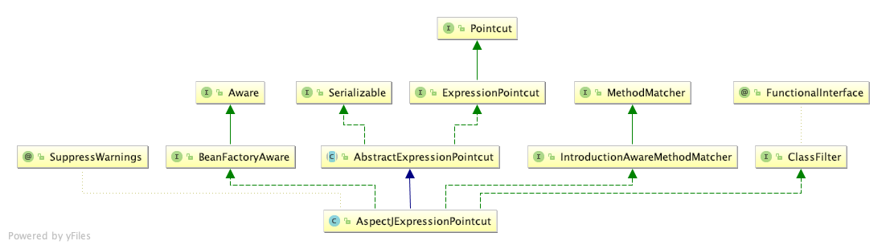
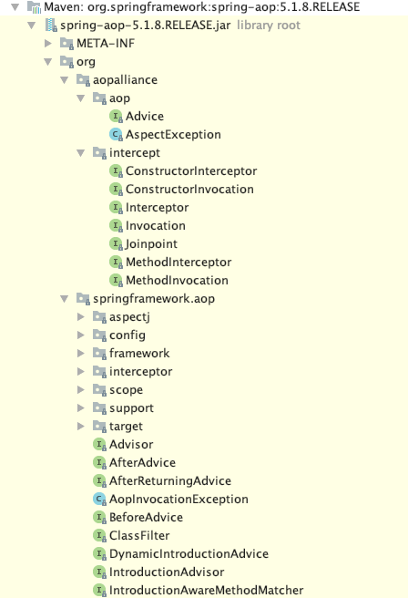
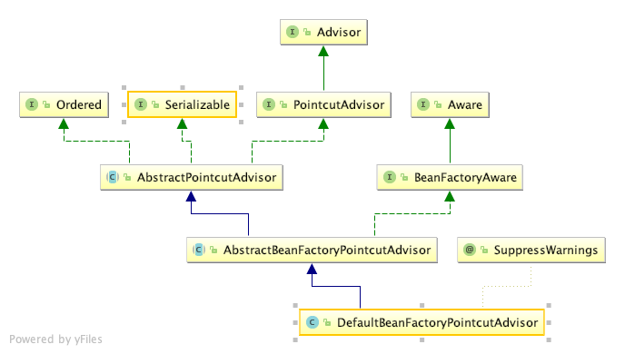
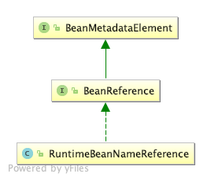
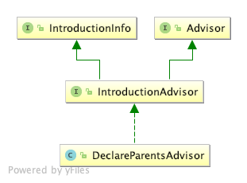
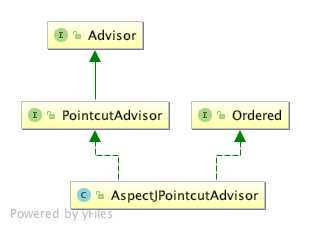
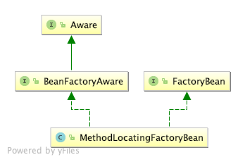
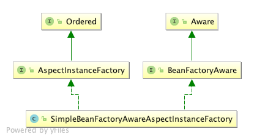
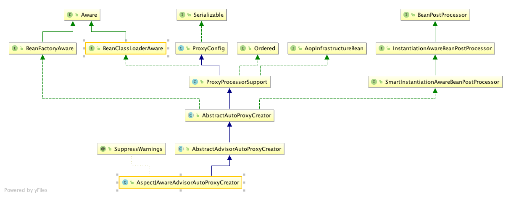
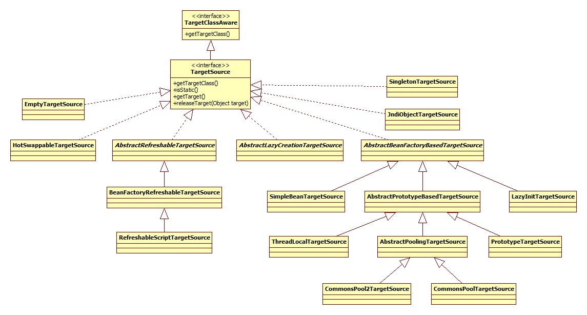

- [ConfigBeanDefinitionParser.parse解析](#configbeandefinitionparserparse%e8%a7%a3%e6%9e%90)
  - [proxy-target-class & expose-proxy](#proxy-target-class--expose-proxy)
  - [aop:pointcut](#aoppointcut)
  - [aop:advisor](#aopadvisor)
  - [aop:aspect](#aopaspect)
  - [其它](#%e5%85%b6%e5%ae%83)
  - [代理子类生成](#%e4%bb%a3%e7%90%86%e5%ad%90%e7%b1%bb%e7%94%9f%e6%88%90)
    - [入口](#%e5%85%a5%e5%8f%a3)
      - [postProcessBeforeInstantiation](#postprocessbeforeinstantiation)
        - [调用时机](#%e8%b0%83%e7%94%a8%e6%97%b6%e6%9c%ba)
          - [进行applyBeanPostProcessorsBeforeInstantiation](#%e8%bf%9b%e8%a1%8capplybeanpostprocessorsbeforeinstantiation)
          - [applyBeanPostProcessorsAfterInitialization](#applybeanpostprocessorsafterinitialization)

# ConfigBeanDefinitionParser.parse解析

```
org.springframework.aop.config.ConfigBeanDefinitionParser.parse
@Override
@Nullable
public BeanDefinition parse(Element element, ParserContext parserContext) {
    CompositeComponentDefinition compositeDef =
            new CompositeComponentDefinition(element.getTagName(), parserContext.extractSource(element));
    parserContext.pushContainingComponent(compositeDef);

    configureAutoProxyCreator(parserContext, element); ⬇️ -- proxy-target-class & expose-proxy  ++ 代理子类生成

    List<Element> childElts = DomUtils.getChildElements(element);
    for (Element elt: childElts) {
        String localName = parserContext.getDelegate().getLocalName(elt);
        if (POINTCUT.equals(localName)) {
            parsePointcut(elt, parserContext); ⬇️ -- aop:pointcut
        }
        else if (ADVISOR.equals(localName)) {
            parseAdvisor(elt, parserContext); ⬇️ -- aop:advisor
        }
        else if (ASPECT.equals(localName)) {
            parseAspect(elt, parserContext); ⬇️ -- aop:aspect
        }
    }

    parserContext.popAndRegisterContainingComponent();
    return null;
}
```

## proxy-target-class & expose-proxy
对应着aop:config的两个属性，前者代表是否为被代理这生成CGLIB子类，默认false，只为接口生成代理子类(话说如果不生成子类那么怎么拦截?)。
后者代表是否将代理bean暴露给用户，如果暴露，可以通过Spring AopContext类获得，默认不暴露。
```
org.springframework.aop.config.ConfigBeanDefinitionParser.configureAutoProxyCreator
private void configureAutoProxyCreator(ParserContext parserContext, Element element) {
    AopNamespaceUtils.registerAspectJAutoProxyCreatorIfNecessary(parserContext, element);
}
org.springframework.aop.config.AopNamespaceUtils.registerAspectJAutoProxyCreatorIfNecessary
public static void registerAspectJAutoProxyCreatorIfNecessary(
			ParserContext parserContext, Element sourceElement) {
    BeanDefinition beanDefinition = AopConfigUtils.registerAspectJAutoProxyCreatorIfNecessary(
            parserContext.getRegistry(), parserContext.extractSource(sourceElement));
    useClassProxyingIfNecessary(parserContext.getRegistry(), sourceElement);
    registerComponentIfNecessary(beanDefinition, parserContext);
}
org.springframework.aop.config.AopNamespaceUtils.useClassProxyingIfNecessary
private static void useClassProxyingIfNecessary(BeanDefinitionRegistry registry, @Nullable Element sourceElement) {
    if (sourceElement != null) {
        // public static final String PROXY_TARGET_CLASS_ATTRIBUTE = "proxy-target-class";
        boolean proxyTargetClass = Boolean.parseBoolean(sourceElement.getAttribute(PROXY_TARGET_CLASS_ATTRIBUTE));
        if (proxyTargetClass) {
            AopConfigUtils.forceAutoProxyCreatorToUseClassProxying(registry);
        }
        // private static final String EXPOSE_PROXY_ATTRIBUTE = "expose-proxy";
        boolean exposeProxy = Boolean.parseBoolean(sourceElement.getAttribute(EXPOSE_PROXY_ATTRIBUTE));
        if (exposeProxy) {
            AopConfigUtils.forceAutoProxyCreatorToExposeProxy(registry);
        }
    }
}
private static void registerComponentIfNecessary(@Nullable BeanDefinition beanDefinition, ParserContext parserContext) {
    if (beanDefinition != null) {
        // public static final String AUTO_PROXY_CREATOR_BEAN_NAME = "org.springframework.aop.config.internalAutoProxyCreator";
        parserContext.registerComponent(
                new BeanComponentDefinition(beanDefinition, AopConfigUtils.AUTO_PROXY_CREATOR_BEAN_NAME));
    }
}
```

## aop:pointcut
```
private AbstractBeanDefinition parsePointcut(Element pointcutElement, ParserContext parserContext) {
    String id = pointcutElement.getAttribute(ID);
    String expression = pointcutElement.getAttribute(EXPRESSION);
    AbstractBeanDefinition pointcutDefinition = null;
    try {
        this.parseState.push(new PointcutEntry(id));
        pointcutDefinition = createPointcutDefinition(expression);
        pointcutDefinition.setSource(parserContext.extractSource(pointcutElement));
        String pointcutBeanName = id;
        if (StringUtils.hasText(pointcutBeanName)) {
            parserContext.getRegistry().registerBeanDefinition(pointcutBeanName, pointcutDefinition);
        }
        else {
            pointcutBeanName = parserContext.getReaderContext().registerWithGeneratedName(pointcutDefinition);
        }
        parserContext.registerComponent(
                new PointcutComponentDefinition(pointcutBeanName, pointcutDefinition, expression));
    }
    finally {
        this.parseState.pop();
    }
    return pointcutDefinition;
}
org.springframework.aop.config.ConfigBeanDefinitionParser.createPointcutDefinition
protected AbstractBeanDefinition createPointcutDefinition(String expression) {
    RootBeanDefinition beanDefinition = new RootBeanDefinition(AspectJExpressionPointcut.class);
    beanDefinition.setScope(BeanDefinition.SCOPE_PROTOTYPE);
    beanDefinition.setSynthetic(true);
    beanDefinition.getPropertyValues().add(EXPRESSION, expression);
    return beanDefinition;
}
```
pointcut的解析是一个生成一个BeanDefinition并将其id, expression等属性保存在BeanDefinition中。注意以下几点:<br/>
 - BeanDefinition的ID来自于id属性，如果没有，那么自动生成。<br/>
 - BeanDefinition的class是AspectJExpressionPointcut。<br/>
 - BeanDefinition的scope为prototype。<br/>
 
 AspectJExpressionPointcut类图:<br/>
 
 
 ## aop:advisor
```
//org.springframework.aop.config.ConfigBeanDefinitionParser#parseAdvisor
private void parseAdvisor(Element advisorElement, ParserContext parserContext) {
    AbstractBeanDefinition advisorDef = createAdvisorBeanDefinition(advisorElement, parserContext);
    String id = advisorElement.getAttribute(ID);
    try {
        this.parseState.push(new AdvisorEntry(id));
        String advisorBeanName = id;
        if (StringUtils.hasText(advisorBeanName)) {
            parserContext.getRegistry().registerBeanDefinition(advisorBeanName, advisorDef);
        }
        else {
            advisorBeanName = parserContext.getReaderContext().registerWithGeneratedName(advisorDef);
        }
        Object pointcut = parsePointcutProperty(advisorElement, parserContext);
        if (pointcut instanceof BeanDefinition) {
            advisorDef.getPropertyValues().add(POINTCUT, pointcut);
            parserContext.registerComponent(
                    new AdvisorComponentDefinition(advisorBeanName, advisorDef, (BeanDefinition) pointcut));
        }
        else if (pointcut instanceof String) {
            advisorDef.getPropertyValues().add(POINTCUT, new RuntimeBeanReference((String) pointcut));
            parserContext.registerComponent(
                    new AdvisorComponentDefinition(advisorBeanName, advisorDef));
        }
    }
    finally {
        this.parseState.pop();
    }
}
//org.springframework.aop.config.ConfigBeanDefinitionParser#createAdvisorBeanDefinition
private AbstractBeanDefinition createAdvisorBeanDefinition(Element advisorElement, ParserContext parserContext) {
    RootBeanDefinition advisorDefinition = new RootBeanDefinition(DefaultBeanFactoryPointcutAdvisor.class);
    advisorDefinition.setSource(parserContext.extractSource(advisorElement));
    String adviceRef = advisorElement.getAttribute(ADVICE_REF);
    if (!StringUtils.hasText(adviceRef)) {
        parserContext.getReaderContext().error(
                "'advice-ref' attribute contains empty value.", advisorElement, this.parseState.snapshot());
    }
    else {
        advisorDefinition.getPropertyValues().add(
                ADVICE_BEAN_NAME, new RuntimeBeanNameReference(adviceRef));
    }
    if (advisorElement.hasAttribute(ORDER_PROPERTY)) {
        advisorDefinition.getPropertyValues().add(
                ORDER_PROPERTY, advisorElement.getAttribute(ORDER_PROPERTY));
    }
    return advisorDefinition;
}
```
首先是其所有属性的示例:
```
<aop:advisor id="" order="" advice-ref="aopAdvice" pointcut="" pointcut-ref="" />
```
advisor概念是Spring独有的，来自于上古时代，应该是较早时候的aop概念的实现: [AOP Alliance (Java/J2EE AOP standards)](http://aopalliance.sourceforge.net/)。
Spring官方的说法: [aop-schema-advisors](https://docs.spring.io/spring/docs/current/spring-framework-reference/core.html#aop)。<br/>
相关包/类：<br/>
<br/>
advice-ref是必须的属性，并且这里的advice必须实现org.aopalliance.aop.Advice的子接口。这些子接口指的什么呢，见Spring官方文档: [aop-api-advice-types](https://docs.spring.io/spring/docs/current/spring-framework-reference/core.html#aop-api)。
比如org.aopalliance.intercept.MethodInterceptor。<br/>
最常见的用途就是结合事务使用:
```
<tx:advice id="txAdvice" transaction-manager="transactionManager">
    <tx:attributes>
        <tx:method name="get*" read-only="true" propagation="NOT_SUPPORTED"/>
        <tx:method name="find*" read-only="true" propagation="NOT_SUPPORTED"/>
        <tx:method name="*" propagation="REQUIRED"/>
    </tx:attributes>
</tx:advice>

<aop:config>
    <aop:pointcut expression="execution(* exam.service..*.*(..))" id="transaction"/>
    <aop:advisor advice-ref="txAdvice" pointcut-ref="transaction"/>
</aop:config>
```
处的beanClass是DefaultBeanFactoryPointcutAdvisor，其类图:<br/>
<br/>

另外注意对于pointcut和pointcut-ref两者处理的区别，对于pointcut属性，Spring会同样创建一个AspectJExpressionPointcut类型的BeanDefinition，
对于pointcut-ref会生成一个RuntimeBeanReference对象指向原pointcut的引用。此类的类图:<br/>
<br/>
aop的实现需要实现各种接口，所以不应该再使用此种方式进行aop，除了Spring内部的实现。

## aop:aspect
```
private void parseAspect(Element aspectElement, ParserContext parserContext) {
    String aspectId = aspectElement.getAttribute(ID);
    String aspectName = aspectElement.getAttribute(REF);
    try {
        this.parseState.push(new AspectEntry(aspectId, aspectName));
        List<BeanDefinition> beanDefinitions = new ArrayList<>();
        List<BeanReference> beanReferences = new ArrayList<>();

        List<Element> declareParents = DomUtils.getChildElementsByTagName(aspectElement, DECLARE_PARENTS);
        for (int i = METHOD_INDEX; i < declareParents.size(); i++) {
            Element declareParentsElement = declareParents.get(i);
            beanDefinitions.add(parseDeclareParents(declareParentsElement, parserContext));
        }
        // We have to parse "advice" and all the advice kinds in one loop, to get the
        // ordering semantics right.
        NodeList nodeList = aspectElement.getChildNodes();
        boolean adviceFoundAlready = false;
        for (int i = 0; i < nodeList.getLength(); i++) {
            Node node = nodeList.item(i);
            if (isAdviceNode(node, parserContext)) {
                if (!adviceFoundAlready) {
                    adviceFoundAlready = true;
                    if (!StringUtils.hasText(aspectName)) {
                        parserContext.getReaderContext().error(
                                "<aspect> tag needs aspect bean reference via 'ref' attribute when declaring advices.",
                                aspectElement, this.parseState.snapshot());
                        return;
                    }
                    beanReferences.add(new RuntimeBeanReference(aspectName));
                }
                AbstractBeanDefinition advisorDefinition = parseAdvice( ⬇️ -- 其他-parseAdvice
                        aspectName, i, aspectElement, (Element) node, parserContext, beanDefinitions, beanReferences);
                beanDefinitions.add(advisorDefinition);
            }
        }

        AspectComponentDefinition aspectComponentDefinition = createAspectComponentDefinition(
                aspectElement, aspectId, beanDefinitions, beanReferences, parserContext);
        parserContext.pushContainingComponent(aspectComponentDefinition);

        List<Element> pointcuts = DomUtils.getChildElementsByTagName(aspectElement, POINTCUT);
        for (Element pointcutElement : pointcuts) {
            parsePointcut(pointcutElement, parserContext);
        }

        parserContext.popAndRegisterContainingComponent();
    }
    finally {
        this.parseState.pop();
    }
}
```
配置举例:
```
<bean id="aopAdvice" class="base.aop.AopDemoAdvice" />
<!-- 必须配置，因为被代理的对象必须在Spring容器中 -->
<bean id="aopDemo" class="base.aop.AopDemo" />
<aop:config>
    <aop:pointcut id="pointcut" expression="execution(* base.aop.AopDemo.send())" />
    <aop:aspect ref="aopAdvice">
        <aop:before method="beforeSend" pointcut-ref="pointcut" />
        <aop:after method="afterSend" pointcut-ref="pointcut" />
    </aop:aspect>
</aop:config>
```
解析形成的BeanDefinition结构如下:
```
AspectComponentDefinition
    beanRefArray
        RuntimeBeanReference(aop:aspect的ref属性)
    beanDefArray
        // 被注册
        RootBeanDefinition(aop:declare-parents)
            beanClass: DeclareParentsAdvisor
            ConstructorArg
                implement-interface
                types-matching
                default-impl
                delegate-ref
        // 被注册
        RootBeanDefinition(aop:before,aop:after...)
            beanClass: AspectJPointcutAdvisor
            ConstructorArg
                RootBeanDefinition
                    beanClass: 由子标签决定
                    ConstructorArg
                        RootBeanDefinition
                            beanClass: MethodLocatingFactoryBean
                            properties
                                targetBeanName: aspectName
                                methodName: method属性
                        RootBeanDefinition
                            beanClass: SimpleBeanFactoryAwareAspectInstanceFactory
                            properties
                                aspectBeanName: aspectName
                        //还有pointcut定义和引用...
```
aop:declare-parents对于aop:declare-parents子标签，其决定的是代理子类应该实现哪些接口:<br/>
`<aop:declare-parents types-matching="" implement-interface="" />`<br/>
此标签最终被解析成为beanClass为DeclareParentsAdvisor的BeanDefinition，并注册到容器中。其类图:<br/>

```
org.springframework.aop.config.ConfigBeanDefinitionParser.parseDeclareParents
private AbstractBeanDefinition parseDeclareParents(Element declareParentsElement, ParserContext parserContext) {
    BeanDefinitionBuilder builder = BeanDefinitionBuilder.rootBeanDefinition(DeclareParentsAdvisor.class);
    builder.addConstructorArgValue(declareParentsElement.getAttribute(IMPLEMENT_INTERFACE));
    builder.addConstructorArgValue(declareParentsElement.getAttribute(TYPE_PATTERN));

    String defaultImpl = declareParentsElement.getAttribute(DEFAULT_IMPL);
    String delegateRef = declareParentsElement.getAttribute(DELEGATE_REF);

    if (StringUtils.hasText(defaultImpl) && !StringUtils.hasText(delegateRef)) {
        builder.addConstructorArgValue(defaultImpl);
    }
    else if (StringUtils.hasText(delegateRef) && !StringUtils.hasText(defaultImpl)) {
        builder.addConstructorArgReference(delegateRef);
    }
    else {
        parserContext.getReaderContext().error(
                "Exactly one of the " + DEFAULT_IMPL + " or " + DELEGATE_REF + " attributes must be specified",
                declareParentsElement, this.parseState.snapshot());
    }

    AbstractBeanDefinition definition = builder.getBeanDefinition();
    definition.setSource(parserContext.extractSource(declareParentsElement));
    parserContext.getReaderContext().registerWithGeneratedName(definition);
    return definition;
}
```
## 其它
此处的其它指的是aop:before, aop:after等最核心的标签。其最终被解析为beanClass为AspectJPointcutAdvisor的BeanDefinition，类图:<br/>
<br/>
正如上面结构图里所描述的，其构造参数为一个BeanDefinition，此对象的beanClass是不确定的，由aop:before/after中的before和after决定，代码:
**parseAdvice**
```
private AbstractBeanDefinition parseAdvice(
			String aspectName, int order, Element aspectElement, Element adviceElement, ParserContext parserContext,
			List<BeanDefinition> beanDefinitions, List<BeanReference> beanReferences) {
    try {
        this.parseState.push(new AdviceEntry(parserContext.getDelegate().getLocalName(adviceElement)));

        // create the method factory bean
        RootBeanDefinition methodDefinition = new RootBeanDefinition(MethodLocatingFactoryBean.class);
        methodDefinition.getPropertyValues().add("targetBeanName", aspectName);
        methodDefinition.getPropertyValues().add("methodName", adviceElement.getAttribute("method"));
        methodDefinition.setSynthetic(true);

        // create instance factory definition
        RootBeanDefinition aspectFactoryDef =
                new RootBeanDefinition(SimpleBeanFactoryAwareAspectInstanceFactory.class);
        aspectFactoryDef.getPropertyValues().add("aspectBeanName", aspectName);
        aspectFactoryDef.setSynthetic(true);

        // register the pointcut
        AbstractBeanDefinition adviceDef = createAdviceDefinition( ⬇️ -- createAdviceDefinition
                adviceElement, parserContext, aspectName, order, methodDefinition, aspectFactoryDef,
                beanDefinitions, beanReferences);

        // configure the advisor
        RootBeanDefinition advisorDefinition = new RootBeanDefinition(AspectJPointcutAdvisor.class);
        advisorDefinition.setSource(parserContext.extractSource(adviceElement));
        advisorDefinition.getConstructorArgumentValues().addGenericArgumentValue(adviceDef);
        if (aspectElement.hasAttribute(ORDER_PROPERTY)) {
            advisorDefinition.getPropertyValues().add(
                    ORDER_PROPERTY, aspectElement.getAttribute(ORDER_PROPERTY));
        }

        // register the final advisor
        parserContext.getReaderContext().registerWithGeneratedName(advisorDefinition);

        return advisorDefinition;
    }
    finally {
        this.parseState.pop();
    }
}
```
**createAdviceDefinition**
```
private AbstractBeanDefinition createAdviceDefinition(
			Element adviceElement, ParserContext parserContext, String aspectName, int order,
			RootBeanDefinition methodDef, RootBeanDefinition aspectFactoryDef,
			List<BeanDefinition> beanDefinitions, List<BeanReference> beanReferences) {

    RootBeanDefinition adviceDefinition = new RootBeanDefinition(getAdviceClass(adviceElement, parserContext)); ⬇️ -- getAdviceClass
    adviceDefinition.setSource(parserContext.extractSource(adviceElement));

    adviceDefinition.getPropertyValues().add(ASPECT_NAME_PROPERTY, aspectName);
    adviceDefinition.getPropertyValues().add(DECLARATION_ORDER_PROPERTY, order);

    if (adviceElement.hasAttribute(RETURNING)) {
        adviceDefinition.getPropertyValues().add(
                RETURNING_PROPERTY, adviceElement.getAttribute(RETURNING));
    }
    if (adviceElement.hasAttribute(THROWING)) {
        adviceDefinition.getPropertyValues().add(
                THROWING_PROPERTY, adviceElement.getAttribute(THROWING));
    }
    if (adviceElement.hasAttribute(ARG_NAMES)) {
        adviceDefinition.getPropertyValues().add(
                ARG_NAMES_PROPERTY, adviceElement.getAttribute(ARG_NAMES));
    }

    ConstructorArgumentValues cav = adviceDefinition.getConstructorArgumentValues();
    cav.addIndexedArgumentValue(METHOD_INDEX, methodDef);

    Object pointcut = parsePointcutProperty(adviceElement, parserContext);
    if (pointcut instanceof BeanDefinition) {
        cav.addIndexedArgumentValue(POINTCUT_INDEX, pointcut);
        beanDefinitions.add((BeanDefinition) pointcut);
    }
    else if (pointcut instanceof String) {
        RuntimeBeanReference pointcutRef = new RuntimeBeanReference((String) pointcut);
        cav.addIndexedArgumentValue(POINTCUT_INDEX, pointcutRef);
        beanReferences.add(pointcutRef);
    }

    cav.addIndexedArgumentValue(ASPECT_INSTANCE_FACTORY_INDEX, aspectFactoryDef);

    return adviceDefinition;
}
```
**getAdviceClass**
```
private Class<?> getAdviceClass(Element adviceElement, ParserContext parserContext) {
    String elementName = parserContext.getDelegate().getLocalName(adviceElement);
    if (BEFORE.equals(elementName)) {
        return AspectJMethodBeforeAdvice.class;
    }
    else if (AFTER.equals(elementName)) {
        return AspectJAfterAdvice.class;
    }
    else if (AFTER_RETURNING_ELEMENT.equals(elementName)) {
        return AspectJAfterReturningAdvice.class;
    }
    else if (AFTER_THROWING_ELEMENT.equals(elementName)) {
        return AspectJAfterThrowingAdvice.class;
    }
    else if (AROUND.equals(elementName)) {
        return AspectJAroundAdvice.class;
    }
    else {
        throw new IllegalArgumentException("Unknown advice kind [" + elementName + "].");
    }
}
```
而此BeanDefinition的构造参数又由以下三个部分组成:

**MethodLocatingFactoryBean**<br/>
第一个便是beanClass为此类型的BeanDefinition。其内部有一个methodName属性，存储的便是标签的method属性的值。其类图:<br/>

```
出现位置org.springframework.aop.config.ConfigBeanDefinitionParser.parseAdvice
RootBeanDefinition methodDefinition = new RootBeanDefinition(MethodLocatingFactoryBean.class);
methodDefinition.getPropertyValues().add("targetBeanName", aspectName);
methodDefinition.getPropertyValues().add("methodName", adviceElement.getAttribute("method"));
methodDefinition.setSynthetic(true);
```
这个东西是干什么用的呢?其实是用于在指定的advice(aop:aspect的ref属性)中得到Method对象。入口在setBeanFactory方法:
```
@Override
public void setBeanFactory(BeanFactory beanFactory) {
    Class<?> beanClass = beanFactory.getType(this.targetBeanName);
    this.method = BeanUtils.resolveSignature(this.methodName, beanClass);
}
```
SimpleBeanFactoryAwareAspectInstanceFactory
```
RootBeanDefinition aspectFactoryDef = new RootBeanDefinition(SimpleBeanFactoryAwareAspectInstanceFactory.class);
aspectFactoryDef.getPropertyValues().add("aspectBeanName", aspectName);
aspectFactoryDef.setSynthetic(true);
```
类图

此类用于在BeanFactory中定位aspect bean，这个bean指的是谁?`<bean id="aopAdvice" class="base.aop.AopDemoAdvice" />`

**总结**<br/>
从整个aop:aspect标签最终被解析为一个AspectJPointcutAdvisor来看，Spring在实现上仍将其作为Advisor的概念。<br/>


## 代理子类生成
```
org.springframework.aop.config.ConfigBeanDefinitionParser.configureAutoProxyCreator
private void configureAutoProxyCreator(ParserContext parserContext, Element element) {
    AopNamespaceUtils.registerAspectJAutoProxyCreatorIfNecessary(parserContext, element);
}
org.springframework.aop.config.AopNamespaceUtils.registerAspectJAutoProxyCreatorIfNecessary
public static void registerAspectJAutoProxyCreatorIfNecessary(
			ParserContext parserContext, Element sourceElement) {
    BeanDefinition beanDefinition = AopConfigUtils.registerAspectJAutoProxyCreatorIfNecessary(
            parserContext.getRegistry(), parserContext.extractSource(sourceElement));
    useClassProxyingIfNecessary(parserContext.getRegistry(), sourceElement);
    registerComponentIfNecessary(beanDefinition, parserContext);
}
org.springframework.aop.config.AopConfigUtils.registerAspectJAutoProxyCreatorIfNecessary(org.springframework.beans.factory.support.BeanDefinitionRegistry, java.lang.Object)
public static BeanDefinition registerAspectJAutoProxyCreatorIfNecessary(
			BeanDefinitionRegistry registry, @Nullable Object source) {
    return registerOrEscalateApcAsRequired(AspectJAwareAdvisorAutoProxyCreator.class, registry, source);
}
```
关键在于AspectJAwareAdvisorAutoProxyCreator，此对象在ConfigBeanDefinitionParser的configureAutoProxyCreator方法中注册，其类图:<br/>
<br/>
### 入口
从AspectJAwareAdvisorAutoProxyCreator的类图中可以看出，此类实现了SmartInstantiationAwareBeanPostProcessor接口，
所以很容易想到入口应该位于此接口及其父接口(BeanPostProcessor)的相关方法中。实际上确实是这样的。
#### postProcessBeforeInstantiation

##### 调用时机
此方法在Bean创建的过程中的调用时机。AbstractAutowireCapableBeanFactory.createBean部分源码:
```
org.springframework.context.support.AbstractApplicationContext.refresh -->
org.springframework.context.support.AbstractApplicationContext.finishBeanFactoryInitialization -->
org.springframework.context.support.AbstractApplicationContext.getBean(java.lang.String) -->
org.springframework.beans.factory.support.AbstractBeanFactory.getBean(java.lang.String) -->
org.springframework.beans.factory.support.AbstractAutowireCapableBeanFactory.createBean(java.lang.String, org.springframework.beans.factory.support.RootBeanDefinition, java.lang.Object[])
//// Give BeanPostProcessors a chance to return a proxy instead of the target bean instance.
Object bean = resolveBeforeInstantiation(beanName, mbdToUse);
if (bean != null) {
    return bean;
}
Object beanInstance = doCreateBean(beanName, mbdToUse, args);
```
AbstractAutoProxyCreator.postProcessBeforeInstantiation:
```
承接上段Object bean = resolveBeforeInstantiation(beanName, mbdToUse);
org.springframework.beans.factory.support.AbstractAutowireCapableBeanFactory.resolveBeforeInstantiation
protected Object resolveBeforeInstantiation(String beanName, RootBeanDefinition mbd) {
    Object bean = null;
    if (!Boolean.FALSE.equals(mbd.beforeInstantiationResolved)) {
        // Make sure bean class is actually resolved at this point.
        if (!mbd.isSynthetic() && hasInstantiationAwareBeanPostProcessors()) {
            Class<?> targetType = determineTargetType(beanName, mbd);
            if (targetType != null) {
                bean = applyBeanPostProcessorsBeforeInstantiation(targetType, beanName); ⬇️ -- 进行applyBeanPostProcessorsBeforeInstantiation
                if (bean != null) {
                    bean = applyBeanPostProcessorsAfterInitialization(bean, beanName); ⬇️ -- 进行applyBeanPostProcessorsAfterInitialization
                }
            }
        }
        mbd.beforeInstantiationResolved = (bean != null);
    }
    return bean;
}
```
###### 进行applyBeanPostProcessorsBeforeInstantiation
```
@Nullable
protected Object applyBeanPostProcessorsBeforeInstantiation(Class<?> beanClass, String beanName) {
    for (BeanPostProcessor bp : getBeanPostProcessors()) {
        if (bp instanceof InstantiationAwareBeanPostProcessor) {
            InstantiationAwareBeanPostProcessor ibp = (InstantiationAwareBeanPostProcessor) bp;
            Object result = ibp.postProcessBeforeInstantiation(beanClass, beanName);
            if (result != null) {
                return result;
            }
        }
    }
    return null;
}
org.springframework.aop.framework.autoproxy.AbstractAutoProxyCreator.postProcessBeforeInstantiation
@Override
public Object postProcessBeforeInstantiation(Class<?> beanClass, String beanName) {
    Object cacheKey = getCacheKey(beanClass, beanName);
    if (!StringUtils.hasLength(beanName) || !this.targetSourcedBeans.contains(beanName)) {
        if (this.advisedBeans.containsKey(cacheKey)) {
            return null;
        }
        if (isInfrastructureClass(beanClass) || shouldSkip(beanClass, beanName)) {
            this.advisedBeans.put(cacheKey, Boolean.FALSE);
            return null;
        }
    }
    // Create proxy here if we have a custom TargetSource.
    // Suppresses unnecessary default instantiation of the target bean:
    // The TargetSource will handle target instances in a custom fashion.
    TargetSource targetSource = getCustomTargetSource(beanClass, beanName);
    if (targetSource != null) {
        if (StringUtils.hasLength(beanName)) {
            this.targetSourcedBeans.add(beanName);
        }
        Object[] specificInterceptors = getAdvicesAndAdvisorsForBean(beanClass, beanName, targetSource);
        Object proxy = createProxy(beanClass, beanName, specificInterceptors, targetSource);
        this.proxyTypes.put(cacheKey, proxy.getClass());
        return proxy;
    }
    return null;
}
```
上段代码说明：
Spring首先会对当前的beanClass进行检查(是否应该/可以对其进行代理)。
不应该代理的类分为两种情况:
- 用于实现AOP的Spring基础类，此种情况在isInfrastructureClass方法中完成检测(单词Infrastructure正是基础设施的意思)。-- isInfrastructureClass(beanClass)
- 子类定义的应该跳过的类，默认AbstractAutoProxyCreator的实现直接返回false，即都不应该跳过。-- shouldSkip(beanClass, beanName)
```
基础类检测
org.springframework.aop.framework.autoproxy.AbstractAutoProxyCreator.isInfrastructureClass
protected boolean isInfrastructureClass(Class<?> beanClass) {
    boolean retVal = Advice.class.isAssignableFrom(beanClass) ||
            Pointcut.class.isAssignableFrom(beanClass) ||
            Advisor.class.isAssignableFrom(beanClass) ||
            AopInfrastructureBean.class.isAssignableFrom(beanClass);
    if (retVal && logger.isTraceEnabled()) {
        logger.trace("Did not attempt to auto-proxy infrastructure class [" + beanClass.getName() + "]");
    }
    return retVal;
}
任何Advice、Pointcut、Advisor、AopInfrastructureBean的子类都被当做Spring实现AOP的基础设施类。
```
```
跳过类检测
即shouldSkip方法。前面提到了，AbstractAutoProxyCreator的默认实现直接返回fasle，这一特性被子类AspectJAwareAdvisorAutoProxyCreator重写:
org.springframework.aop.aspectj.autoproxy.AspectJAwareAdvisorAutoProxyCreator.shouldSkip
@Override
protected boolean shouldSkip(Class<?> beanClass, String beanName) {
    // TODO: Consider optimization by caching the list of the aspect names
    List<Advisor> candidateAdvisors = findCandidateAdvisors();
    for (Advisor advisor : candidateAdvisors) {
        if (advisor instanceof AspectJPointcutAdvisor &&
                ((AspectJPointcutAdvisor) advisor).getAspectName().equals(beanName)) {
            return true;
        }
    }
    return super.shouldSkip(beanClass, beanName);
}
此方法跳过的是我们通过aop:aspect标签配置的切面，即:
<bean id="aopAdvice" class="base.aop.AopDemoAdvice" />
<aop:config>
    <aop:aspect ref="aopAdvice">
    </aop:aspect>
</aop:config>
里的aopAdvice。
```
从前面的aop:aspect一节中可以知道，Spring对于aop:config的解析其实是把aop:before/after等标签解析成为了AspectJPointcutAdvisor类型的BeanDefinition，而aopAdvice以AbstractAspectJAdvice的类型保存在其中。
所以可以得出结论: **Spring跳过的是适用于当前bean的Advisor的Advice/Aspect对象**。<br/>
<br/>
_Advisor寻找_<br/>
关键便是findCandidateAdvisors方法，此方法将逻辑委托给BeanFactoryAdvisorRetrievalHelper.findAdvisorBeans:<br/>
```
org.springframework.aop.framework.autoproxy.AbstractAdvisorAutoProxyCreator.findCandidateAdvisors
protected List<Advisor> findCandidateAdvisors() {
    Assert.state(this.advisorRetrievalHelper != null, "No BeanFactoryAdvisorRetrievalHelper available");
    return this.advisorRetrievalHelper.findAdvisorBeans();
}
org.springframework.aop.framework.autoproxy.BeanFactoryAdvisorRetrievalHelper.findAdvisorBeans
public List<Advisor> findAdvisorBeans() {
    // Determine list of advisor bean names, if not cached already.
    String[] advisorNames = this.cachedAdvisorBeanNames;
    if (advisorNames == null) {
        // Do not initialize FactoryBeans here: We need to leave all regular beans
        // uninitialized to let the auto-proxy creator apply to them!
        advisorNames = BeanFactoryUtils.beanNamesForTypeIncludingAncestors(
                this.beanFactory, Advisor.class, true, false);
        this.cachedAdvisorBeanNames = advisorNames;
    }
    if (advisorNames.length == 0) {
        return new ArrayList<>();
    }

    List<Advisor> advisors = new ArrayList<>();
    for (String name : advisorNames) {
        // 适用性检测 ⬇️ 
        if (isEligibleBean(name)) {
            if (this.beanFactory.isCurrentlyInCreation(name)) {
                if (logger.isTraceEnabled()) {
                    logger.trace("Skipping currently created advisor '" + name + "'");
                }
            }
            else {
                try {
                    advisors.add(this.beanFactory.getBean(name, Advisor.class));
                }
                catch (BeanCreationException ex) {
                    Throwable rootCause = ex.getMostSpecificCause();
                    if (rootCause instanceof BeanCurrentlyInCreationException) {
                        BeanCreationException bce = (BeanCreationException) rootCause;
                        String bceBeanName = bce.getBeanName();
                        if (bceBeanName != null && this.beanFactory.isCurrentlyInCreation(bceBeanName)) {
                            if (logger.isTraceEnabled()) {
                                logger.trace("Skipping advisor '" + name +
                                        "' with dependency on currently created bean: " + ex.getMessage());
                            }
                            // Ignore: indicates a reference back to the bean we're trying to advise.
                            // We want to find advisors other than the currently created bean itself.
                            continue;
                        }
                    }
                    throw ex;
                }
            }
        }
    }
    return advisors;
}
首先是从容器中获取到所有的Advisor示例，然后调用isEligibleBean方法逐一判断Advisor是否适用于当前bean。
```
适用性检测
```
org.springframework.aop.framework.autoproxy.BeanFactoryAdvisorRetrievalHelper.isEligibleBean
protected boolean isEligibleBean(String beanName) {
    return true;
}
```
而AbstractAdvisorAutoProxyCreator的子类AspectJAwareAdvisorAutoProxyCreator并没有覆盖此方法，所以此处会对**容器中所有的Advisor的Advice进行跳过**。<br/>
_检测结果缓存_<br/>
因为postProcessBeforeInstantiation方法会在每个bean初始化之前被调用，所以没有必要每次都真的进行基础类检测和跳过类检测，Spring使用了advisedBeans作为缓存用以提高性能。<br/>
_TargetSource_<br/>
对于自定义的TargetSource，Spring会立即执行代理子类的创建。Spring的代理其实是针对TargetSource的，其类图:<br/>


###### applyBeanPostProcessorsAfterInitialization
org.springframework.beans.factory.support.AbstractAutowireCapableBeanFactory.applyBeanPostProcessorsAfterInitialization
```
@Override
public Object applyBeanPostProcessorsAfterInitialization(Object existingBean, String beanName)
        throws BeansException {
    Object result = existingBean;
    for (BeanPostProcessor processor : getBeanPostProcessors()) {
        Object current = processor.postProcessAfterInitialization(result, beanName);
        if (current == null) {
            return result;
        }
        result = current;
    }
    return result;
}
org.springframework.aop.framework.autoproxy.AbstractAutoProxyCreator.postProcessAfterInitialization
@Override
public Object postProcessAfterInitialization(@Nullable Object bean, String beanName) {
    if (bean != null) {
        Object cacheKey = getCacheKey(bean.getClass(), beanName);
        if (this.earlyProxyReferences.remove(cacheKey) != bean) {
            return wrapIfNecessary(bean, beanName, cacheKey);
        }
    }
    return bean;
}
```
关键便在于wrapIfNecessary方法:
```
org.springframework.aop.framework.autoproxy.AbstractAutoProxyCreator.wrapIfNecessary
protected Object wrapIfNecessary(Object bean, String beanName, Object cacheKey) {
    //自定义TargetSource，已经进行过代理子类生成
    if (StringUtils.hasLength(beanName) && this.targetSourcedBeans.contains(beanName)) {
        return bean;
    }
    if (Boolean.FALSE.equals(this.advisedBeans.get(cacheKey))) {
        return bean;
    }
    if (isInfrastructureClass(bean.getClass()) || shouldSkip(bean.getClass(), beanName)) {
        this.advisedBeans.put(cacheKey, Boolean.FALSE);
        return bean;
    }

    // Create proxy if we have advice.
    Object[] specificInterceptors = getAdvicesAndAdvisorsForBean(bean.getClass(), beanName, null);
    if (specificInterceptors != DO_NOT_PROXY) {
        this.advisedBeans.put(cacheKey, Boolean.TRUE);
        Object proxy = createProxy(
                bean.getClass(), beanName, specificInterceptors, new SingletonTargetSource(bean)); ⬇️ -- 创建代理
        this.proxyTypes.put(cacheKey, proxy.getClass());
        return proxy;
    }

    this.advisedBeans.put(cacheKey, Boolean.FALSE);
    return bean;
}
```
此方法的开头又进行了基础类以及跳过类的检测<br/>
_Advisor寻找_<br/>
即getAdvicesAndAdvisorsForBean方法，这里进行的便是去容器中寻找适用于当前bean的Advisor，最终调用的是AbstractAdvisorAutoProxyCreator.findEligibleAdvisors:<br/>
```
org.springframework.aop.framework.autoproxy.AbstractAdvisorAutoProxyCreator.getAdvicesAndAdvisorsForBean
@Override
@Nullable
protected Object[] getAdvicesAndAdvisorsForBean(
        Class<?> beanClass, String beanName, @Nullable TargetSource targetSource) {
    List<Advisor> advisors = findEligibleAdvisors(beanClass, beanName);
    if (advisors.isEmpty()) {
        return DO_NOT_PROXY;
    }
    return advisors.toArray();
}
org.springframework.aop.framework.autoproxy.AbstractAdvisorAutoProxyCreator.findEligibleAdvisors
protected List<Advisor> findEligibleAdvisors(Class<?> beanClass, String beanName) {
    List<Advisor> candidateAdvisors = findCandidateAdvisors(); -- 同上
    List<Advisor> eligibleAdvisors = findAdvisorsThatCanApply(candidateAdvisors, beanClass, beanName);
    extendAdvisors(eligibleAdvisors);
    if (!eligibleAdvisors.isEmpty()) {
        eligibleAdvisors = sortAdvisors(eligibleAdvisors); ⬇️ -- 排序
    }
    return eligibleAdvisors;
}
```
`适用性判断`<br/>
findAdvisorsThatCanApply最终调用AopUtils.findAdvisorsThatCanApply:<br/>
```
org.springframework.aop.framework.autoproxy.AbstractAdvisorAutoProxyCreator.findAdvisorsThatCanApply
protected List<Advisor> findAdvisorsThatCanApply(
			List<Advisor> candidateAdvisors, Class<?> beanClass, String beanName) {
    ProxyCreationContext.setCurrentProxiedBeanName(beanName);
    try {
        return AopUtils.findAdvisorsThatCanApply(candidateAdvisors, beanClass);
    }
    finally {
        ProxyCreationContext.setCurrentProxiedBeanName(null);
    }
}
org.springframework.aop.support.AopUtils.findAdvisorsThatCanApply
public static List<Advisor> findAdvisorsThatCanApply(List<Advisor> candidateAdvisors, Class<?> clazz) {
    if (candidateAdvisors.isEmpty()) {
        return candidateAdvisors;
    }
    List<Advisor> eligibleAdvisors = new ArrayList<>();
    for (Advisor candidate : candidateAdvisors) {
        if (candidate instanceof IntroductionAdvisor && canApply(candidate, clazz)) {
            eligibleAdvisors.add(candidate);
        }
    }
    boolean hasIntroductions = !eligibleAdvisors.isEmpty();
    for (Advisor candidate : candidateAdvisors) {
        if (candidate instanceof IntroductionAdvisor) {
            // already processed
            continue;
        }
        if (canApply(candidate, clazz, hasIntroductions)) {
            eligibleAdvisors.add(candidate);
        }
    }
    return eligibleAdvisors;
}
```
关键在于canApply方法，从源码中可以看出，对于Advisor的判断分为了IntroductionAdvisor以及非IntroductionAdvisor两种情况。<br/>
这种分开处理导致了**IntroductionAdvisor在Advisor链中总是位于非IntroductionAdvisor前面**。<br/>
canApply(candidate, clazz)其实等价于canApply(candidate, clazz, false):<br/>
```
org.springframework.aop.support.AopUtils.canApply(org.springframework.aop.Advisor, java.lang.Class<?>, boolean)
public static boolean canApply(Advisor advisor, Class<?> targetClass, boolean hasIntroductions) {
    if (advisor instanceof IntroductionAdvisor) {
        return ((IntroductionAdvisor) advisor).getClassFilter().matches(targetClass);
    }
    else if (advisor instanceof PointcutAdvisor) {
        PointcutAdvisor pca = (PointcutAdvisor) advisor;
        return canApply(pca.getPointcut(), targetClass, hasIntroductions);
    }
    else {
        // It doesn't have a pointcut so we assume it applies.
        return true;
    }
}
```
引入Advisor与其它Advisor是两种不同的判断方式。
_引入_<br/>
引入的概念在下面aop:scoped-proxy中有提到。因为引入的目的在于动态地向一个类添加另一种功能(接口)，所以只要判断给定的类是否是要引入到的类即可。<br/>
_其它_<br/>
AopUtils.canApply:
```
org.springframework.aop.support.AopUtils.canApply(org.springframework.aop.Pointcut, java.lang.Class<?>, boolean)
public static boolean canApply(Pointcut pc, Class<?> targetClass, boolean hasIntroductions) {
    Assert.notNull(pc, "Pointcut must not be null");
    if (!pc.getClassFilter().matches(targetClass)) {
        return false;
    }
    MethodMatcher methodMatcher = pc.getMethodMatcher();
    if (methodMatcher == MethodMatcher.TRUE) {
        // No need to iterate the methods if we're matching any method anyway...
        return true;
    }
    IntroductionAwareMethodMatcher introductionAwareMethodMatcher = null;
    if (methodMatcher instanceof IntroductionAwareMethodMatcher) {
        introductionAwareMethodMatcher = (IntroductionAwareMethodMatcher) methodMatcher;
    }
    Set<Class<?>> classes = new LinkedHashSet<>();
    if (!Proxy.isProxyClass(targetClass)) {
        classes.add(ClassUtils.getUserClass(targetClass));
    }
    classes.addAll(ClassUtils.getAllInterfacesForClassAsSet(targetClass));
    for (Class<?> clazz : classes) {
        Method[] methods = ReflectionUtils.getAllDeclaredMethods(clazz);
        for (Method method : methods) {
            if (introductionAwareMethodMatcher != null ?
                    introductionAwareMethodMatcher.matches(method, targetClass, hasIntroductions) :
                    methodMatcher.matches(method, targetClass)) {
                return true;
            }
        }
    }
    return false;
}
```
Spring的Pointcut由ClassFilter和MethodMatcher两部分组成，其中前者用以判断给定的类是否在Pointcut的匹配范围内，后者用以在ClassFilter匹配满足的情况下判断给定的方法是否在Pointcut匹配的范围内。<br/>
从源码中可以看出，如果ClassFilter匹配得到满足并且Pointcut并不能匹配此类的任意方法，便会用反射的方法获取targetClass(被检测类)的全部方法逐一交由Pointcut的MethodMatcher进行检测。<br/>
关于Pointcut表达式是如何解析及存储的在此不再展开。

_Advisor扩展_<br/>
AbstractAdvisorAutoProxyCreator.extendAdvisors允许子类向Advisor链表中添加自己的Advisor。子类AspectJAwareAdvisorAutoProxyCreator重写了此方法，其逻辑是:<br/>
如果Advisor链表中的Advisor含有AspectJAdvice，那么将会把一个ExposeInvocationInterceptor添加到链表的表头，目的在于将MethodInvocation以ThreadLocal的方式暴露给后面所有的Advisor，暂不知道具体的用途。<br/>

_排序_<br/>
即sortAdvisors方法，用于对实现了Ordered接口的Advisor进行排序。<br/>
```
org.springframework.aop.framework.autoproxy.AbstractAdvisorAutoProxyCreator.sortAdvisors
protected List<Advisor> sortAdvisors(List<Advisor> advisors) {
    AnnotationAwareOrderComparator.sort(advisors);
    return advisors;
}
```

_创建代理_<br/>
AbstractAutoProxyCreator.createProxy<br/>
```
org.springframework.aop.framework.autoproxy.AbstractAutoProxyCreator.createProxy
protected Object createProxy(Class<?> beanClass, @Nullable String beanName,
			@Nullable Object[] specificInterceptors, TargetSource targetSource) {
    if (this.beanFactory instanceof ConfigurableListableBeanFactory) {
        AutoProxyUtils.exposeTargetClass((ConfigurableListableBeanFactory) this.beanFactory, beanName, beanClass);
    }
    ProxyFactory proxyFactory = new ProxyFactory();
    proxyFactory.copyFrom(this);
    if (!proxyFactory.isProxyTargetClass()) {
        if (shouldProxyTargetClass(beanClass, beanName)) {
            proxyFactory.setProxyTargetClass(true);
        }
        else {
            evaluateProxyInterfaces(beanClass, proxyFactory);
        }
    }
    Advisor[] advisors = buildAdvisors(beanName, specificInterceptors);
    proxyFactory.addAdvisors(advisors);
    proxyFactory.setTargetSource(targetSource);
    customizeProxyFactory(proxyFactory);
    proxyFactory.setFrozen(this.freezeProxy);
    if (advisorsPreFiltered()) {
        proxyFactory.setPreFiltered(true);
    }
    return proxyFactory.getProxy(getProxyClassLoader()); ⬇️ -- JDK动态代理 or Cglib
}
```
`JDK动态代理 or Cglib`<br/>
```
org.springframework.aop.framework.ProxyFactory.getProxy(java.lang.ClassLoader)
public Object getProxy(@Nullable ClassLoader classLoader) {
    return createAopProxy().getProxy(classLoader);
}
org.springframework.aop.framework.ProxyCreatorSupport.createAopProxy
protected final synchronized AopProxy createAopProxy() {
    if (!this.active) {
        activate();
    }
    return getAopProxyFactory().createAopProxy(this); ⬇️ -- JDK动态代理
}
org.springframework.aop.framework.DefaultAopProxyFactory.createAopProxy
@Override
public AopProxy createAopProxy(AdvisedSupport config) throws AopConfigException {
    if (config.isOptimize() || config.isProxyTargetClass() || hasNoUserSuppliedProxyInterfaces(config)) {
        Class<?> targetClass = config.getTargetClass();
        if (targetClass == null) {
            throw new AopConfigException("TargetSource cannot determine target class: " +
                    "Either an interface or a target is required for proxy creation.");
        }
        if (targetClass.isInterface() || Proxy.isProxyClass(targetClass)) {
            return new JdkDynamicAopProxy(config);
        }
        return new ObjenesisCglibAopProxy(config);
    }
    else {
        return new JdkDynamicAopProxy(config);
    }
}
```
如果指定了(proxy-target-class设为true)使用Cglib，那么就会使用Cglib的方式，如果没有指定(或为false)，那么先回检测被代理类是否实现了自己的接口，如果实现了，那么就采用JDK动态代理的方式。<br/>
`JDK动态代理`<br/>
JdkDynamicAopProxy.getProxy:<br/>
```
org.springframework.aop.framework.JdkDynamicAopProxy.getProxy(java.lang.ClassLoader)
@Override
public Object getProxy(@Nullable ClassLoader classLoader) {
    if (logger.isTraceEnabled()) {
        logger.trace("Creating JDK dynamic proxy: " + this.advised.getTargetSource());
    }
    Class<?>[] proxiedInterfaces = AopProxyUtils.completeProxiedInterfaces(this.advised, true);
    findDefinedEqualsAndHashCodeMethods(proxiedInterfaces);
    return Proxy.newProxyInstance(classLoader, proxiedInterfaces, this);
}
```
关键的InvocationHandler参数其实就是JdkDynamicAopProxy自身。


```
org.springframework.aop.framework.CglibAopProxy.getProxy(java.lang.ClassLoader)
@Override
public Object getProxy(@Nullable ClassLoader classLoader) {
    if (logger.isTraceEnabled()) {
        logger.trace("Creating CGLIB proxy: " + this.advised.getTargetSource());
    }

    try {
        Class<?> rootClass = this.advised.getTargetClass();
        Assert.state(rootClass != null, "Target class must be available for creating a CGLIB proxy");

        Class<?> proxySuperClass = rootClass;
        if (ClassUtils.isCglibProxyClass(rootClass)) {
            proxySuperClass = rootClass.getSuperclass();
            Class<?>[] additionalInterfaces = rootClass.getInterfaces();
            for (Class<?> additionalInterface : additionalInterfaces) {
                this.advised.addInterface(additionalInterface);
            }
        }

        // Validate the class, writing log messages as necessary.
        validateClassIfNecessary(proxySuperClass, classLoader);

        // Configure CGLIB Enhancer...
        Enhancer enhancer = createEnhancer();
        if (classLoader != null) {
            enhancer.setClassLoader(classLoader);
            if (classLoader instanceof SmartClassLoader &&
                    ((SmartClassLoader) classLoader).isClassReloadable(proxySuperClass)) {
                enhancer.setUseCache(false);
            }
        }
        enhancer.setSuperclass(proxySuperClass);
        enhancer.setInterfaces(AopProxyUtils.completeProxiedInterfaces(this.advised));
        enhancer.setNamingPolicy(SpringNamingPolicy.INSTANCE);
        enhancer.setStrategy(new ClassLoaderAwareUndeclaredThrowableStrategy(classLoader));

        Callback[] callbacks = getCallbacks(rootClass);
        Class<?>[] types = new Class<?>[callbacks.length];
        for (int x = 0; x < types.length; x++) {
            types[x] = callbacks[x].getClass();
        }
        // fixedInterceptorMap only populated at this point, after getCallbacks call above
        enhancer.setCallbackFilter(new ProxyCallbackFilter(
                this.advised.getConfigurationOnlyCopy(), this.fixedInterceptorMap, this.fixedInterceptorOffset));
        enhancer.setCallbackTypes(types);

        // Generate the proxy class and create a proxy instance.
        return createProxyClassAndInstance(enhancer, callbacks);
    }
    catch (CodeGenerationException | IllegalArgumentException ex) {
        throw new AopConfigException("Could not generate CGLIB subclass of " + this.advised.getTargetClass() +
                ": Common causes of this problem include using a final class or a non-visible class",
                ex);
    }
    catch (Throwable ex) {
        // TargetSource.getTarget() failed
        throw new AopConfigException("Unexpected AOP exception", ex);
    }
}
```


